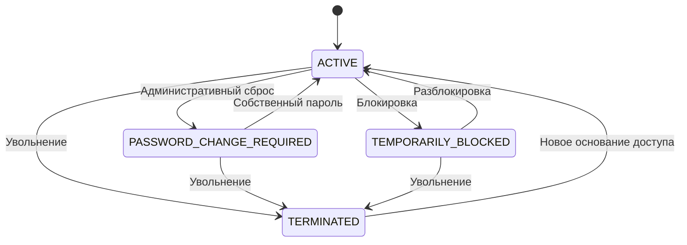

# Управление доступом сотрудников: пароли, блокировка и увольнение

**Статус:** Draft for implementation

**Версия:** 1.0

**Дата:** 2026-09-22

**Проект:** Corpsite

**Путь:** `docs/implementation/account-access-lifecycle.md`

## 1. Назначение документа

Этот документ является технической спецификацией для разработчиков и ИИ-агентов. Он дополняет управленческий документ «Концепция управления доступом сотрудников в системе Corpsite» и описывает реализацию единого жизненного цикла учётной записи:

- самостоятельную смену известного пароля;
- административный сброс забытого пароля;
- обязательную смену временного пароля;
- временную блокировку и разблокировку;
- прекращение доступа при увольнении;
- контролируемое восстановление доступа;
- отзыв ранее выданных сессий и токенов;
- предварительную проверку и передачу персональных задач;
- обычный и security-аудит.

Документ не является разрешением на изменение production. Любое изменение production выполняется только после тестирования, резервного копирования и отдельного подтверждения.

## 2. Связанные документы и решения

Перед реализацией агент должен найти и прочитать актуальные версии:

- ADR, описывающий `token_version` и отзыв JWT;
- документацию по `Person`, `Employee`, `User` и назначениям;
- правила кадрового увольнения и изменения статуса сотрудника;
- действующую модель permissions, grants и security-аудита;
- инструкции deployment и rollback;
- управленческий документ «Концепция управления доступом сотрудников в системе Corpsite».

Если реализация или схема БД расходится с этим документом, агент не должен молча выбирать вариант. Расхождение необходимо описать и либо обновить спецификацию, либо получить решение владельца проекта.

## 2.1 Принятые и отложенные решения (WP-ACCESS-002)

### Принятые решения

- `USER_ACCESS_ADMIN` не назначается автоматически ролям `ADMIN`, `HR_HEAD` или
  любым другим Platform Role. Он предоставляется только персональным
  `access_grants` конкретным утверждённым пользователям.
- Первым получателем позднее станет основной системный аккаунт владельца
  системы. Точную учётную запись нельзя угадывать: её необходимо отдельно
  идентифицировать и подтвердить. Резервный персональный аккаунт администратора
  пока не создан и будет добавлен отдельным завершающим действием перед
  production-вводом.
- Будущее автоматическое прекращение доступа может основываться только на
  применённом утверждённом кадровом приказе `TERMINATION`. Архивная проверка и
  HR-синхронизация сами по себе доступ не прекращают.
- Отсутствие преемника или незавершённые зависимости не должно препятствовать
  экстренному прекращению доступа; их безопасная обработка будет определена
  отдельным этапом.

### Отложенные решения и работа

- Передача задач и документов, планировщик, восстановление доступа и изменение
  Telegram-привязок остаются будущими этапами.
- WP-ACCESS-002 добавляет только read-only permission и проекции. Он не меняет
  состояние User/Employee/grant/assignment, не создаёт access command и не
  выполняет кадровое увольнение.

## 3. Текущее состояние, которое необходимо подтвердить

По состоянию на подготовку спецификации в Corpsite уже реализована self-service смена пароля вошедшим пользователем:

- пользователь вводит текущий пароль, новый пароль и подтверждение;
- backend определяет пользователя только по текущему JWT;
- новый пароль хешируется штатным PBKDF2-HMAC-SHA256;
- после успешной смены увеличивается `token_version`;
- прежняя сессия становится недействительной;
- создаётся событие `PASSWORD_CHANGED`;
- frontend очищает локальную сессию и перенаправляет пользователя на `/login`.

Перед разработкой необходимо подтвердить это по коду и тестам. В частности проверить:

- фактический маршрут смены пароля;
- обязательность проверки `token_version` для каждого поддерживаемого способа входа;
- поля таблицы `users`;
- обработку Google и Telegram входа;
- существующие кадровые команды увольнения;
- существующие механизмы блокировки после неудачных входов;
- таблицы задач, документов, согласований, уведомлений и прямых grants.

## 4. Область первого релиза

В первый релиз входят:

1. Административный сброс забытого пароля.
2. Временный пароль с ограниченным сроком действия.
3. Обязательная установка собственного пароля до доступа к рабочим разделам.
4. Временная блокировка и разблокировка пользователя.
5. Немедленный отзыв всех действующих JWT и иных поддерживаемых сессий.
6. Предварительный просмотр последствий прекращения доступа.
7. Прекращение доступа по утверждённому кадровому событию увольнения.
8. Безопасная передача персонально назначенных задач и документов.
9. Обычный и security-аудит всех операций.
10. Идемпотентность и защита от конкурентных изменений.

Во второй релиз переносятся:

- самостоятельное восстановление по подтверждённому email;
- резервное восстановление через ранее подтверждённый Telegram;
- массовые операции;
- внешняя IAM/SSO-интеграция;
- автоматические уведомления во внешние каналы, если для них ещё нет утверждённой политики.

## 5. Не входит в задачу

- Просмотр или восстановление старого пароля.
- Передача постоянного пароля администратору.
- Удаление `Person`, `Employee`, `User`, задач, документов или audit-записей.
- Изменение кадрового статуса без утверждённого кадрового основания.
- Назначение новой роли при сбросе пароля.
- Автоматическое восстановление старых прямых grants при повторном приёме.
- Неявный доступ по названию роли без проверки permission.

## 6. Базовая модель

### 6.1. Разделение сущностей

- `Person` — человек и долговременная идентичность.
- `Employee` — трудовые отношения и кадровый статус.
- `User` — учётная запись для входа и авторизации.
- `PersonAssignment` — назначение в подразделение и должность.
- `Role` и access grants — полномочия пользователя.

Прекращение доступа изменяет состояние `User` и кадровые проекции `Employee`/назначения, но не удаляет исторические сущности.

### 6.2. Состояния доступа

Состояние не следует дублировать новым полем, если оно однозначно выводится из существующих полей. Перед миграцией необходимо проверить актуальную схему.

Рекомендуемый приоритет вычисления состояния:

1. `TERMINATED` — `User.is_active = false` вследствие прекращения доступа.
2. `TEMPORARILY_BLOCKED` — действует ручная или автоматическая блокировка.
3. `PASSWORD_CHANGE_REQUIRED` — учётная запись активна, но установлен `must_change_password`.
4. `ACTIVE` — учётная запись активна и не ограничена.
5. `PENDING_ACTIVATION` — учётная запись подготовлена до даты начала работы, если этот сценарий будет внедрён.

Плановое прекращение доступа является отдельной командой со статусом исполнения, а не промежуточным значением `User.is_active`.



## 7. Полномочия

Ввести отдельное permission:

`USER_ACCESS_ADMIN`

Оно разрешает:

- открыть административный раздел управления доступом;
- выполнить сброс пароля;
- временно заблокировать и разблокировать пользователя;
- просмотреть последствия прекращения доступа;
- исполнить прекращение доступа при наличии утверждённого кадрового основания.

Требования:

- permission назначается только явно утверждённым лицам;
- проверка выполняется через действующий permission/grant-механизм;
- нельзя проверять только строковый код Platform Role;
- обычные руководящие, кадровые и административные роли не получают permission автоматически без решения владельца проекта;
- технический системный администратор не должен видеть пароль сотрудника после его установки.

Если прекращение доступа выполняется автоматически из утверждённого кадрового workflow, система выступает исполнителем, а audit должен хранить инициатора кадрового решения и технического исполнителя.

## 8. Идентификация объекта операции

Административные команды рекомендуется привязать к `employee_id`, а не принимать `person_id` или `user_id` в теле запроса.

Backend обязан:

1. Найти `Employee` по route-параметру.
2. Подтвердить связь с одним `Person`, если операция требует кадрового контекста.
3. Найти ровно один ожидаемый `User`, связанный через `User.employee_id`.
4. Проверить активное назначение и кадровое основание в зависимости от команды.
5. Остановить операцию при отсутствии, неоднозначности или конфликте связей.

`user_id`, `person_id`, login и role из клиентского JSON не должны использоваться для выбора субъекта операции.

## 9. Командный контракт

Все изменяющие команды должны принимать:

- `command_id` — UUID для идемпотентности;
- ожидаемую CAS-версию, предпочтительно `expected_token_version` для `User`;
- основание или комментарий, если этого требует операция;
- дополнительные данные конкретной команды.

Если в `users` нет `updated_at`, нельзя имитировать CAS клиентским временем. Для первого релиза допустимо использовать `token_version` как ожидаемую версию при условии, что каждая операция управления доступом атомарно увеличивает её.

Повтор команды с тем же `command_id` и тем же payload возвращает исходный результат. Тот же `command_id` с другим payload возвращает конфликт.

## 10. Предлагаемые API

Окончательные URL должны соответствовать текущим соглашениям проекта. Рекомендуемый набор:

### 10.1. Чтение и предварительный просмотр

```http
GET /directory/personnel/employees/{employee_id}/access
GET /directory/personnel/employees/{employee_id}/access/termination-preview
```

Ответ состояния доступа содержит только безопасные данные:

- `employee_id`;
- `user_id` при необходимости для отображения, но не для последующих команд;
- login;
- вычисленное состояние;
- роль;
- признак обязательной смены пароля;
- срок временного пароля без его значения;
- время/основание блокировки;
- `token_version` как CAS-версию;
- безопасную сводку зависимостей.

### 10.2. Команды

```http
POST /directory/personnel/employees/{employee_id}/access/password-reset
POST /directory/personnel/employees/{employee_id}/access/block
POST /directory/personnel/employees/{employee_id}/access/unblock
POST /directory/personnel/employees/{employee_id}/access/terminate
POST /directory/personnel/employees/{employee_id}/access/restore
```

Пример общей части тела:

```json
{
  "command_id": "00000000-0000-0000-0000-000000000000",
  "expected_token_version": 4,
  "reason": "Подтверждённое обращение сотрудника"
}
```

Коды ответа:

- `200` — команда исполнена либо идемпотентно воспроизведён результат;
- `400/422` — невалидные данные;
- `401` — отсутствует действующая авторизация;
- `403` — нет `USER_ACCESS_ADMIN`;
- `404` — Employee/User не найден без раскрытия лишних данных;
- `409` — CAS-конфликт, неоднозначная связь или изменившиеся зависимости;
- `423` — команда несовместима с текущим состоянием блокировки, если этот код принят в проекте.

## 11. Административный сброс пароля

### 11.1. Предусловия

- инициатор активен и имеет `USER_ACCESS_ADMIN`;
- Employee и User однозначно связаны;
- User активен и не находится в состоянии `TERMINATED`;
- CAS-версия совпадает;
- отсутствует конфликт идемпотентности.

### 11.2. Выполнение

В одной транзакции:

1. Заблокировать строку User через `SELECT ... FOR UPDATE`.
2. Повторить проверки после блокировки.
3. Сгенерировать криптографически стойкий временный пароль через `secrets` или эквивалент.
4. Применить действующую password policy.
5. Сохранить только штатный password hash.
6. Установить `must_change_password = true`.
7. Установить `temp_password_expires_at`, рекомендуемый срок — 24 часа.
8. Увеличить `token_version`.
9. Сбросить счётчики неудачных входов и автоматическую login-блокировку только если это явно предусмотрено командой.
10. Записать обычный audit и security-audit.
11. Зафиксировать идемпотентный результат.

Открытое значение временного пароля:

- не сохраняется в БД;
- не записывается в логи, audit, exception tracking или command result;
- возвращается только в непосредственном успешном HTTP-ответе;
- показывается в UI один раз;
- не может быть повторно получено через reload.

Если передавать временный пароль сотруднику небезопасно, администратор должен повторить reset и получить новый пароль; старый становится недействительным.

### 11.3. Первый вход

Пользователь с `must_change_password = true` может обращаться только к:

- странице установки нового пароля;
- endpoint установки нового пароля;
- logout;
- минимальным служебным endpoint, необходимым для отображения страницы.

Доступ к задачам, личной карточке и иным рабочим разделам блокируется middleware/backend-проверкой, а не только скрытием UI.

После установки собственного пароля:

- `must_change_password = false`;
- `temp_password_expires_at = null`;
- `password_changed_at` обновляется;
- `token_version` снова увеличивается;
- временная сессия прекращается;
- пользователь входит заново;
- фиксируется `PASSWORD_RESET_COMPLETED` или эквивалентное событие.

## 12. Временная блокировка

Временная блокировка применяется при подозрении на компрометацию, утрате устройства или служебной проверке.

Команда должна:

- сохранить причину, инициатора и время;
- установить явный признак ручной блокировки, не смешивая его с автоматической блокировкой после ошибок входа;
- увеличить `token_version`;
- прекратить вход по паролю, Google и Telegram;
- отменить активные recovery/reset tokens;
- не изменять роль, Employee, назначения, задачи или документы;
- создать audit-событие `USER_TEMPORARILY_BLOCKED`.

Разблокировка выполняется отдельной командой, не стирает историю блокировки и создаёт `USER_UNBLOCKED`. Если во время блокировки сотрудник был уволен, разблокировка запрещена.

При отсутствии подходящих полей следует добавить миграцию, например:

- `manual_blocked_at`;
- `manual_blocked_by_user_id`;
- `manual_block_reason`.

Не следует использовать только `is_active = false` для временной блокировки, если это делает её неотличимой от увольнения.

## 13. Прекращение доступа при увольнении

### 13.1. Источник истины

Основанием является только утверждённое кадровое событие с датой и временем вступления в силу. Черновик приказа или неподтверждённое изменение не прекращает доступ.

Для немедленного увольнения команда исполняется сразу. Для будущей даты создаётся контролируемое расписание прекращения доступа.

Часовой пояс бизнес-даты: `Asia/Almaty`, если конфигурация организации не задаёт иной утверждённый часовой пояс.

### 13.2. Предварительный просмотр

До подтверждения UI должен показать:

- текущий Employee/User и назначение;
- роль и прямые grants;
- персонально назначенные задачи;
- входящие документы, где User является исполнителем;
- активные согласования;
- незавершённые персональные уведомления/доставки, если они требуют передачи;
- Google и Telegram привязки как безопасные boolean-признаки;
- предлагаемых преемников или отсутствие преемника;
- конфликты, которые блокируют операцию.

Preview выполняется read-only и возвращает версию/хеш зависимостей. Execute обязан повторно проверить зависимости под блокировками. Изменение между preview и execute приводит к `409`, а не к частичному выполнению.

### 13.3. Исполнение

В одной транзакции либо согласованной оркестрации:

1. Заблокировать Employee, User, активное назначение и записи команды увольнения.
2. Проверить кадровое основание и effective time.
3. Повторно проверить CAS и зависимости.
4. Передать или закрыть персональные задачи согласно подтверждённому плану.
5. Ролевые задачи оставить на роли.
6. Отозвать или закрыть срок прямых grants.
7. Обработать персональные назначения входящих документов без изменения их истории.
8. Деактивировать User и увеличить `token_version`.
9. Прекратить Google/Telegram аутентификацию и рабочие уведомления без удаления исторических идентификаторов, если политика хранения не требует иного.
10. Закрыть активное кадровое назначение и обновить Employee через действующий кадровый command/workflow, а не прямыми несогласованными UPDATE.
11. Записать обычный audit, security-audit и результат передачи работы.

Операция не должна удалять Person, Employee, User, задачи, документы, события или аудит.

### 13.4. Планировщик

Для будущего effective time рекомендуется отдельная таблица команд, например `user_access_terminations`, со следующими полями:

- `termination_id`;
- `command_id` с unique constraint;
- `employee_id`;
- `user_id`;
- ссылка на кадровое событие/приказ;
- `effective_at` в UTC;
- исходный часовой пояс;
- `status`: `SCHEDULED`, `PROCESSING`, `COMPLETED`, `FAILED`, `CANCELLED`;
- `expected_token_version`;
- безопасный план передачи зависимостей;
- `created_by_user_id`, `created_at`, `executed_at`;
- код последней ошибки без секретов.

Планировщик должен быть идемпотентным, устойчивым к повторному запуску и использовать блокировку строки/skip-locked по принятому в проекте шаблону.

## 14. Восстановление доступа

После увольнения старый User не должен активироваться автоматически только потому, что найден тот же Person.

Восстановление требует:

- нового действующего кадрового назначения;
- отдельного подтверждения роли;
- проверки прямых grants;
- нового временного пароля или утверждённого внешнего способа входа;
- увеличения `token_version`;
- нового audit-события `ACCESS_RESTORED`.

Старые прямые grants не восстанавливаются автоматически. Исторические задачи и документы сохраняются.

## 15. Аудит

Рекомендуемые события:

| Событие | Значение |
|---|---|
| `PASSWORD_RESET_REQUESTED` | Администратор начал подтверждённый сброс |
| `PASSWORD_RESET_ISSUED` | Создан временный пароль |
| `PASSWORD_RESET_COMPLETED` | Пользователь установил собственный пароль |
| `PASSWORD_RESET_EXPIRED` | Временный пароль истёк |
| `USER_TEMPORARILY_BLOCKED` | Доступ временно остановлен |
| `USER_UNBLOCKED` | Временная блокировка снята |
| `ACCESS_TERMINATION_SCHEDULED` | Запланировано прекращение доступа |
| `ACCESS_TERMINATED` | Доступ фактически прекращён |
| `ACCESS_TERMINATION_FAILED` | Исполнение остановлено без частичного результата |
| `ACCESS_RESTORED` | Доступ восстановлен по новому основанию |

Audit должен содержать:

- event type;
- `command_id`;
- инициатора;
- технического исполнителя, если это scheduler;
- затронутые `employee_id` и `user_id`;
- основание;
- время;
- результат;
- предыдущие и новые безопасные признаки состояния;
- идентификатор кадрового события;
- сводку передачи зависимостей.

Запрещено включать:

- открытые пароли;
- password hashes;
- JWT;
- recovery/reset tokens;
- содержимое одноразовых ссылок;
- лишние персональные данные.

Отказы в чувствительных операциях также фиксируются в security-аудите без секретных данных.

## 16. UI

### 16.1. Карточка сотрудника

Добавить раздел «Управление доступом» с:

- login;
- ролью;
- текущим состоянием;
- датой последней смены пароля без показа пароля;
- сроком временного пароля;
- причиной блокировки;
- кнопками, доступными по permission и состоянию.

Кнопки:

- «Сбросить пароль»;
- «Временно заблокировать»;
- «Разблокировать»;
- «Прекратить доступ»;
- «Восстановить доступ» при наличии нового основания.

### 16.2. Подтверждение опасных операций

Для блокировки и прекращения доступа требуется отдельный dialog:

- Ф.И.О., login и роль;
- описание последствий;
- причина;
- зависимости и план передачи;
- явное подтверждение;
- новый `command_id` для одной пользовательской операции.

### 16.3. Временный пароль

После успешного reset:

- показать пароль один раз;
- добавить «Показать/скрыть» и «Копировать»;
- явно сообщить срок действия и необходимость смены;
- после закрытия dialog не предоставлять повторный просмотр;
- не сохранять пароль в `localStorage`, URL, analytics или frontend logs.

### 16.4. Режим обязательной смены

После входа временным паролем пользователь перенаправляется на отдельную страницу установки нового пароля. Навигация в рабочие разделы блокируется до успеха.

## 17. Безопасность

- Все endpoint требуют аутентификацию и permission.
- Проверка выполняется на backend независимо от UI.
- Пароли хешируются только штатным password hasher проекта.
- Генерация временного пароля использует CSPRNG.
- Password policy применяется одинаково при self-change, reset и первом входе.
- `token_version` проверяется для всех JWT.
- При блокировке, reset, увольнении и восстановлении версия увеличивается.
- Google/Telegram вход проверяет `User.is_active`, ручную блокировку и кадровое прекращение доступа.
- Ответы восстановления не должны раскрывать существование произвольного login.
- Rate limit применяется к login, reset и установке нового пароля.
- Исключения и tracing очищаются от секретов.
- Любой конфликт останавливает всю операцию до первой записи либо вызывает полный rollback.

## 18. Тестирование

### 18.1. Backend unit/service

- генерация временного пароля;
- policy и hashing;
- вычисление состояния;
- разрешённые переходы состояний;
- запрет восстановления без нового назначения;
- безопасная сериализация ответа и audit.

### 18.2. PostgreSQL integration

- reset → первый вход → обязательная смена → повторный вход;
- истечение временного пароля;
- повторное использование временного пароля запрещено;
- старый JWT недействителен сразу после reset/block/terminate;
- неправильная CAS-версия возвращает `409` без изменений;
- одинаковый `command_id` не создаёт повторных событий;
- конфликт payload для того же `command_id` отклоняется;
- block/unblock сохраняет роль и зависимости;
- увольнение закрывает доступ, но сохраняет Person/Employee/User и историю;
- rollback при ошибке передачи задачи;
- планировщик безопасно повторяет незавершённую команду;
- Google/Telegram не обходят блокировку.

### 18.3. API authorization

- пользователь без permission получает `403`;
- permission со scope применяется согласно действующей модели;
- клиентские `user_id`, `person_id`, role и login не могут перенаправить команду на другого субъекта;
- terminated User получает `401` всеми способами входа.

### 18.4. Frontend/Vitest

- кнопки видны только при разрешённом состоянии;
- временный пароль показывается один раз;
- пароль не сохраняется после reload;
- dialog требует причину и подтверждение;
- `409` предлагает обновить карточку;
- обязательная смена не позволяет перейти в рабочий раздел;
- preview увольнения показывает зависимости;
- UI не удаляет тесты и не ослабляет утверждения ради прохождения.

### 18.5. Production smoke после отдельного разрешения

- использовать специально утверждённый тестовый User;
- не менять пароль реального сотрудника без его участия;
- проверить старый и новый JWT;
- проверить audit;
- удалить только созданные smoke-артефакты штатными командами;
- не использовать прямые SQL UPDATE для cleanup.

## 19. Миграции

Точный состав определяется после инвентаризации. Возможные изменения:

- permission `USER_ACCESS_ADMIN`;
- поля ручной блокировки в `users`;
- таблица идемпотентных access-команд;
- таблица плановых прекращений доступа;
- индексы по `command_id`, `employee_id`, `user_id`, `effective_at`, `status`;
- ограничение уникальности активного User для Employee, если оно соответствует фактической модели;
- безопасные foreign keys на User/Employee/кадровое событие.

Миграция не должна:

- создавать или деактивировать реальных пользователей;
- назначать permission широкому кругу ролей без решения;
- менять password hashes;
- удалять исторические записи;
- объединять независимую Alembic-ветку без отдельного решения.

Upgrade/downgrade необходимо проверить на отдельной test-БД. Downgrade не должен удалять используемые роли, permissions или audit-данные.

## 20. Наблюдаемость и эксплуатация

Добавить безопасные метрики:

- количество успешных и отклонённых reset;
- количество временных блокировок;
- запланированные/выполненные/ошибочные прекращения доступа;
- задержка исполнения плановой команды;
- количество CAS-конфликтов;
- количество истёкших временных паролей.

Метрики и логи не содержат пароль, hash, JWT или полный payload команды.

Для ошибок планировщика предусмотреть операционное уведомление и безопасный повтор. Нельзя автоматически повторять операцию, если изменились кадровые или task-зависимости без нового preview.

## 21. Этапы реализации

### WP-ACCESS-001 — Инвентаризация и ADR

- подтвердить текущую схему и маршруты;
- составить карту всех способов входа;
- определить источник утверждённого увольнения;
- инвентаризировать персональные зависимости;
- принять ADR о состояниях, CAS, idempotency и временном пароле.

Результат: документация без изменения поведения production.

### WP-ACCESS-002 — Permission и read projection

- добавить `USER_ACCESS_ADMIN`;
- реализовать безопасное чтение состояния;
- реализовать termination preview;
- добавить audit чтения, если это требуется политикой.

### WP-ACCESS-003 — Административный reset

- reset-команда;
- временный пароль;
- обязательная смена;
- отзыв сессий;
- UI и тесты.

### WP-ACCESS-004 — Блокировка

- ручная block/unblock модель;
- проверки всех способов входа;
- UI, audit и тесты.

### WP-ACCESS-005 — Прекращение доступа

- интеграция с кадровым событием;
- preview и передача зависимостей;
- немедленное и плановое исполнение;
- scheduler, audit и тесты.

### WP-ACCESS-006 — Восстановление

- новое кадровое основание;
- подтверждение роли и grants;
- временный пароль;
- безопасное восстановление.

### WP-ACCESS-007 — Rollout

- test-БД;
- локальный smoke;
- резервная копия production;
- миграция;
- backend/frontend deploy;
- production smoke;
- rollback rehearsal и эксплуатационная инструкция.

## 22. Критерии приёмки первого релиза

Первый релиз считается готовым, если:

1. Сотрудник с забытым паролем получает временный доступ без раскрытия старого пароля.
2. До установки собственного пароля рабочие разделы недоступны.
3. Временный пароль истекает и не может использоваться повторно.
4. Reset, block и terminate немедленно отзывают ранее выданный JWT.
5. Заблокированный или уволенный User не входит через пароль, Google или Telegram.
6. Увольнение не удаляет Person, Employee, User, задачи, документы и историю.
7. Персональные зависимости показаны до исполнения и переданы по подтверждённому плану.
8. При конфликте данных не происходит частичного изменения.
9. Повтор команды не создаёт дубликатов.
10. Все операции имеют обычный и security-аудит без секретов.
11. Backend, frontend, migration и integration tests проходят.
12. Production изменяется только после backup и отдельного подтверждения.

## 23. Правила работы ИИ-агента

ИИ-агент, реализующий эту спецификацию, обязан:

1. Сначала прочитать `AGENTS.md`, связанные ADR и актуальные implementation-документы.
2. Провести read-only инвентаризацию до редактирования кода.
3. Не предполагать наличие таблицы, поля, роли, permission или endpoint без проверки.
4. Не обращаться к production без явного указания пользователя.
5. Не использовать production для тестов.
6. Не выполнять прямые кадровые UPDATE, если существует command/workflow.
7. Не выводить password hashes, JWT, секреты или чувствительные персональные данные.
8. Сохранять посторонние изменения в dirty worktree и включать в commit только согласованные файлы.
9. Не выполнять commit, push или deploy без отдельной команды.
10. Не удалять и не ослаблять тесты ради прохождения.
11. Для PostgreSQL integration использовать только отдельную test-БД.
12. После каждого этапа сообщать изменённые файлы, проверки, ограничения и невыполненные действия.

## 24. Задание на первый этап для Codex

> Проведи read-only инвентаризацию существующего контура управления доступом в Corpsite и сопоставь его с `docs/implementation/account-access-lifecycle.md`. Проверь модели User, Employee, Person и назначений; self-service password change; password hasher; `must_change_password`; срок временного пароля; `token_version` и все способы входа; ручные и автоматические блокировки; кадровое увольнение; персональные задачи, документы, согласования, notifications и прямые grants; обычный и security-аудит; scheduler и Alembic heads.
>
> Код, БД и production пока не изменяй. Не выполняй commit, push или deploy. Подготовь отчёт о расхождениях и технический план `WP-ACCESS-001`: конкретные файлы, модели, миграции, endpoints, permission, транзакционные границы, CAS/idempotency, audit-события, UI-компоненты и тесты. Все неизвестные или неоднозначные решения вынеси отдельно для утверждения.
