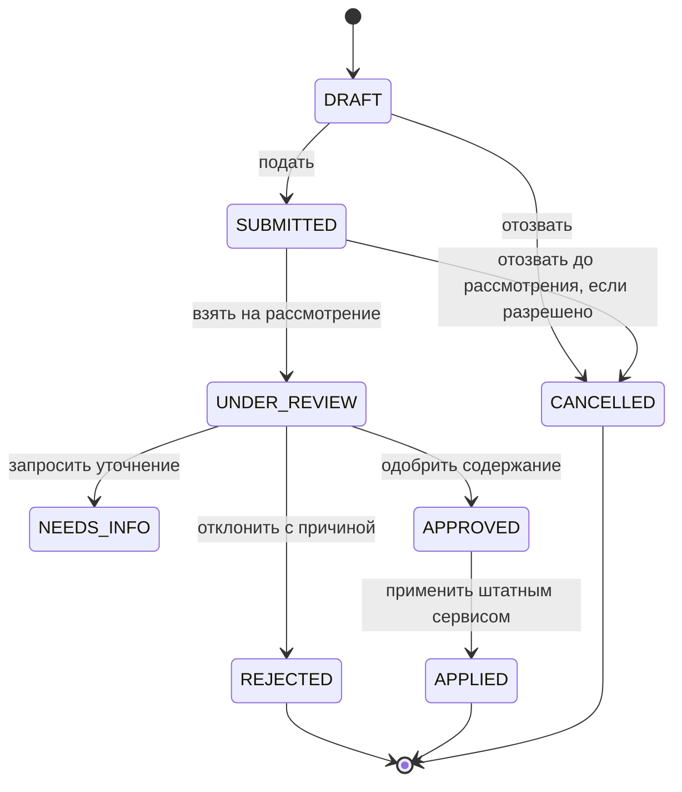

# План реализации: экспорт контрольного списка и предложения сотрудников по исправлению персональных данных

```text
Status: Working Draft
Canonical: Yes
Current authorized work package: WP-CL-001
Implementation status: Not started
```

- Проект: Corpsite
- Версия: 1.0
- Дата: 03 сентября 2026 года
- Область: Активный персонал, контрольный список, личная карточка сотрудника

Этот Markdown-файл является каноническим источником требований. Word-файл `План_экспорта_контрольного_списка.docx` является только копией для чтения и не является источником требований для дальнейшей работы.

> **Ограничение текущего этапа.** До утверждения результатов `WP-CL-001` запрещено начинать реализацию экспорта, миграций, API и UI.

> **Ключевое решение.** Личные карточки и связанные кадровые данные остаются единственным источником истины. Экспорт и представление сотрудника строятся из тех же данных; файл Excel не становится параллельным реестром.

## 1. Цель и ожидаемый результат

Создать управляемый контур, в котором отдел кадров получает воспроизводимую Excel-выгрузку по активному персоналу, сотрудник видит собственное представление контрольного списка и может предложить исправление, а официальные данные изменяются только после кадрового рассмотрения.

- Экспорт формируется на конкретную дату из актуальных карточек и действующих назначений.
- Экспортный формат имеет собственную версию и может отличаться от старого импортного шаблона.
- Сотрудник видит только собственные данные и не редактирует официальную карточку напрямую.
- Каждое предложение, доказательство, решение и фактическое изменение сохраняются в аудите.

## 2. Границы задачи

### 2.1. Входит в работу

- Инвентаризация всех столбцов исходного контрольного списка и источников данных Corpsite.
- Экспорт активного персонала в Excel из подраздела «Контрольный список → Экспорт».
- Представление контрольного списка в личной карточке сотрудника.
- Предложения по исправлению отдельных полей с приложением доказательств.
- Кадровое рассмотрение, одобрение, отклонение и применение исправлений.
- Ролевые ограничения, аудит, тесты и поэтапный rollout.

### 2.2. Не входит без отдельного решения

- Автоматическая обратная загрузка сформированного Excel в личные карточки.
- Массовое исправление официальных данных по предложениям сотрудников.
- Изменение существующего импорта контрольного списка, если для экспорта это не требуется.
- Автоматическое признание загруженного сотрудником файла достаточным доказательством.

## 3. Неподвижные правила

| Код | Правило | Содержание |
| --- | --- | --- |
| R1 | Источник истины | Официальные сущности Person/Employee, действующее назначение и профильные записи; экспортные файлы только снимки. |
| R2 | Активный персонал | Определение фиксируется до реализации: статус сотрудника, действующее основное назначение и дата среза. |
| R3 | Одна строка | В основном листе Excel одна строка соответствует одному активному сотруднику. |
| R4 | Многозначные данные | Образование, обучение, категории и награды сериализуются по утверждённому правилу либо выносятся в дополнительные листы. |
| R5 | Нет прямого self-edit | Сотрудник создаёт предложение; изменение официального поля выполняется отдельной кадровой операцией. |
| R6 | Защита от устаревания | Предложение хранит исходное значение/версию; применение запрещается, если поле изменилось после подачи. |
| R7 | Аудит | Автор, время, старое и новое значение, решение HR и применивший пользователь неизменяемо фиксируются. |

## 4. Целевая структура интерфейса

### 4.1. Для отдела кадров

Во вкладке «Контрольный список» добавить подраздел «Экспорт». Он не смешивается с загрузкой и проверкой импортированных записей.

- Фильтры: дата среза, группа отделений, отделение; при необходимости — должность и категория персонала.
- Предварительный итог: количество сотрудников и предупреждения о незаполненных обязательных полях.
- Действие «Сформировать Excel» доступно только уполномоченным кадровым ролям и создаёт файл формата `.xlsx`.
- После формирования интерфейс предлагает пользователю выбрать имя и место сохранения файла; при отсутствии системного диалога используется стандартное скачивание браузера.
- После формирования отображаются дата, автор, параметры, количество строк, версия формата и ссылка на файл.

### 4.2. Для сотрудника

В карточке сотрудника добавить раздел «Контрольный список», который использует ту же проекцию данных, но показывает сведения блоками, а не широкой Excel-строкой.

- Основные данные: ФИО, дата/год рождения, ИИН, пол, национальность, контакты.
- Трудовые данные: подразделение, должность, дата начала, категория персонала, стаж.
- Профессиональные данные: образование, специальность, квалификация, обучение, степень, награды.
- У каждого разрешённого поля — действие «Предложить исправление» и история собственных обращений.

## 5. Этап 0 — инвентаризация и матрица полей

> **Запрет на преждевременную реализацию.** Экспорт не разрабатывается до утверждения матрицы полей и определения активного персонала.

Нужно найти фактические модели, API и UI-компоненты, из которых уже читаются соответствующие сведения. Нельзя создавать дублирующие справочники ради экспорта.

| Столбец | Предполагаемый источник | Правило/вопрос | Статус |
| --- | --- | --- | --- |
| № | Вычисляемое | Порядковый номер после сортировки | Готово |
| Группа персонала/подразделений | Оргструктура/правило группировки | Уточнить смысл безымянного столбца исходного файла | Решение |
| Фамилия, имя, отчество | Person | Единый утверждённый формат ФИО | Инвентаризация |
| Год рождения | Person | Год из полной даты рождения | Инвентаризация |
| ИИН | Идентификационные данные | Текст, 12 знаков, без числового преобразования | Инвентаризация |
| Пол | Person/профиль | Справочное отображаемое значение | Инвентаризация |
| Национальность | Person/профиль | Проверить наличие и правила доступа | Инвентаризация |
| ВУЗ, год окончания | Образование | Правило нескольких записей | Решение |
| Специальность по диплому | Образование | Связать с конкретным дипломом | Решение |
| Занимаемая должность | Основное активное назначение | Должность и дата начала | Инвентаризация |
| Категория должности | Справочник должностей/медкатегорий | Не смешивать разные виды категорий | Решение |
| Стаж работы | История работы/расчёт | Определить медицинский, общий или в должности | Решение |
| Повышение квалификации | Обучение/сертификаты | Порядок и разделитель нескольких записей | Решение |
| Квалификационная категория | Медицинские категории | Название, дата, срок действия | Инвентаризация |
| Степень | Профессиональный профиль | Уточнить модель и справочник | Инвентаризация |
| Награды | Награды | Порядок нескольких записей | Решение |
| Примечание | Не определено | Не переносить свободный текст без политики | Решение |
| Телефоны | Контакты | Основной и дополнительные; сохранять как текст | Инвентаризация |

### Результат этапа 0

- Утверждённая матрица «столбец → сущность/поле → правило → доступность → пример».
- Зафиксированное определение «активного сотрудника на дату T».
- Решение по множественным данным и составу листов Excel.
- Перечень отсутствующих данных: допустимый пробел, предупреждение или блокировка экспорта.

## 6. Этап 1 — контракт экспортной проекции

После инвентаризации вводится единый read-only сервис проекции. Его используют Excel-экспорт и представление в карточке сотрудника. UI не должен самостоятельно собирать сведения из множества API.

1. Зафиксировать версию схемы, например `CONTROL_LIST_EXPORT_V1`.
2. Определить стабильную сортировку: группа → подразделение → ФИО → `employee_id`.
3. Добавить технические метаданные: `employee_id`, дата среза, дата формирования, версия схемы.
4. Определить, какие поля доступны сотруднику, HR и экспортному процессу.
5. Для каждого поля возвращать значение, признак отсутствия и при необходимости источник/дату актуальности.

### Критерии приёмки этапа 1

- Одинаковый сотрудник получает одинаковые значения в API проекции, Excel и карточке.
- Повторный расчёт при неизменных данных даёт идентичный набор строк и порядок.
- В проекцию не попадают кандидаты, архивные и уволенные сотрудники вне определения активности.
- Нет новых таблиц-двойников для ФИО, назначения, образования или контактов.

## 7. Этап 2 — Excel-экспорт для отдела кадров

### 7.1. Рекомендуемый состав файла

| Лист | Назначение | Статус |
| --- | --- | --- |
| Контрольный список | Одна строка на сотрудника; привычные кадровые столбцы | Обязателен |
| Метаданные | Версия схемы, дата среза, дата формирования, автор, параметры, число строк | Обязателен |
| Ошибки данных | Сотрудник, поле, причина отсутствия/невалидности | Рекомендуется |
| Многозначные данные | Отдельные строки образования/обучения/наград, если плоская сериализация неприемлема | По решению этапа 0 |

### 7.2. Правила файла

- Единственный пользовательский формат выгрузки — Excel Workbook (`.xlsx`). CSV и другие форматы не подменяют основной результат.
- Сохранение запускается только явным действием пользователя. Поддерживаемый браузер открывает системный диалог выбора имени и папки; fallback — стандартное скачивание браузера с заранее сформированным понятным именем.
- Сервер и frontend не получают и не задают путь к локальной папке пользователя; выбор расположения остаётся на стороне браузера/операционной системы.
- Без объединённых ячеек внутри набора данных; одна строка заголовков и автофильтр.
- ИИН, телефоны и идентификаторы записываются как текст; даты — как даты Excel.
- Закрепляется строка заголовков, задаются ширины, перенос длинного текста и понятные названия листов.
- Пустое значение остаётся пустым; предположения и подстановка фиктивных значений запрещены.
- Имя файла содержит дату среза и время формирования; файл сопровождается контрольной суммой.

### 7.3. История экспортов

Рекомендуется хранить запись о каждом формировании: пользователь, параметры, дата среза, версия схемы, количество строк, имя/идентификатор файла, SHA-256, статус и ошибка. Сам файл хранится по действующей политике документов проекта, а не в произвольной папке frontend.

### Критерии приёмки этапа 2

- HR формирует файл только в пределах разрешённого охвата.
- Число строк совпадает с числом сотрудников в предварительном просмотре.
- Файл открывается без предупреждений и сохраняет ИИН/телефоны без потери нулей.
- При нажатии кнопки пользователь получает диалог выбора места сохранения `.xlsx` либо штатный браузерный диалог/скачивание, если прямой выбор папки не поддерживается.
- Фильтры влияют на предварительный просмотр и файл одинаково.
- В журнале экспорта зафиксированы параметры и результат.

## 8. Этап 3 — представление сотрудника

В карточке показывается не копия экспортной строки, а человекочитаемое представление той же проекции. Поля группируются по смыслу; отсутствующие сведения обозначаются текстом, а не только цветом.

- Сотрудник видит только собственные данные; HR — по существующему организационному охвату.
- Рядом с полем показываются статус полноты и действие «Предложить исправление», если поле разрешено для обращений.
- Многозначные данные отображаются отдельными карточками с датами и документами.
- История предложений показывает текущий статус и решение без раскрытия служебных данных других пользователей.

### Критерии приёмки этапа 3

- Значения совпадают с экспортной проекцией на ту же дату.
- Прямое редактирование официальных полей сотруднику недоступно.
- Ни через URL, ни через API сотрудник не получает карточку другого сотрудника.
- Статусы понятны без зависимости от цветового восприятия.

## 9. Этап 4 — предложения и доказательства

### 9.1. Минимальная модель предложения

| Объект | Обязательные сведения |
| --- | --- |
| Обращение | Автор, `employee_id`, статус, время подачи, общий комментарий |
| Позиция изменения | Код поля, отображаемое название, исходное значение/версия, предлагаемое значение |
| Доказательство | Файл, тип, размер, SHA-256, автор и время; после подачи неизменяемо |
| Решение HR | Решение, причина, `reviewer`, `reviewed_at` |
| Применение | Кадровая операция, старое/новое значение, `applied_by`, `applied_at` |

### 9.2. Жизненный цикл

| Статус | Инициатор | Смысл |
| --- | --- | --- |
| DRAFT | Сотрудник | Создать/редактировать, приложить файл, удалить черновик |
| SUBMITTED | Система | Зафиксировать снимок исходного значения и доказательства |
| UNDER_REVIEW | HR | Взять на рассмотрение |
| NEEDS_INFO | HR → сотрудник | Запросить уточнение с обязательным комментарием |
| APPROVED | HR | Одобрить содержание, но ещё не менять карточку |
| REJECTED | HR | Отклонить с обязательной причиной |
| APPLIED | HR/уполномоченный | Применить через штатный сервис изменения карточки |
| CANCELLED | Сотрудник | Отозвать до начала рассмотрения, если разрешено политикой |



### 9.3. Инварианты

- Одобрение и применение — разные события и могут иметь разных исполнителей.
- `APPLIED` возможен только из `APPROVED` и только при совпадении сохранённого исходного значения/версии.
- `REJECTED` и `NEEDS_INFO` требуют комментария HR.
- После `SUBMITTED` файлы не заменяются; новая версия доказательства добавляется как новый файл.
- Изменение выполняется существующим доменным сервисом и создаёт обычный аудит личной карточки.

## 10. Права доступа

| Возможность | Кому | Назначение |
| --- | --- | --- |
| `CONTROL_LIST_EXPORT` | HR/администратор | Предварительный просмотр и создание выгрузки |
| `CONTROL_LIST_EXPORT_HISTORY` | HR/администратор | Просмотр и скачивание разрешённых экспортов |
| `EMPLOYEE_DATA_PROPOSAL_CREATE` | Сотрудник | Предложение исправления только собственной карточки |
| `EMPLOYEE_DATA_PROPOSAL_REVIEW` | HR | Рассмотрение в пределах кадрового охвата |
| `EMPLOYEE_DATA_PROPOSAL_APPLY` | HR/уполномоченный | Фактическое изменение после одобрения |

Названия прав являются проектными. Перед реализацией нужно проверить существующие роли и capabilities и переиспользовать их, если они уже выражают требуемое действие.

## 11. Этап 5 — тестирование и безопасный rollout

### 11.1. Обязательные проверки

| Область | Проверки |
| --- | --- |
| Проекция | Активность на дату, основное назначение, сортировка, пустые и множественные поля |
| Excel | Типы ячеек, нули ИИН/телефонов, фильтры, число строк, открытие файла |
| RBAC | Сотрудник видит только себя; HR — разрешённый охват; запрет прямых URL |
| FSM | Разрешённые и запрещённые переходы; обязательные комментарии |
| Конкурентность | Изменение поля после `SUBMITTED` блокирует применение устаревшего предложения |
| Файлы | Тип, размер, вредоносное имя, контрольная сумма, недоступность посторонним |
| Аудит | Полная цепочка: создание → подача → решение → применение |

### 11.2. Порядок включения

1. Включить read-only проекцию и сверить выборку с действующим списком активного персонала.
2. Открыть экспорт ограниченной HR-группе и проверить реальный файл без массовой рассылки.
3. Включить сотрудникам только просмотр собственного представления.
4. Запустить предложения исправлений на пилотной группе без автоматического применения.
5. После проверки аудита разрешить HR применение одобренных изменений.

## 12. Риски и меры

| Риск | Проявление | Мера |
| --- | --- | --- |
| Параллельный реестр | Excel начинают править и считать источником истины | Явно маркировать снимок; запретить обратный импорт без отдельного процесса |
| Неверный охват | В экспорт попадают уволенные/кандидаты/вторичные назначения | Утвердить определение активности и тесты на дату |
| Потеря структуры | Несколько дипломов или обучений склеиваются неоднозначно | Утвердить сериализацию либо отдельные листы |
| Устаревшее исправление | HR применяет предложение после другого изменения | Проверка исходного значения/версии при применении |
| Утечка ПД | Чужая карточка, экспорт или доказательство доступны по ссылке | Проверка прав в SQL/API, непрозрачные ссылки, аудит скачивания |
| Цветовая неоднозначность | Статусы различимы только по цвету | Текстовые статусы и иконки; цвет только дополнительный сигнал |

## 13. Решения, которые нужно принять

1. Что именно означает безымянный столбец с группой персонала в старом файле?
2. Как считать стаж: общий, медицинский, по специальности или несколько показателей?
3. Какие данные обязательны и должны блокировать экспорт, а какие дают предупреждение?
4. Как представлять несколько образований, обучений, категорий и наград?
5. Нужно ли хранить сами экспортные файлы или достаточно воспроизводимых параметров и журнала?
6. Кто, кроме HR, может применять одобренное изменение?
7. Какие типы и максимальный размер доказательств разрешены?
8. Какой срок хранения экспортов, предложений и доказательств?

## 14. Рабочие пакеты

| Пакет | Содержание | Результат | Порядок |
| --- | --- | --- | --- |
| WP-CL-001 | Инвентаризация и матрица полей | Документ и примеры; без изменения продукта | Первым |
| WP-CL-002 | Контракт экспортной проекции | Backend read-only + тесты | После утверждения WP-CL-001 |
| WP-CL-003 | Excel и история экспортов | Backend/генератор + RBAC + тесты | После WP-CL-002 |
| WP-CL-004 | UI «Контрольный список → Экспорт» | Предпросмотр, фильтры, сохранение `.xlsx` с выбором места | После WP-CL-003 |
| WP-CL-005 | Представление в карточке | Self-view + HR-view | После WP-CL-002 |
| WP-CL-006 | Предложения и доказательства | Модель, API, файлы, аудит | После WP-CL-005 |
| WP-CL-007 | Рассмотрение и применение | HR UI, FSM, optimistic lock | После WP-CL-006 |
| WP-CL-008 | Пилот и rollout | Сверка, обучение, метрики, включение | Финальным |

## 15. Следующее действие

> Начать только с `WP-CL-001`. Codex должен найти существующие модели, API, документацию и UI контрольного списка; составить фактическую матрицу полей; перечислить пробелы и вопросы. Не создавать миграции, endpoints, экспорт или интерфейс до отдельного утверждения матрицы.

## 16. Условие завершения всей программы

Работа считается завершённой, когда HR формирует воспроизводимый экспорт по активному персоналу; сотрудник видит совпадающее собственное представление; предложения исправлений проходят управляемое рассмотрение с доказательствами; официальные данные меняются только разрешённой кадровой операцией; доступ и аудит подтверждены тестами и пилотом.

## История документа

| Дата | Версия | Изменение |
| --- | --- | --- |
| 2026-09-03 | 1.0 | Создан канонический план реализации. |
