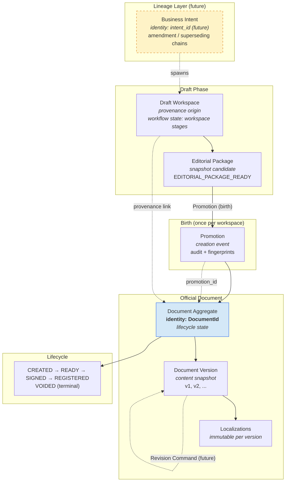

# OO-IMP-003A — Document Identity & Revision Architecture Ratification

**Status:** Ratified (architecture only)  
**Date:** 2026-07-12  
**Scope:** Architecture policy — no code changes  
**Basis:** OO-IMP-003 implementation review, UDE-003/004/005, OO-IMP-001/002/003  
**Supersedes:** Informal assumptions only; does not alter OO-IMP-003 code

---

## Executive Summary

OO-IMP-003 correctly implements **Promotion as a birth event** with **idempotent replay per WorkspaceId** (UDE-004 PR2). This ratification **affirms that policy** as the official Unified Document Engine rule for document instantiation.

However, OO-IMP-003 is an **intentional partial implementation** of the full UDE target. Three gaps require explicit architectural closure before OO-IMP-004+:

1. **Workspace post-promotion semantics** — OO keeps workspace mutable; UDE requires `DOCUMENT_PROMOTED` freeze.
2. **Version mutability in DRAFT** — UDE allows material Version N+1 commits in DRAFT; OO freezes localizations at Version 1.
3. **Fingerprint drift handling** — silent idempotent replay masks editorial divergence.

**Ratification decision:** Adopt UDE-aligned identity and revision policy. OO-IMP-003 code remains valid as **birth MVP**. Gaps are addressed in future WPs, not by rewriting OO-IMP-003 retroactively.

---

## Current Model

### As implemented (OO-IMP-003)

```text
Draft Workspace (mutable, repeatable editorial cycle)
        │
        │  POST /workspaces/{id}/promote  (first time)
        ▼
Promotion (once per workspace — UNIQUE constraint)
        │
        ▼
Document Aggregate (DocumentId assigned)
        │
        ▼
DocumentVersion v1 (is_current=true, immutable localizations)
        │
        ▼
Lifecycle: CREATED
```

### Idempotent replay (second promote)

```text
Workspace (possibly changed editorial package)
        │
        │  POST /workspaces/{id}/promote  (again)
        ▼
existing Document returned (idempotent_replay=true)
        │
        └── no validation, no fingerprint comparison, no Version 2
```

### Database enforcement

| Constraint | Table | Effect |
|---|---|---|
| `uq_oo_documents_workspace` | `operational_order_documents` | One DocumentId per WorkspaceId |
| `uq_oo_promotions_workspace` | `operational_order_promotions` | One Promotion record per WorkspaceId |
| `uq_oo_document_versions_number` | `operational_order_document_versions` | Multiple versions per document **allowed by schema**, not by service |

### Divergence from UDE target

| Aspect | UDE-004 target | OO-IMP-003 actual |
|---|---|---|
| Workspace after promotion | Frozen `DOCUMENT_PROMOTED` | Continues independently, mutable |
| Lifecycle entry state | `DRAFT` | `CREATED` (forward-compatible alias) |
| Version 1 mutability | Mutable baseline in DRAFT (IS1) | Immutable localization snapshot |
| Re-promote semantics | Idempotent birth (PR2) | ✅ Same |
| Version 2 path | Material commit in DRAFT | ❌ Not implemented |

---

## Identity Analysis

### Candidate models evaluated

| Option | Role | Pros | Cons | Long-term consequence |
|---|---|---|---|---|
| **A — DocumentId** | Stable identity of one legal document instance | Aligns with UDE-004, ECM norms, signing, registration, journal; survives all versions | Does not alone express amendment chains | **Recommended primary identity** |
| **B — Workspace** | Draft container | Natural for intake/editorial | Not stable across revisions; 1:1 birth binding makes it a birth certificate, not business identity | Becomes provenance only |
| **C — Promotion Event** | Creation audit record | Strong audit trail | Event, not entity; one per workspace in current schema | Provenance, not identity |
| **D — Business Intent** | "The order we meant to issue" | Supports superseding, corrections, amendment chains | Not modeled yet; spans multiple documents | **Future lineage layer above DocumentId** |
| **E — Draft Lineage** | Provenance graph | Rich audit | Too granular for legal identity | Supporting metadata |
| **F — Composite** | DocumentId + BusinessIntentId | Full ECM model | Requires new entity | Target state for amendment WP |

### Ratified identity model

```text
Business Intent (future — not yet persisted)
        │
        │  1:N (amendment / replacement / superseding chains)
        ▼
DocumentId  ←── PRIMARY BUSINESS IDENTITY (legal document instance)
        │
        │  1:N
        ▼
DocumentVersion (content revision within same legal instance)
        │
        │  provenance
        ▼
WorkspaceId (draft origin — birth certificate, not identity)
        │
        └── PromotionId (creation event — audit, not identity)
```

**Decision:** **DocumentId (Option A)** is the canonical business identity of a legal document instance. Workspace and Promotion are **provenance and audit**, not substitutes for identity. **Business Intent (Option D)** will be introduced as a **lineage layer** when amendment/superseding WPs arrive — it does not replace DocumentId.

---

## Promotion Analysis

### Question: Birth event or version creation command?

**Answer: Birth event.**

### Evidence

**UDE-004 Promotion Model:**

> Promotion = technical operation to materialize Document Aggregate from OfficialDraftPackage  
> Document Activation = business event — document born  
> Pipeline step 4: Assign DocumentId  
> Pipeline step 6: Create Version 1 baseline  
> Rule PR2: Idempotent per WorkspaceId

**UDE-003 Promotion Boundary:**

> New identities at promotion: DocumentId, DocumentLifecycleState=DRAFT, Lifecycle Audit stream.

**OO-IMP-003:**

> PromotionService is a Document Aggregate Factory — not a copy command.  
> One document per workspace. Repeated promote = idempotent replay.

### Semantic classification

| Operation | Nature | Produces |
|---|---|---|
| **Promotion** | Birth / Activation | DocumentId + Version 1 + lifecycle entry |
| **Revision** (future) | Content evolution command | Version N+1 on existing DocumentId |
| **Re-promote** (current) | Idempotent birth guard | Existing DocumentId (no new version) |

Promotion is **not** a general versioning command. Treating re-promote as "create Version 2" would violate PR2 and collapse birth semantics into revision semantics.

---

## Workspace Model

### Options evaluated

| Model | Description | Fit with UDE | Fit with OO-IMP-003 |
|---|---|---|---|
| **A — One-time incubator** | Workspace completes at birth; new edition = new Workspace | ✅ UDE step 9: freeze `DOCUMENT_PROMOTED` | ❌ OO keeps workspace alive |
| **B — Living master document** | Workspace feeds new DocumentVersions | Partial — UDE uses Document aggregate for DRAFT edits, not workspace | ❌ OO has no version-creation path |
| **C — Hybrid (ratified)** | Incubator until first Promotion; then archival draft origin | ✅ Aligns with UDE intent | Requires future WP to freeze |

### Ratified workspace model: **Hybrid A→Archive (UDE-aligned)**

After **first successful Promotion**:

1. Workspace **ceases to be an official editorial source of truth** for the Document Aggregate.
2. Workspace transitions to **`DOCUMENT_PROMOTED` archival state** (UDE target) — read-only for official purposes.
3. Further editorial work on the **same business intent** requires either:
   - **Revision Command** on the existing DocumentId (while lifecycle permits), or
   - **New Workspace** for a new document instance (replacement / superseding order).

**OO-IMP-003 interim deviation** (workspace remains mutable) is **technical debt**, not ratified long-term policy. It is tolerated until Workspace Freeze WP.

### Why not pure Model B (living master)?

A living workspace that silently diverges from an immutable Document creates the fingerprint drift hazard identified in review. ECM and UDE both separate **working copy** from **published instance**. The working copy may continue to exist, but it must not be confused with the official document without an explicit Revision Command.

---

## Revision Analysis

### How should Version 2 appear?

| Option | Verdict | Pros | Cons | Architecture impact |
|---|---|---|---|---|
| **A — Re-promote** | **Rejected** | Simple API reuse | Collapses birth/revision; silent drift; violates PR2 intent | Breaks identity model |
| **B — Revision Command** | **Ratified** | Clean separation; matches UDE IS1/DRAFT mutability; ECM version history | Requires new command, fingerprint rules, `is_current` flip | Moderate — new OO-IMP-003B/004 scope |
| **C — New Workspace** | **Conditional** | Clean lineage for replacement orders | Wrong for same-document correction; proliferates workspaces | For superseding/amendment documents only |
| **D — New Document** | **Conditional** | Clear legal boundary for replacement | Loses version continuity | For new Business Intent, not same-document edit |
| **E — Return-to-DRAFT + edit** | **Partial** | Matches PO/UDE READY correction | Still needs Version N+1 materialization at commit | Part of lifecycle WP |

### Ratified revision model

```text
Version 1  ←  Promotion (birth)           [OO-IMP-003 ✅]
Version 2+ ←  CreateDocumentRevision      [Future WP — OO-IMP-003B or OO-IMP-004 prep]
New Document ←  New Workspace + Promotion [Superseding / replacement orders — OO-IMP-00X]
```

**Re-promote never creates Version 2.** Idempotent replay remains the only re-promote behavior.

---

## Identity Graph



### Legend

| Element | Classification |
|---|---|
| **DocumentId** | Primary identity |
| **Business Intent** (future) | Lineage identity above document |
| **WorkspaceId** | Provenance + workflow state |
| **Promotion** | Creation event + snapshot audit |
| **DocumentVersion** | Content snapshot revision |
| **Localizations** | Immutable text snapshot per version |
| **Lifecycle state** | Legal workflow state on DocumentId |

---

## UNIQUE Constraint Analysis

### `UNIQUE(workspace_id)` on documents and promotions

| Interpretation | Assessment |
|---|---|
| **Implementation detail** | No — enforced at DB, service, and API layers deliberately |
| **Architectural policy** | **Yes — for birth binding** |

### Ratified policy

> **Birth Binding Rule (UDE-004 PR2):** At most one Document Aggregate may be born from a given WorkspaceId. At most one Promotion completion record per WorkspaceId.

This policy is **correct and permanent** for birth semantics.

### What it does NOT prohibit

The UNIQUE constraints do **not** prohibit:

- Multiple `DocumentVersion` rows per `document_id` (schema already allows)
- Multiple documents per **Business Intent** (different workspaces)
- Amendment documents with **new DocumentId** linked by lineage

### Evolution path (no schema change required for Version 2)

Version 2 is created within the **same** `document_id`, not by relaxing `UNIQUE(workspace_id)`. The birth binding remains; revision is orthogonal.

If future policy requires **re-opening a promoted workspace** for a new birth (explicitly rejected), that would require removing UNIQUE — **not recommended**.

---

## Fingerprint Drift Policy

### Current behavior

```text
Workspace edit → new editorial package → re-promote → silent idempotent replay
```

No fingerprint comparison. No user signal. Document v1 unchanged.

### Options evaluated

| Option | Assessment |
|---|---|
| A — Silent replay | Current; acceptable for idempotency, insufficient for operations |
| B — Warn on drift | Required adjunct to replay |
| C — Forbid re-promote | Too harsh; breaks PR2 idempotency contract |
| D — Suggest Revision | Correct operational guidance |
| E — New Workspace | Correct for replacement orders, not same-document correction |

### Ratified policy: **A + B + D (composite)**

On re-promote when Document already exists:

1. **Always return existing Document** (idempotent replay — PR2 preserved).
2. **Compare** `workspace_fingerprint` vs `created_from_workspace_fingerprint`.
3. If drift detected:
   - Include `fingerprint_drift_detected: true` in response metadata.
   - Include advisory code `REVISION_RECOMMENDED` (not an error).
   - Do **not** create Version 2 silently.
   - Do **not** block the HTTP 200 replay response.

**Forbidden:** Silent replay without drift awareness (current gap).  
**Forbidden:** Auto-creating Version 2 on re-promote.

Implementation deferred to **OO-IMP-003B** (drift detection advisory).

---

## Lifecycle Interaction

### State × Version creation matrix (ratified policy)

| Lifecycle State | Create Version 2+ | Edit content | Re-promote |
|---|---|---|---|
| **CREATED** (OO) / **DRAFT** (UDE) | ✅ Via Revision Command | ✅ Via Revision Command | Replay only (birth done) |
| **READY_FOR_SIGNATURE** | ❌ | ❌ (ReturnToDraft first) | Replay only |
| **SIGNED** | ❌ | ❌ | Replay only |
| **REGISTERED** | ❌ | ❌ | Replay only |
| **VOIDED** | ❌ | ❌ | Replay only; new doc via new Workspace |

### Recommendations per transition

**CREATED → READY_FOR_SIGNATURE (OO-IMP-004):**

- Gate must verify **current version** localizations are complete and fingerprints consistent.
- Fingerprint drift between workspace and document must **block READY**, not silently pass.

**READY_FOR_SIGNATURE:**

- No new versions. Corrections require explicit **ReturnToDraft** (UDE-005) then Revision Command.

**SIGNED / REGISTERED:**

- Content immutable. Amendments via **VOID + new Document** or **superseding Document** (new Business Intent lineage).

**VOIDED:**

- Terminal. Replacement order = new Workspace + new Promotion + new DocumentId.

---

## Personnel Orders Comparison

### PO model (production)

| Aspect | Personnel Orders |
|---|---|
| Identity | `order_id` at creation (early birth) |
| Revision | Block-level `revision` (optimistic concurrency), not document Version N |
| Correction | Void / correcting order — not inline amendment of applied order |
| DRAFT edit | Content editable in DRAFT only (R10) |
| File versions | `order_documents` = rendered file versions (PDF/DOCX), not semantic versions |

### Must OO match PO exactly?

**No.** Operational Orders is a **UDE-native** consumer and may implement the **target UDE model** (DocumentVersion snapshots, Revision Command) ahead of PO migration.

### Required alignment (non-negotiable)

| Principle | Shared |
|---|---|
| DocumentId stable through lifecycle | ✅ |
| DRAFT-only content mutation | ✅ |
| READY+ content locked | ✅ |
| Applied correction via void/superseding, not silent edit | ✅ |
| Signing creates immutability boundary | ✅ |

### Allowed divergence

| Aspect | OO may differ |
|---|---|
| Explicit DocumentVersion table | OO native; PO uses block revision |
| Workspace incubation path | OO has workspace; PO creates order early |
| Birth timing | OO promotes at editorial ready; PO creates at draft start |

**Ratification:** Shared **lifecycle and immutability rules** (UDE-005); specialization may differ in **revision materialization** until PO converges via UDE-006 adapters.

---

## ECM / DMS Comparison

Comparison with typical enterprise content platforms (pattern-level, not product copy):

| Pattern | SharePoint | Documentum | Alfresco | M-Files | **UDE (ratified)** |
|---|---|---|---|---|---|
| Working draft | Document library draft | Checkout / working copy | Working copy in folder | Checked-out object | Draft Workspace |
| Publication event | Major version publish | Approval → registered | Version label "approved" | State transition | **Promotion (birth)** |
| Version history | Major/minor versions | Rendition + version tree | Version chain | Object history | **DocumentVersion snapshots** |
| Identity | List item ID | r_object_id | node UUID | Object ID | **DocumentId** |
| Amendment | New item or version | New rendition / relation | New document + association | Object link | **New DocumentId + lineage** or **Version N+1 in DRAFT** |
| Immutability gate | Approval / signature | Legal hold / finalize | Aspect "published" | State "approved" | **SIGNED snapshot** |

### Closest ECM analog

UDE is closest to **Documentum / enterprise records management**:

- Formal **birth event** (promotion/registration)
- **Version tree** under stable document identity
- **Immutability** at legal milestone (signed/registered)
- **Amendment** as new record or controlled revision — not silent overwrite

UDE intentionally rejects **SharePoint-style casual overwrite** of published content.

---

## Architectural Risks (if current model left unchanged)

### OO-IMP-004 — READY_FOR_SIGNATURE

| Risk | Severity | Description |
|---|---|---|
| Drift blindness | **High** | Operator marks READY while workspace editorial package differs from Document v1 |
| No ReturnToDraft | Medium | Cannot correct from READY without revision WP |

### OO-IMP-005 — Signing

| Risk | Severity | Description |
|---|---|---|
| Wrong content signed | **Critical** | Document v1 may not reflect latest workspace editorial state |
| No signed snapshot model | High | OO has no ADR-UDE-009 signed snapshot yet |

### OO-IMP-006 — Registration

| Risk | Medium | Registration binds to potentially stale v1 |

### OO-IMP-007 — Execution projection

| Risk | Medium | Execution obligations derived from snapshot; drift means wrong obligations if v1 stale |

### OO-IMP-008 — Amendments / corrections

| Risk | **Critical** | No Revision Command, no Business Intent lineage, no superseding document model |

### Cross-cutting risks

| Scenario | Current behavior | Risk |
|---|---|---|
| **Amendments** | Workspace edits don't affect document | Legal text divergence |
| **Corrections** | Re-promote returns old v1 | Operator believes new package was published |
| **Replacement orders** | No lineage model | Cannot link superseding order to original |
| **Superseding orders** | Must manually create new workspace | No `supersedes_document_id` |

---

## Recommended Architecture

> **This is the single ratified architecture. Not a menu of options.**

### The Unified Document Engine Identity & Revision Architecture

**1. Primary Identity:** `DocumentId` identifies one legal document instance from birth through VOID. It never changes.

**2. Lineage Identity (future):** `BusinessIntentId` (or equivalent) links amendment, superseding, and replacement documents. One Business Intent may own many DocumentIds over time. Introduced before OO-IMP-008.

**3. Workspace Role:** Draft incubation container. After first successful Promotion, workspace transitions to `DOCUMENT_PROMOTED` (read-only for official purposes). WorkspaceId is provenance, not identity. New official edition of a **different** business act uses a new Workspace.

**4. Promotion Role:** Birth event only. Assigns DocumentId, creates Version 1, bootstraps lifecycle. Idempotent per WorkspaceId (PR2). Never creates Version 2+.

**5. Revision Role:** Separate `CreateDocumentRevision` command. Creates Version N+1 on existing DocumentId from a validated editorial snapshot. Permitted only while lifecycle is CREATED/DRAFT. Flips `is_current`. Leaves Promotion record unchanged.

**6. Fingerprint Drift Policy:** Re-promote always replays existing Document. If workspace fingerprint differs from birth fingerprint, response includes drift advisory and `REVISION_RECOMMENDED`. Never silent.

**7. Lifecycle Immutability:** Version creation forbidden at READY_FOR_SIGNATURE and beyond. SIGNED creates immutable legal snapshot. REGISTERED binds journal identity. VOIDED is terminal.

**8. Correction Strategy:**

| Situation | Mechanism |
|---|---|
| Same document, pre-signature edit | Revision Command (Version N+1) |
| Same document, post-READY correction | ReturnToDraft → Revision → re-READY |
| Applied document error | VOID + superseding Document (new DocumentId, linked lineage) |
| Replacement order | New Business Intent or explicit `supersedes` link → new Workspace → new Promotion |

**9. OO-IMP-003 status:** Valid birth MVP. Aligns with PR2. Deviations (mutable workspace, immutable v1, silent drift) are **scheduled debt**, not permanent design.

---

## Ratification Decision

| Question | Decision |
|---|---|
| Is one Document per Workspace + idempotent replay official policy? | **YES — permanent for birth** |
| Is Promotion a birth event? | **YES** |
| Is DocumentId the primary identity? | **YES** |
| Is Workspace identity? | **NO — provenance only** |
| Should Version 2 come from re-promote? | **NO — Revision Command** |
| Should workspace stay mutable forever? | **NO — freeze at DOCUMENT_PROMOTED (UDE)** |
| Should silent drift replay continue? | **NO — add drift advisory (future WP)** |
| Must OO match PO revision mechanics? | **NO — must match UDE lifecycle/immutability rules** |

**Ratified by:** OO-IMP-003A architecture review  
**Effective:** Upon acceptance of this document  
**Code impact:** None in OO-IMP-003A

---

## Future WP Impact on OO-IMP-003 (no implementation here)

OO-IMP-003 code should **not** be rewritten. These changes belong in subsequent WPs:

| WP | Change required | Rationale |
|---|---|---|
| **OO-IMP-003B** | Fingerprint drift detection on idempotent replay; `REVISION_RECOMMENDED` advisory in promote response | Closes silent drift risk |
| **OO-IMP-003C** | `CreateDocumentRevision` command + Version N+1 service + `is_current` flip | UDE IS1 / DRAFT mutability |
| **OO-IMP-003D** | Workspace `DOCUMENT_PROMOTED` stage or freeze flag; block official editorial commands on frozen workspace | UDE-004 step 9 alignment |
| **OO-IMP-004** | Lifecycle `CREATED` → `READY_FOR_SIGNATURE`; drift gate before READY | Signing readiness |
| **OO-IMP-004** | Rename/map `CREATED` ↔ `DRAFT` for UDE consistency | Terminology alignment |
| **OO-IMP-008** | `BusinessIntentId` / `supersedes_document_id` lineage | Amendments, replacement orders |

### What does NOT need to change in OO-IMP-003

- `UNIQUE(workspace_id)` on documents and promotions
- Idempotent replay core logic
- DocumentId assignment at first promotion
- Version 1 snapshot structure
- Promotion audit trail
- Read APIs for document/versions/localizations

---

## References

- `docs/unified-document-engine/UDE-003-promotion-boundary.md`
- `docs/unified-document-engine/UDE-004-promotion-model.md` (PR1, PR2, PR3)
- `docs/unified-document-engine/UDE-004-immutable-snapshot.md` (IS1, IS2)
- `docs/unified-document-engine/UDE-005-lifecycle-state-model.md`
- `docs/operational-orders/implementation/OO-IMP-003-official-draft-package.md`
- `docs/personnel-orders/PO-LIFECYCLE-002-delete-and-void-policy.md`
- `docs/personnel-orders/architecture/PO-EDIT-001-editorial-document-model.md`

---

*End of ratification document.*
