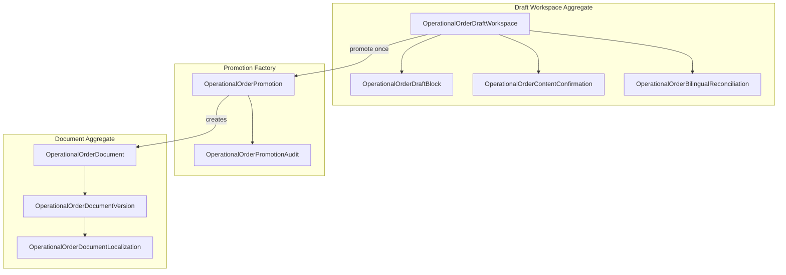
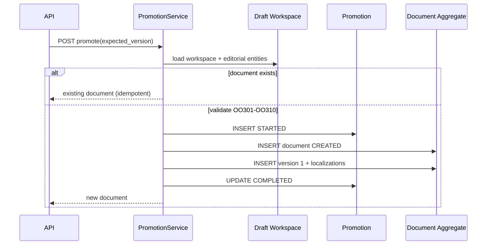

# OO-IMP-003 — Official Draft Package and Document Aggregate Creation

**Status:** Implemented (local)  
**Revision:** `y9z0a1b2c3d4`  
**Down revision:** `x8y9z0a1b2c3`  
**Package:** `app/operational_orders/`

First Operational Orders work package introducing **DocumentId** and the immutable **Document Aggregate** snapshot.

---

## Proposed design (architecture review)

### Aggregate boundary

| Aggregate | Root | Lifecycle | Mutability |
|---|---|---|---|
| Draft Workspace | `OperationalOrderDraftWorkspace` | Workspace stages (`SUBMITTED` → `EDITORIAL_PACKAGE_READY` → `DOCUMENT_PROMOTED`) | Frozen after promotion (OO-IMP-003B) |
| Document Aggregate | `OperationalOrderDocument` | Document lifecycle (`CREATED` → future states) | Immutable snapshot at promotion |

Workspace and Document are **independent aggregates**. `workspace_id` on the document is provenance only. Post-promotion workspace edits do not alter the aggregate.

> **OO-IMP-003B supersession:** At OO-IMP-003 ship, workspace remained mutable after promotion (intentional MVP debt). OO-IMP-003B freezes workspace to `DOCUMENT_PROMOTED` and blocks mutating commands. See [OO-IMP-003B](OO-IMP-003B-workspace-freeze-drift-advisory.md).

### Idempotent promotion model

Per UDE-004 PR2: **one document per workspace**. Repeated `POST /workspaces/{id}/promote` returns the existing aggregate (`idempotent_replay: true`, HTTP 200). No second document is created.

### Promotion architecture

`PromotionService` is a **Document Aggregate Factory** — not a copy command.

```text
validate preconditions (OO301–OO310)
  ↓
PROMOTION_STARTED audit
  ↓
freeze editorial package snapshot (fingerprints + block order)
  ↓
create OperationalOrderDocument (status=CREATED)
  ↓
create Version 1 (is_current=true)
  ↓
create localization snapshots (RU + KK)
  ↓
append provenance (PROMOTED_FROM_WORKSPACE, SNAPSHOT_CREATED, DOCUMENT_VERSION_CREATED)
  ↓
PROMOTION_COMPLETED audit
  ↓
freeze workspace to DOCUMENT_PROMOTED (OO-IMP-003B)
```

At initial OO-IMP-003 implementation, promotion did not change workspace stage. OO-IMP-003B added `freeze_workspace()` as the final promotion step.

### Snapshot model

| Field | Source |
|---|---|
| `official_text` | `workspace_effective_text ?? submitted_text` at promotion time |
| `content_fingerprint` | SHA-256 of official text |
| `source_workspace_block_version` | Block version at promotion |
| `source_confirmation_ids` | Active confirmations matching fingerprint |
| `source_reconciliation_id` | Active reconciliation for RU/KK pair |
| `snapshot_fingerprint` | Hash of ordered localization fingerprints |
| `workspace_fingerprint` | Hash of workspace version + blocks + reconciliations |

### Lifecycle initialization

First lifecycle state: **`CREATED`**. Future states (`READY_FOR_SIGNATURE`, `SIGNED`, `REGISTERED`, `VOIDED`) are defined in contracts but not implemented.

---

## Scope

Implemented:

- Document aggregate ORM entities and tables
- Promotion service (aggregate factory)
- Promotion validation (`OO301`–`OO310`)
- Append-only promotion audit
- Workspace provenance extensions
- REST API for promote + document read
- Permission `OPERATIONAL_ORDERS_PROMOTE`
- Alembic migration `y9z0a1b2c3d4`

Deferred:

- Signing, registration, official number, journal, archive, void, execution
- PDF/HTML rendering, notifications, frontend UI

---

## Aggregate diagram



---

## Promotion sequence



---

## New ORM entities

| Entity | Table |
|---|---|
| `OperationalOrderDocument` | `operational_order_documents` |
| `OperationalOrderDocumentVersion` | `operational_order_document_versions` |
| `OperationalOrderDocumentLocalization` | `operational_order_document_localizations` |
| `OperationalOrderPromotion` | `operational_order_promotions` |
| `OperationalOrderPromotionAudit` | `operational_order_promotion_audit` |

---

## API matrix

| Method | Path | Permission | Notes |
|---|---|---|---|
| POST | `/api/operational-orders/workspaces/{workspace_id}/promote` | `OPERATIONAL_ORDERS_PROMOTE` + org scope + `EDITORIAL_PACKAGE_READY` | Idempotent |
| GET | `/api/operational-orders/documents/{document_id}` | promote or intake read + scope | |
| GET | `/api/operational-orders/documents/{document_id}/versions` | same | |
| GET | `/api/operational-orders/documents/{document_id}/versions/{version}` | same | Includes localizations |
| GET | `/api/operational-orders/documents/{document_id}/localizations` | same | Current or `?version_number=` |

---

## Permission matrix

| Action | Permission | Scope | Stage gate |
|---|---|---|---|
| Promote | `OPERATIONAL_ORDERS_PROMOTE` | submitting org unit | `EDITORIAL_PACKAGE_READY` |
| Read document | `OPERATIONAL_ORDERS_PROMOTE` or intake read/operate | document org unit | — |

Privileged users bypass permission checks.

---

## Validation matrix (OO301–OO310)

| Code | Condition |
|---|---|
| OO301 | Workspace not `EDITORIAL_PACKAGE_READY` |
| OO302 | Missing RU or KK localization |
| OO303 | Missing content confirmation |
| OO304 | Missing bilingual reconciliation |
| OO305 | Workspace version conflict (`OO_PROMOTION_VERSION_CONFLICT`, HTTP 409) |
| OO306 | Promotion already exists (handled idempotently — no error) |
| OO307 | Snapshot fingerprint mismatch (internal guard) |
| OO308 | Active translation assignment |
| OO309 | Open blocking clarification |
| OO310 | Stale workspace / reconciliation / localization state |

---

## Migration

- **Revision:** `y9z0a1b2c3d4`
- **Down revision:** `x8y9z0a1b2c3`
- Creates 5 tables, extends provenance action CHECK, seeds `OPERATIONAL_ORDERS_PROMOTE`

---

## Tests

`tests/operational_orders/test_promotion.py`:

- Promotion creates document aggregate + version 1 + localizations
- Workspace edit after promotion does not change aggregate
- Idempotent repeated promotion
- Blocked: no reconciliation, no confirmations, no RU, no KK, stale version
- Authorization and cross-document isolation

Run:

```bash
alembic upgrade head
pytest tests/operational_orders/ -q
pytest tests/document_engine/ -q
pytest tests/personnel_orders/characterization/ -q
```

---

## Personnel Orders

**Unchanged.** No modifications to `app/db/models/personnel_orders.py`, PO services, or PO migrations.

---

## Readiness for next WP

OO-IMP-003 delivers:

- Persistent `DocumentId` and immutable Version 1 snapshot
- `CREATED` lifecycle entry point
- Provenance link `workspace_id` → `document_id`

Next WP candidates:

- OO-IMP-004: `READY_FOR_SIGNATURE` lifecycle transition
- UDE-005 lifecycle orchestration integration
- Official draft package rendering (PDF/HTML deferred)
