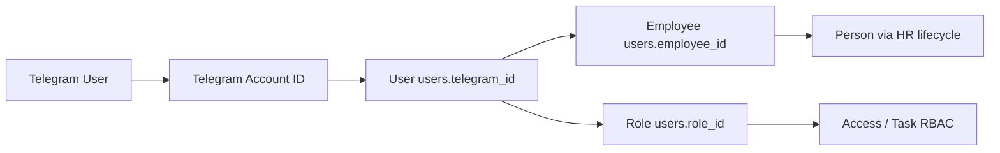

# OPS-007 — Telegram Bot Operational Audit

**Status:** Audit complete (read-only)  
**Date:** 2026-06-21  
**Scope:** Architecture, database, identity integrity, permissions, commands, operational risk  
**Constraints honored:** No schema changes, no production mutations, no Telegram sends, no bot behavior changes

---

## Executive summary

Telegram integration is a **standalone polling bot** (`corpsite-bot/`) plus a **backend bind API** (`app/tg_bind.py`). The **authoritative bind store** is `users.telegram_id` (TEXT). Legacy table `tg_bindings` exists in schema but is **unused by application code**.

**Primary authorization key:** `telegram_id` → `user_id` (via `/auth/self-bind`), then backend RBAC uses **`user_id` + `role_id`** from DB. **`employee_id` and `login` are not used** in the bot layer.

**Critical operational gaps identified:**

| Severity | Finding |
|----------|---------|
| **HIGH** | `/events` and `/history` resolve identity from **local JSON** (`bindings.json`), not DB — diverges from `/bind`, `/tasks`, `/whoami` |
| **HIGH** | `/unbind` clears **local JSON only** — does not clear `users.telegram_id` (DB bind persists) |
| **HIGH** | Bot `/tasks/*` calls use `X-User-Id` + internal token, but `/tasks` routes require **JWT Bearer** (`get_current_user`) — auth path mismatch |
| **MEDIUM** | Two local JSON stores (`bot_bindings.json` vs `bindings.json`) with different consumers |
| **MEDIUM** | No DB unique constraint on `telegram_id`; app-level conflict checks only |
| **MEDIUM** | `telegram_bound_at` / `telegram_username` not written on bind consume |
| **LOW** | Legacy `tg_bindings` table still in schema; type drift BIGINT vs TEXT |

**Identity integrity counts (local dev DB, 2026-06-21):**

| Check | Count |
|-------|-------|
| Total users | 356 |
| Users with `telegram_id` | 0 |
| Legacy `tg_bindings` rows | 0 |
| C2: Telegram bound, no employee | 0 |
| C3: Employee+user, no Telegram | 7 |
| C5: Duplicate `telegram_id` | 0 |
| C6: Service account with Telegram | 0 |
| C7: Inactive user with Telegram | 0 |

> **Production:** Re-run `scripts/ops/ops007_telegram_integrity_counts.py` or `docs/ops/OPS-007-telegram-integrity-audit.sql` on VPS with read-only session for live counts.

---

## Phase A — Architecture inventory

### A.1 Identity chain (target model)



**Operational bind path (implemented):**

```
Telegram User → users.telegram_id → user_id → role_id → task/API permissions
                              ↘ employee_id (HR linkage, ADR-044 R2)
```

Person → EmployeeIdentity → Employee is **upstream of User** in ADR-044; Telegram bind attaches at **User** layer only.

### A.2 Bot entrypoints

| Component | Path | Mode |
|-----------|------|------|
| Bot main | `corpsite-bot/src/bot/bot.py` | **Long polling** (`app.run_polling`) — no webhook |
| Events poller | `corpsite-bot/src/bot/events_poller.py` | Background asyncio loop; delivery-queue or per-user fallback |
| Bind API | `app/tg_bind.py` | FastAPI router mounted in `app/main.py` |

### A.3 Bind / auth flow

```
Web UI (Profile)
  POST /me/tg-bind-code  [JWT or X-User-Id + internal token]
    → in-memory one-time code (TTL 30 min)

Telegram: /bind <code>
  POST /tg/bind/consume  [X-Bot-Bind-Token]
    → UPDATE users.telegram_id
  POST /auth/self-bind  [X-Telegram-User-Id]
    → { user_id }

Subsequent bot commands
  POST /auth/self-bind → user_id (10 min cache in tasks handler)
  API calls: X-User-Id + X-Internal-Api-Token
```

### A.4 User / employee resolution

| Layer | Resolution |
|-------|------------|
| Bot → User | `POST /auth/self-bind` lookup on `users.telegram_id` |
| User → Employee | `users.employee_id` FK (not consulted by bot) |
| User → Role | Backend `load_user_context()` on `user_id` |
| Directory display | `directory_service._fetch_linked_user()` joins employee → user → telegram fields |

### A.5 Role / permission checks

| Location | Check |
|----------|-------|
| Bot `/unbind` | `tg_user_id in ADMIN_TG_IDS` (env) |
| Bot `/tasks`, `/whoami`, `/bind` | Bound user via `self-bind` (404 → "not bound") |
| Bot `/events` | Local `get_binding(tg_user_id)` from `bindings.json` |
| Backend `/meta/*` | `require_uid` + `users.telegram_id IS NOT NULL` |
| Backend `/tasks/*` | JWT `get_current_user` → `role_id`, org scope, FSM gates |
| Event delivery enqueue | Active user + non-empty `telegram_id` (`app/events.py`) |

### A.6 Authorization source summary

| Identifier | Used for bot auth? | Role |
|------------|-------------------|------|
| `telegram_id` | Identity lookup | Maps TG → `user_id` |
| **`user_id`** | **Primary** | Impersonation header for API |
| **`role_id`** | Backend only | Task RBAC after user resolved |
| `employee_id` | Not in bot | HR/directory only |
| `login` | Not in bot | Web login + bind code issuance |

### A.7 Related file inventory

#### Bot package
- `corpsite-bot/src/bot/bot.py` — entry, handler registration, polling
- `corpsite-bot/src/bot/events_poller.py` — push notifications
- `corpsite-bot/src/bot/events_renderer.py` — event message formatting
- `corpsite-bot/src/bot/ux.py` — UX helpers
- `corpsite-bot/src/bot/handlers/start.py`
- `corpsite-bot/src/bot/handlers/bind.py`
- `corpsite-bot/src/bot/handlers/unbind.py`
- `corpsite-bot/src/bot/handlers/whoami.py`
- `corpsite-bot/src/bot/handlers/tasks.py`
- `corpsite-bot/src/bot/handlers/events.py`
- `corpsite-bot/src/bot/integrations/corpsite_api.py`
- `corpsite-bot/src/bot/integrations/meta_api.py`
- `corpsite-bot/src/bot/storage/bindings.py` — `bindings.json`
- `corpsite-bot/src/bot/storage/cursor_store.py`
- `corpsite-bot/requirements.txt`, `.env.example`

#### Backend
- `app/tg_bind.py` — bind code, consume, self-bind
- `app/auth.py` — JWT, `/auth/me` telegram fields
- `app/meta.py` — bound gate for meta
- `app/events.py` — telegram delivery enqueue
- `app/task_events.py` — delivery queue, `/tasks/me/events`
- `app/services/tasks_router.py` — task CRUD (JWT)
- `app/services/tasks_service.py` — RBAC by role_id
- `app/security/directory_scope.py` — `require_uid`, internal token
- `app/directory/working_contacts_routes.py` — telegram in working contacts
- `app/services/directory_service.py` — employee → user telegram
- `app/directory/contacts_routes.py` — contacts.telegram_*
- `app/errors.py` — TGBIND_* codes

#### Frontend
- `corpsite-ui/components/TelegramBindPanel.tsx`
- `corpsite-ui/app/profile/_components/ProfilePageClient.tsx`
- `corpsite-ui/lib/api.ts` — `apiCreateTelegramBindCode`
- `corpsite-ui/app/directory/employees/_components/EmployeeAccountSections.tsx`
- `corpsite-ui/app/directory/working-contacts/_components/*`

#### Tests / ops scripts
- `tests/test_auth_me_telegram.py`
- `scripts/smoke_phase3_tg_bind.py`
- `scripts/pilot/qm_notifications_check.py`
- `scripts/ops/ops007_telegram_integrity_counts.py` *(this audit)*
- `docs/ops/OPS-007-telegram-integrity-audit.sql` *(this audit)*

#### Schema / ADR
- `alembic/versions/02b0d99063cd_baseline.py` — users telegram cols, tg_bindings
- `docs/adr/ADR-044-phase-r2-validation.sql` — R2.1-S5 telegram/employee check
- `docs/adr/ADR-005-events-poller.md`, `ADR-022-events-delivery-queue-source-of-truth.md`

---

## Phase B — Database inventory

### B.1 Tables

| Table / store | Purpose | PK | FKs | Active usage |
|---------------|---------|----|----|--------------|
| **`users.telegram_id`** | Auth bind (source of truth) | `user_id` | `employee_id` → employees, `role_id` → roles | **Active** — bind, self-bind, delivery |
| **`users.telegram_username`** | Display / `/auth/me` | — | — | Read only; **not set on bind** |
| **`users.telegram_bound_at`** | Bind timestamp | — | — | Schema only; **not written** |
| **`tg_bindings`** | Legacy bind map | `tg_user_id` | `user_id` → users (UNIQUE) | **Unused** in app code |
| **`contacts.telegram_*`** | Directory contact info | `contact_id` | none to users | **Separate** from auth bind |
| **`task_event_deliveries`** | Outbound notifications | `(audit_id, user_id, channel)` | user_id → users | **Active** when `channel='telegram'` |
| **`notifications`** | General notifications enum | varies | recipient_user_id | Enum includes `telegram` |
| **In-memory `_CODES`** | One-time bind codes | code hash | — | Ephemeral, not persisted |
| **`bindings.json`** | Bot local tg→user map | — | — | `/events`, `/unbind` only |
| **`bot_bindings.json`** | Bot poller fallback | — | — | Per-user poll mode only |

### B.2 Row counts (local dev DB)

| Metric | Count |
|--------|-------|
| `users` | 356 |
| Users with non-empty `telegram_id` | 0 |
| `tg_bindings` | 0 |
| `contacts` with telegram fields | 9 |
| `task_event_deliveries` (telegram) | 0 |

### B.3 Orphan / duplicate checks (local)

| Check | Result |
|-------|--------|
| Orphan `tg_bindings.user_id` | 0 |
| Duplicate `telegram_id` across users | 0 |
| `tg_bindings` drift from `users.telegram_id` | 0 |

---

## Phase C — Identity integrity audit

Checks defined in `docs/ops/OPS-007-telegram-integrity-audit.sql` and `scripts/ops/ops007_telegram_integrity_counts.py`.

| # | Condition | Local count | Notes |
|---|-----------|-------------|-------|
| 1 | Telegram linked but no User | N/A (structural) | `telegram_id` is column on `users`; orphan TG IDs cannot exist without user row |
| 2 | User linked (TG set) but no Employee | **0** | ADR R2.1-S5 check |
| 3 | Employee + active user but no Telegram | **7** | Expected for users not yet bound |
| 4 | Multiple Telegram per User | **0** | Single column — N/A |
| 5 | Multiple Users per Telegram | **0** | No duplicates locally |
| 6 | Service accounts with Telegram | **0** | Heuristic: login/full_name markers |
| — | Inactive users with Telegram | **0** | Delivery filter excludes inactive |
| — | Legacy `tg_bindings` drift | **0** | Table empty locally |

**C1 (orphan telegram records):** No separate telegram account table; orphans would appear as duplicate or invalid `telegram_id` values — C5 covers duplicates.

---

## Phase D — Permission audit

### D.1 Evaluation points

| Endpoint / flow | Auth mechanism | Permission model | Deny behavior |
|-----------------|----------------|------------------|---------------|
| `POST /me/tg-bind-code` | JWT or internal `X-User-Id` | Authenticated user only | 401/403 TGBIND_* |
| `POST /tg/bind/consume` | `X-Bot-Bind-Token` | Bot secret | 403/409 conflicts |
| `POST /auth/self-bind` | `X-Telegram-User-Id` | TG must exist in DB | 404 not bound |
| `GET /meta/task-statuses` | `require_uid` + bound check | Must have `telegram_id` | 403 META_FORBIDDEN_NOT_BOUND |
| `GET /tasks/me/events` | `require_uid` | User scope | 401/403 |
| `GET/PATCH/POST /tasks/*` | **`get_current_user` (JWT only)** | `role_id`, org scope, FSM | 401/403/404 |
| Task actions (report/approve) | JWT → `can_report_or_update`, `can_approve` | Role + assignment scope | 403 |
| Event delivery poller | Service `EVENTS_INTERNAL_API_USER_ID` | Internal token | N/A (system) |
| Bot `/unbind` | `ADMIN_TG_IDS` | Hardcoded TG admin set | "Доступ запрещён" |

### D.2 Primary authorization source

**Confirmed:** Bot resolves **`user_id`** from `telegram_id`, then backend loads **`role_id`** from `users` for task RBAC. Neither `employee_id` nor `login` participates in bot authorization.

### D.3 Fallback behavior

| Scenario | Behavior |
|----------|----------|
| Not bound (self-bind 404) | Bot: "не привязаны" / bind instructions |
| Backend unreachable | Bot: generic unavailable message |
| 403 on task action | Bot: "Недостаточно прав" |
| `/events` without local JSON binding | "Вы не привязаны" **even if DB bind exists** |
| Missing JWT on `/tasks` | **401** from backend (bot does not obtain JWT) |

### D.4 Internal token vs JWT split

Endpoints accepting **`X-User-Id` + `X-Internal-Api-Token`** (via `require_uid`):

- `/auth/self-bind` (header-only TG)
- `/tg/bind/consume`, `/me/tg-bind-code`
- `/meta/task-statuses`
- `/tasks/me/events`
- `/tasks/internal/task-event-deliveries/*`

Endpoints requiring **JWT Bearer only**:

- All `/tasks` CRUD and action routes in `tasks_router.py`

`ENABLE_LEGACY_X_USER_ID` affects `require_uid` only, **not** `get_current_user`.

---

## Phase E — Functional audit (command inventory)

| Command | Handler | Permission gate | Target entity | Backend calls |
|---------|---------|-----------------|---------------|---------------|
| `/start` | `handlers/start.py` | None | — | None |
| `/bind` | `handlers/bind.py` | None (status check) | User bind state | `POST /auth/self-bind` |
| `/bind <code>` | `handlers/bind.py` | Valid code + bot token | `users.telegram_id` | `POST /tg/bind/consume`, self-bind |
| `/unbind <tg_id>` | `handlers/unbind.py` | `ADMIN_TG_IDS` | Local `bindings.json` | **None (DB untouched)** |
| `/whoami` | `handlers/whoami.py` | DB bind via self-bind | user_id | `POST /auth/self-bind` |
| `/tasks` | `handlers/tasks.py` | DB bind | Task list | `GET /tasks` *(JWT mismatch)* |
| `/tasks <id>` | `handlers/tasks.py` | DB bind + task RBAC | Task | `GET /tasks/{id}` |
| `/tasks <id> history` | `handlers/tasks.py` | DB bind + visibility | Task events | `GET /tasks/{id}/events` |
| `/tasks <id> update ...` | `handlers/tasks.py` | `can_report_or_update` | Task | `PATCH /tasks/{id}` |
| `/tasks <id> report ...` | `handlers/tasks.py` | `can_report_or_update` | Task | `POST .../actions/report` |
| `/tasks <id> approve/reject` | `handlers/tasks.py` | `can_approve` | Task | `POST .../actions/approve|reject` |
| `/events`, `/history` | `handlers/events.py` | **Local JSON bind** | User events | `GET /tasks/me/events` |
| `/ping` | `bot.py` | None | — | None |
| `/whereami` | `bot.py` | None | Chat metadata | None |
| *(unknown command)* | `bot.py` | None | — | Lists available commands |
| **Background poller** | `events_poller.py` | Internal service user | Delivery queue | `GET/POST .../task-event-deliveries/*` |

**Sub-workflows (poller):**

- **Delivery-queue mode:** Reads `telegram_chat_id` from `users.telegram_id` via backend queue
- **Per-user fallback:** Iterates `bot_bindings.json` (not DB)

---

## Phase F — Operational risk assessment

### HIGH

| ID | Risk | Evidence |
|----|------|----------|
| H-1 | **Split bind resolution** — `/events` uses local JSON; `/tasks` uses DB | `handlers/events.py` vs `handlers/tasks.py` |
| H-2 | **`/unbind` does not unbind DB** — operator may believe TG is detached while `users.telegram_id` remains | `handlers/unbind.py` → `remove_binding()` only |
| H-3 | **Bot task API auth mismatch** — client sends internal headers; server requires JWT | `corpsite_api.py` vs `tasks_router.py` + `get_current_user` |
| H-4 | **Broken identity chain visibility** — Telegram bound users without `employee_id` break ADR-044 Person→User chain | R2.1-S5 validation; run on prod |

### MEDIUM

| ID | Risk | Evidence |
|----|------|----------|
| M-1 | **Dual JSON stores** — `bindings.json` vs `bot_bindings.json` | `storage/bindings.py` vs `bot.py` BINDINGS_PATH |
| M-2 | **No DB UNIQUE on `telegram_id`** — race could duplicate bind | App checks in `tg_bind.py` only |
| M-3 | **Incomplete bind metadata** — `telegram_bound_at`, `telegram_username` not set on consume | `tg_bind.py` UPDATE sets only `telegram_id` |
| M-4 | **Legacy `tg_bindings` table** — schema drift risk if manually populated | Baseline migration, zero app references |
| M-5 | **In-memory bind codes** — lost on restart; no audit trail of code issuance | `_CODES` dict in `tg_bind.py` |
| M-6 | **Contacts vs users telegram planes** — `contacts.telegram_numeric_id` unrelated to auth bind | Separate directory entity |

### LOW

| ID | Risk | Evidence |
|----|------|----------|
| L-1 | **Type drift** — baseline BIGINT vs app TEXT for `telegram_id` | Casts `::text` throughout |
| L-2 | **UX** — mixed RU messages; `/bind` without code says "admin" in events error | Handler copy |
| L-3 | **`X-Telegram-Username` accepted but unused** | `auth_self_bind` |
| L-4 | **Admin unbind is TG-ID allowlist** — not tied to corpsite role model | `ADMIN_TG_IDS` env |

---

## Deliverables checklist

| # | Deliverable | Location |
|---|-------------|----------|
| 1 | OPS-007 audit report | `docs/ops/OPS-007-telegram-bot-operational-audit.md` (this document) |
| 2 | Architecture diagram | Phase A §A.1 (mermaid) |
| 3 | DB inventory | Phase B |
| 4 | Identity integrity findings | Phase C + `docs/ops/OPS-007-telegram-integrity-audit.sql` |
| 5 | Permission model findings | Phase D |
| 6 | Command inventory | Phase E |
| 7 | Risk assessment | Phase F |

---

## Recommended next steps (post-audit, superseded by OPS-007a for items 2–5)

These were **observations** from the audit. Items 2–5 addressed in OPS-007a (see section below):

1. Run integrity SQL on **VPS production** read-only session and append counts to this report.
2. ~~Unify bind resolution~~ — **Done (OPS-007a)**
3. ~~Align bot task auth~~ — **Done (OPS-007a internal API)**
4. ~~Fix `/unbind`~~ — **Done (OPS-007a)**
5. ~~Consolidate JSON bind stores~~ — **Deprecated behind flag (OPS-007a)**
6. Add DB UNIQUE index on `trim(telegram_id)` where not null (future migration — not in OPS-007).

---

## Production verification command

```bash
# VPS — read-only recommended
python scripts/ops/ops007_telegram_integrity_counts.py

# Or via psql
psql "$DATABASE_URL" -v ON_ERROR_STOP=1 -f docs/ops/OPS-007-telegram-integrity-audit.sql
```

---

## Audit attestation

- No schema migrations executed  
- No UPDATE/INSERT/DELETE on production  
- No Telegram messages sent  
- No bot code modified (audit phase only; OPS-007a modified bot separately)  
- Local DB queried read-only via SQLAlchemy SELECT only

---

## OPS-007a — Telegram Binding Unification (implementation)

**Status:** Implemented (backend + bot)  
**Date:** 2026-06-21  
**Scope:** Unify Telegram identity on `users.telegram_id`; internal bot API (Option A)

### Source of truth

| Layer | Before (audit) | After (OPS-007a) |
|-------|----------------|------------------|
| `/whoami`, `/bind` | DB via `/auth/self-bind` | DB via `POST /internal/bot/tg/resolve` |
| `/tasks` | `X-User-Id` + internal token vs JWT mismatch | DB resolve + `/internal/bot/tasks/*` |
| `/events`, `/history` | Local `bindings.json` | DB via internal resolve + `/internal/bot/tasks/me/events` |
| `/unbind` | Local JSON only | `POST /internal/bot/tg/unbind` clears `users.telegram_id` |

**Authoritative field:** `users.telegram_id` (TEXT). All bot authorization resolves Telegram → `user_id` through the backend.

### Deprecated local JSON (not deleted)

| File | Status |
|------|--------|
| `data/bindings.json` | No longer used for auth unless `TELEGRAM_LEGACY_JSON_BINDINGS=1` |
| `bot_bindings.json` (`BINDINGS_PATH`) | Events poller per-user fallback gated by same flag |

`get_binding()` in `corpsite-bot/src/bot/storage/bindings.py` returns `None` by default. Legacy JSON is **dev fallback only**.

### Internal bot API contract

**Prefix:** `/internal/bot`  
**Auth:** `X-Internal-Api-Token: $INTERNAL_API_TOKEN` + `X-Telegram-User-Id: <telegram_user_id>`

| Method | Path | Purpose |
|--------|------|---------|
| POST | `/internal/bot/tg/resolve` | Map `telegram_id` → `user_id` |
| POST | `/internal/bot/tg/unbind` | Self-unbind (clears DB, idempotent) |
| POST | `/internal/bot/tg/unbind/{target_tg_user_id}` | Admin unbind (actor TG in header) |
| GET | `/internal/bot/tasks` | List tasks (delegates to `tasks_router`) |
| GET/PATCH/POST | `/internal/bot/tasks/{id}[/report\|approve\|reject]` | Task mutations |
| GET | `/internal/bot/tasks/{id}/events` | Task event history |
| GET | `/internal/bot/tasks/me/events` | User's task events (`/events`, `/history`) |

**Implementation files:**

- `app/security/bot_internal_auth.py` — token + TG header + bound-user dependency; service-account block
- `app/tg_bot_internal_router.py` — routes above
- `app/tg_bind.py` — `resolve_user_id_by_telegram_id()`, `unbind_user_telegram()` (preserves `employee_id`, audit `ACCESS_CHANGED` with `source: telegram_unbind`)
- `corpsite-bot/src/bot/integrations/corpsite_api.py` — bot client uses internal paths

### `/unbind` behavior

- Clears `users.telegram_id` and `telegram_username` only
- Does **not** modify `employee_id`
- Idempotent: unknown or already-unbound TG returns `{ applied: false, telegram_bound: false }`
- Service accounts blocked (403)
- Audit event written when unbind applied

### Tests

`tests/test_ops007a_telegram_bot_internal.py`:

- TG resolve bound / unknown rejected
- Internal calls without token → 403
- Unbind clears DB, idempotent, preserves `employee_id`
- Service account blocked for bot tasks
- Task list via internal API
- Legacy JSON bindings disabled by default / opt-in flag

Run: `INTERNAL_API_TOKEN=... pytest tests/test_ops007a_telegram_bot_internal.py`

### Remaining risks (post-007a)

| Severity | Item |
|----------|------|
| MEDIUM | No DB UNIQUE on `telegram_id` — race still possible at app layer |
| MEDIUM | Legacy JSON files still on disk; dev flag could re-enable split resolution |
| MEDIUM | `telegram_bound_at` / `telegram_username` still not set on bind consume |
| LOW | Admin unbind still uses `ADMIN_TG_IDS` allowlist, not corpsite RBAC |
| LOW | `GET /meta/task-statuses` from bot may still use non-internal path if called |
| LOW | Legacy `tg_bindings` table unused; consider future cleanup migration |
