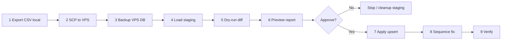

# Positions Sync Runbook — Phase 1 (ADR-014)

## Метаданные

| Поле | Значение |
|------|----------|
| **ADR** | ADR-014 (Accepted) |
| **Phase** | 1 — `positions` only |
| **HEAD (на момент подготовки)** | `618bd1c` |
| **Direction** | Local → VPS |
| **Статус runbook** | Draft — **импорт не выполнялся** |
| **VPS snapshot (2026-06-10)** | `positions = 1`, `employees with position_id=64 = 6` |

## Scope

| Включено | Исключено |
|----------|-----------|
| Таблица `public.positions` | `employees`, `users`, `org_units` |
| Колонки: `position_id`, `name`, `category` | Operational tables |
| Upsert by `position_id` | DELETE / TRUNCATE |
| Sequence fix | Auth fields |
| Dry-run + preview + apply | GitHub transfer |

## Expected Result

```
positions count:  1  →  96
position_id=64:     "Специалист"  →  "Заведующий гинекологическим отделением"
employees FK:       без изменений (все 6 остаются на position_id=64)
sequence:           setval ≥ MAX(position_id)
```

---

## Предварительные условия

### Local (Windows)

- Docker Desktop запущен
- Контейнер `corpsite-pg` с БД `corpsite`
- В local `SELECT count(*) FROM positions` = **96**
- OpenSSH client (`scp`) или WinSCP

### VPS (Linux)

- SSH-доступ: `ubuntu@46.247.42.47`
- Контейнер `corpsite-pg` запущен
- Путь проекта: `/opt/projects/corpsite/app`
- Каталог backup: `/opt/projects/corpsite/backups/` (создать при необходимости)
- **Никаких данных в GitHub** — только SCP/SFTP

### Роли оператора

1. **Local operator** — export + transfer
2. **VPS operator** — backup, staging, dry-run, apply, verify
3. Оба согласуют preview report перед `--apply`

---

## Пошаговый pipeline



| Шаг | Действие | Среда | Запись в prod |
|-----|----------|-------|:-------------:|
| 1 | Export CSV | Local | — |
| 2 | Transfer CSV | Local → VPS | — |
| 3 | Full DB backup | VPS | — |
| 4 | Load `stg_positions` | VPS | staging only |
| 5 | Dry-run diff | VPS | — |
| 6 | Preview report | VPS | — |
| 7 | Apply upsert | VPS | **да** |
| 8 | `setval` sequence | VPS | **да** |
| 9 | Verify SQL + API | VPS | read-only |

---

## Шаг 1 — Export CSV на Local (Windows)

### 1.1 Проверка источника

**PowerShell:**

```powershell
cd C:\path\to\corpsite\app

docker exec corpsite-pg psql -U postgres -d corpsite -c "SELECT count(*) FROM positions;"

docker exec corpsite-pg psql -U postgres -d corpsite -c `
  "SELECT position_id, left(name,60) AS name, category FROM positions WHERE position_id=64;"

docker exec corpsite-pg psql -U postgres -d corpsite -c `
  "SELECT position_id, left(name,60) AS name, category FROM positions ORDER BY position_id LIMIT 5;"
```

**Ожидание:** `count = 96`; id=64 = `Заведующий гинекологическим отделением`.

### 1.2 Export в CSV (UTF-8)

**PowerShell:**

```powershell
$stamp = Get-Date -Format "yyyyMMdd_HHmmss"
$outDir = ".\data\sync"
New-Item -ItemType Directory -Force -Path $outDir | Out-Null
$csvHost = "$outDir\positions_export_$stamp.csv"

docker exec corpsite-pg psql -U postgres -d corpsite -c `
  "\copy (SELECT position_id, name, category FROM public.positions ORDER BY position_id) TO STDOUT WITH CSV HEADER ENCODING 'UTF8'" `
  | Out-File -FilePath $csvHost -Encoding utf8NoBOM

# Проверка
(Get-Content $csvHost | Measure-Object -Line).Lines
# Ожидание: 97 строк (1 header + 96 data)

Select-String -Path $csvHost -Pattern "^64,"
```

**Альтернатива (файл внутри контейнера + docker cp):**

```powershell
docker exec corpsite-pg psql -U postgres -d corpsite -c `
  "\copy (SELECT position_id, name, category FROM public.positions ORDER BY position_id) TO '/tmp/positions_export.csv' WITH CSV HEADER ENCODING 'UTF8'"

docker cp corpsite-pg:/tmp/positions_export.csv "$outDir\positions_export_$stamp.csv"
```

### 1.3 Контроль качества CSV

| Проверка | Ожидание |
|----------|----------|
| Строк данных | 96 |
| Колонки | `position_id,name,category` |
| Кодировка | UTF-8 (кириллица читаема) |
| Дубликаты `position_id` | 0 |
| Пустые `name` | 0 |
| `category` | одно из: `leaders`, `medical`, `admin`, `technical`, `other` |

**PowerShell (валидация category):**

```powershell
$rows = Import-Csv $csvHost
$rows.Count
$rows | Where-Object { $_.position_id -eq "64" } | Format-List
$bad = $rows | Where-Object { $_.category -notin @("leaders","medical","admin","technical","other") }
$bad | Measure-Object
```

---

## Шаг 2 — Transfer CSV на VPS

### 2.1 SCP (Windows OpenSSH)

**PowerShell:**

```powershell
$csvHost = ".\data\sync\positions_export_YYYYMMDD_HHMMSS.csv"
$remoteDir = "/opt/projects/corpsite/data/sync"

ssh ubuntu@46.247.42.47 "mkdir -p $remoteDir"
scp $csvHost ubuntu@46.247.42.47:${remoteDir}/positions_export.csv
```

### 2.2 Проверка на VPS

```bash
ls -la /opt/projects/corpsite/data/sync/positions_export.csv
wc -l /opt/projects/corpsite/data/sync/positions_export.csv
head -n 3 /opt/projects/corpsite/data/sync/positions_export.csv
grep '^64,' /opt/projects/corpsite/data/sync/positions_export.csv
```

**Ожидание:** 97 строк; строка id=64 содержит `Заведующий гинекологическим отделением`.

> **Запрещено:** commit CSV в git, attach в GitHub Issue/PR.

---

## Шаг 3 — Backup VPS (обязательно до apply)

```bash
STAMP=$(date +%Y%m%d_%H%M%S)
BACKUP_DIR=/opt/projects/corpsite/backups
mkdir -p "$BACKUP_DIR"

# Full database backup
docker exec corpsite-pg pg_dump -U postgres -Fc corpsite \
  > "$BACKUP_DIR/corpsite_pre_positions_sync_${STAMP}.dump"

# Table-only backup (быстрый rollback positions)
docker exec corpsite-pg pg_dump -U postgres -Fc -t public.positions corpsite \
  > "$BACKUP_DIR/positions_only_pre_sync_${STAMP}.dump"

ls -lh "$BACKUP_DIR"/*${STAMP}*
sha256sum "$BACKUP_DIR/corpsite_pre_positions_sync_${STAMP}.dump"
```

Зафиксировать в ops-заметке (не в git с PII):

- имя файла backup
- SHA256
- `positions` count до = 1

---

## Шаг 4 — Staging import (без записи в prod)

```bash
CSV=/opt/projects/corpsite/data/sync/positions_export.csv

docker exec -i corpsite-pg psql -U postgres -d corpsite <<'SQL'
BEGIN;

DROP TABLE IF EXISTS stg_positions_import;
CREATE TABLE stg_positions_import (
    position_id BIGINT NOT NULL,
    name        TEXT NOT NULL,
    category    TEXT NOT NULL
);

SQL

# Load CSV into staging (copy file into container first)
docker cp "$CSV" corpsite-pg:/tmp/positions_export.csv

docker exec corpsite-pg psql -U postgres -d corpsite -c \
  "\copy stg_positions_import(position_id, name, category) FROM '/tmp/positions_export.csv' WITH CSV HEADER ENCODING 'UTF8'"

docker exec corpsite-pg psql -U postgres -d corpsite -c \
  "SELECT count(*) AS stg_count FROM stg_positions_import;"
```

**Ожидание:** `stg_count = 96`.

---

## Шаг 5 — Dry-run diff

```bash
docker exec corpsite-pg psql -U postgres -d corpsite <<'SQL'
-- Summary
SELECT 'prod' AS src, count(*) FROM public.positions
UNION ALL
SELECT 'stg', count(*) FROM stg_positions_import;

-- INSERT: in staging, not in prod
SELECT 'INSERT' AS action, s.position_id, s.name, s.category
FROM stg_positions_import s
LEFT JOIN public.positions p ON p.position_id = s.position_id
WHERE p.position_id IS NULL
ORDER BY s.position_id;

-- UPDATE: same PK, different fields
SELECT 'UPDATE' AS action,
       s.position_id,
       p.name AS prod_name,
       s.name AS stg_name,
       p.category AS prod_category,
       s.category AS stg_category
FROM stg_positions_import s
JOIN public.positions p ON p.position_id = s.position_id
WHERE p.name IS DISTINCT FROM s.name
   OR p.category IS DISTINCT FROM s.category
ORDER BY s.position_id;

-- SKIP count
SELECT 'SKIP' AS action, count(*) AS cnt
FROM stg_positions_import s
JOIN public.positions p ON p.position_id = s.position_id
WHERE p.name IS NOT DISTINCT FROM s.name
  AND p.category IS NOT DISTINCT FROM s.category;

-- FK impact: employees referencing positions that would exist after apply
SELECT e.employee_id, e.position_id, p.name AS current_position_name
FROM public.employees e
JOIN public.positions p ON p.position_id = e.position_id
WHERE e.position_id IN (
    SELECT s.position_id FROM stg_positions_import s
    JOIN public.positions p2 ON p2.position_id = s.position_id
    WHERE p2.name IS DISTINCT FROM s.name
       OR p2.category IS DISTINCT FROM s.category
)
ORDER BY e.employee_id;
SQL
```

### Expected dry-run summary

| Action | Count | Примечание |
|--------|------:|------------|
| INSERT | 95 | Новые position_id с local |
| UPDATE | 1 | Только `position_id=64` |
| SKIP | 0 | — |

---

## Шаг 6 — Preview report

Сохранить вывод dry-run в файл (на VPS, не в git):

```bash
REPORT=/opt/projects/corpsite/data/sync/positions_diff_$(date +%Y%m%d_%H%M%S).txt

{
  echo "=== Positions Sync Preview ==="
  date -Is
  echo "CSV: /opt/projects/corpsite/data/sync/positions_export.csv"
  docker exec corpsite-pg psql -U postgres -d corpsite -c \
    "SELECT count(*) prod FROM positions; SELECT count(*) stg FROM stg_positions_import;"
  echo "--- UPDATE rows ---"
  docker exec corpsite-pg psql -U postgres -d corpsite -c \
    "SELECT s.position_id, p.name prod_name, s.name stg_name, p.category prod_cat, s.category stg_cat
     FROM stg_positions_import s
     JOIN positions p ON p.position_id=s.position_id
     WHERE p.name IS DISTINCT FROM s.name OR p.category IS DISTINCT FROM s.category;"
  echo "--- INSERT count ---"
  docker exec corpsite-pg psql -U postgres -d corpsite -c \
    "SELECT count(*) FROM stg_positions_import s LEFT JOIN positions p ON p.position_id=s.position_id WHERE p.position_id IS NULL;"
} | tee "$REPORT"
```

**Gate для apply:** оператор подтверждает:

- [ ] INSERT = 95
- [ ] UPDATE = 1 (только id=64)
- [ ] FK employees: 6 rows on id=64 — label change only
- [ ] Backup SHA записан
- [ ] Нет неожиданных UPDATE/DELETE

---

## Шаг 7 — Apply (только после approval)

> **Не выполнять без подтверждения preview.**

```bash
docker exec corpsite-pg psql -U postgres -d corpsite <<'SQL'
BEGIN;

INSERT INTO public.positions (position_id, name, category)
OVERRIDING SYSTEM VALUE
SELECT position_id, name, category
FROM stg_positions_import
ON CONFLICT (position_id) DO UPDATE
SET name = EXCLUDED.name,
    category = EXCLUDED.category
WHERE public.positions.name IS DISTINCT FROM EXCLUDED.name
   OR public.positions.category IS DISTINCT FROM EXCLUDED.category;

COMMIT;
SQL
```

---

## Шаг 8 — Sequence fix

```bash
docker exec corpsite-pg psql -U postgres -d corpsite -c \
  "SELECT setval('public.positions_position_id_seq', (SELECT COALESCE(MAX(position_id), 1) FROM public.positions));"

docker exec corpsite-pg psql -U postgres -d corpsite -c \
  "SELECT MAX(position_id) AS max_id, last_value FROM public.positions_position_id_seq;"
```

**Ожидание:** `last_value` ≥ `max_id` (вероятно 96 или выше по local max id).

---

## Шаг 9 — Verify

### 9.1 SQL checks

```bash
docker exec corpsite-pg psql -U postgres -d corpsite <<'SQL'
SELECT count(*) AS positions_count FROM public.positions;

SELECT position_id, name, category
FROM public.positions
WHERE position_id = 64;

SELECT e.employee_id, e.position_id, p.name AS position_name
FROM public.employees e
JOIN public.positions p ON p.position_id = e.position_id
WHERE e.position_id = 64
ORDER BY e.employee_id;

-- FK integrity
SELECT e.employee_id, e.position_id
FROM public.employees e
LEFT JOIN public.positions p ON p.position_id = e.position_id
WHERE e.position_id IS NOT NULL AND p.position_id IS NULL;
SQL
```

**Ожидание:**

| Check | Expected |
|-------|----------|
| `positions_count` | 96 |
| id=64 name | `Заведующий гинекологическим отделением` |
| employees FK orphans | 0 rows |
| employees on id=64 | 6 rows, updated label |

### 9.2 API smoke (VPS)

```bash
# Health
curl -sf http://127.0.0.1:8000/health

# Login + list positions (privileged user)
TOKEN=$(curl -sf -X POST http://127.0.0.1:8000/auth/login \
  -H 'Content-Type: application/json' \
  -d '{"login":"admin","password":"<ADMIN_PASSWORD>"}' \
  | python3 -c "import sys,json; print(json.load(sys.stdin)['access_token'])")

curl -sf "http://127.0.0.1:8000/directory/positions?limit=200&offset=0" \
  -H "Authorization: Bearer $TOKEN" \
  | python3 -c "import sys,json; d=json.load(sys.stdin); print('total', d.get('total')); print('items', len(d.get('items',[])))"
```

**Ожидание:** `total = 96`, API HTTP 200.

### 9.3 UI smoke (manual)

| URL | Что проверить |
|-----|---------------|
| `http://46.247.42.47:3000/directory/positions` | Список ~96 должностей; id=64 с новым названием |
| `http://46.247.42.47:3000/directory/employees` | Фильтр «Должность» — полный список; 6 сотрудников показывают новое имя должности |
| `http://46.247.42.47:3000/directory/employees/<id>` | Поле «Должность» у pilot employees |
| Create employee drawer | Dropdown должностей — 96 options |

### 9.4 Cleanup staging

```bash
docker exec corpsite-pg psql -U postgres -d corpsite -c \
  "DROP TABLE IF EXISTS stg_positions_import;"
docker exec corpsite-pg rm -f /tmp/positions_export.csv
```

---

## position_id = 64 — отдельный разбор

### Происхождение VPS placeholder

Запись создана пилотным bootstrap `scripts/pilot/directory_prereq_bootstrap.sql`:

```sql
INSERT INTO public.positions (position_id, name) ...
VALUES (64, 'Специалист')
```

Цель: удовлетворить FK для `employees.position_id = 64` и `db/init/020_seed_roles_users_employees.sql` до появления полного справочника.

### Сравнение

| Поле | VPS (до sync) | Local (reference) | После sync |
|------|---------------|-------------------|------------|
| `position_id` | 64 | 64 | 64 (без изменений) |
| `name` | `Специалист` | `Заведующий гинекологическим отделением` | local value |
| `category` | `other` | (из local CSV) | из local CSV |

### Почему UPDATE безопасен

- `position_id` **не меняется** — все FK остаются валидными
- Меняется только display label в `positions.name` (и возможно `category`)
- `employees.position_id` остаётся `64` — **строки employees не затрагиваются**
- Pilot users/tasks **не зависят** от текста должности

### Employees на VPS с `position_id = 64` (snapshot 2026-06-10)

| employee_id | role (без PII) | org_unit_id | is_active |
|-------------|----------------|-------------|-----------|
| 1 | QM pilot employee | 44 | true |
| 2 | QM pilot employee | 44 | true |
| 3 | QM pilot employee | 44 | true |
| 4 | QM pilot employee | 44 | true |
| 5 | QM pilot employee | 44 | true |
| 7 | smoke test employee | 1 | true |

**Итого:** 6 employees (5 QM pilot + 1 smoke test). ФИО намеренно не включены в runbook (PII).

**UI-эффект:** в списке сотрудников и карточке сотрудника поле «Должность» изменится с `Специалист` на `Заведующий гинекологическим отделением` (join по `position_id`).

---

## UI-страницы, затронутые после импорта

| Страница / компонент | Путь | Что изменится |
|----------------------|------|---------------|
| **Должности** | `/directory/positions` | Основной экран: 1 → 96 записей; фильтр по category |
| **Персонал (список)** | `/directory/employees`, `/directory/personnel` | Dropdown фильтра «Должность»; колонка должности для 6 employees |
| **Карточка сотрудника** | `/directory/staff?employeeId={id}` (alias: `/directory/employees/[id]`) | Поле «Должность» (join `positions.name`) |
| **Создание сотрудника** | EmployeeCreateDrawer | Dropdown `positionOptions` — 96 вариантов |
| **Directory hub** | `/directory` (redirect → `/directory/staff`) | Список сотрудников — `position.name` в превью |
| **AppShell nav** | Sidebar «Должности» | Без изменений структуры; больше данных на странице |

### Не затронуты

| Область | Причина |
|---------|---------|
| `/tasks` | Tasks не хранят `position_id` |
| `/admin/regular-tasks` | Шаблоны привязаны к roles/units |
| Telegram bind | Не зависит от positions |
| RBAC / roles | `roles` table не меняется |
| Users list | `users` не имеют прямого FK на positions |

---

## Rollback Plan

### Когда откатывать

- `positions_count` ≠ 96 после apply
- FK orphans > 0
- Неожиданные UPDATE (не только id=64)
- API `/directory/positions` ≠ 200
- Оператор фиксирует регрессию в UI

### Вариант A — Table-only restore (быстрый, рекомендуемый)

```bash
# Остановить apply-повторы; восстановить только positions
BACKUP=/opt/projects/corpsite/backups/positions_only_pre_sync_YYYYMMDD_HHMMSS.dump

docker exec -i corpsite-pg pg_restore -U postgres -d corpsite \
  --clean --if-exists --table=public.positions < "$BACKUP"

docker exec corpsite-pg psql -U postgres -d corpsite -c \
  "SELECT setval('public.positions_position_id_seq', (SELECT COALESCE(MAX(position_id), 1) FROM public.positions));"

docker exec corpsite-pg psql -U postgres -d corpsite -c "SELECT count(*) FROM positions;"
docker exec corpsite-pg psql -U postgres -d corpsite -c \
  "SELECT position_id, name FROM positions WHERE position_id=64;"
```

**Ожидание после rollback:** count=1, id=64=`Специалист`.

### Вариант B — Full database restore (тяжёлый)

Использовать если table-only restore не сработал или были побочные изменения.

```bash
BACKUP=/opt/projects/corpsite/backups/corpsite_pre_positions_sync_YYYYMMDD_HHMMSS.dump

# MAINTENANCE: остановить backend/bot на время restore
docker exec -i corpsite-pg pg_restore -U postgres -d corpsite --clean --if-exists < "$BACKUP"
```

> **Внимание:** full restore откатит **все** изменения БД после backup, не только positions.

### Вариант C — Manual revert id=64 only (минимальный, если остальной import OK)

Только если apply прошёл, но id=64 неверный:

```sql
BEGIN;
UPDATE public.positions
SET name = 'Специалист', category = 'other'
WHERE position_id = 64;
COMMIT;
```

Не откатывает 95 INSERT — только для точечной коррекции label.

### Post-rollback verify

```bash
docker exec corpsite-pg psql -U postgres -d corpsite -c "SELECT count(*) FROM positions;"
curl -sf http://127.0.0.1:8000/health
# UI: /directory/positions shows 1 row
```

### Rollback checklist

- [ ] Backend работает (`/health` 200)
- [ ] `positions` count восстановлен
- [ ] id=64 = `Специалист` (если table-only rollback)
- [ ] 6 employees FK valid
- [ ] Запись в ops log: rollback reason + backup file used

---

## Risk Assessment

| Risk | Severity | Likelihood | Mitigation |
|------|----------|------------|------------|
| CSV encoding corruption (кириллица) | High | Medium | UTF-8 export; `grep '^64,'` на обеих сторонах |
| Accidental apply без dry-run | High | Low | Separate apply step; checklist gate |
| position_id=64 label surprise for pilot users | Low | Certain | Ожидаемо по ADR-014; comms to QM team |
| FK break on employees | High | Very Low | Upsert by PK only; employees untouched |
| Sequence gap on future INSERT | Medium | Low | Mandatory `setval` step |
| Backup failure | Critical | Low | Verify `ls -lh` + `sha256sum` before apply |
| CSV in GitHub | Critical | Low | SCP only; `.gitignore` for `data/sync/` |
| Wrong source DB (VPS export instead of local) | High | Low | Pre-check `count=96` on local |
| Smoke employee (id=7) shows unexpected title | Low | Certain | Acceptable; test data |

**Общая оценка Phase 1:** **LOW risk** при соблюдении pipeline (backup → dry-run → preview → apply).

---

## Ops Log Template (после выполнения)

Записать на VPS в `/opt/projects/corpsite/data/sync/ops.log` (не в git):

```
[YYYY-MM-DD HH:MM] Phase 1 positions sync
Operator: <name>
Local CSV: positions_export.csv (96 rows)
Backup: corpsite_pre_positions_sync_<stamp>.dump sha256=<hash>
Dry-run: INSERT=95 UPDATE=1 SKIP=0
Apply: YES/NO
Result count: <N>
position_id=64: <name after>
Verify API: OK/FAIL
Rollback: NO / <details>
```

---

## Следующий шаг (вне данного runbook)

1. Review данного runbook
2. Local operator: export + SCP
3. VPS operator: шаги 3–6 (без apply до approval)
4. После approval: шаги 7–9
5. Commit runbook: `docs(ops): add positions sync runbook`

---

## История

| Дата | Изменение |
|------|-----------|
| 2026-06-10 | Draft runbook; импорт не выполнялся |
