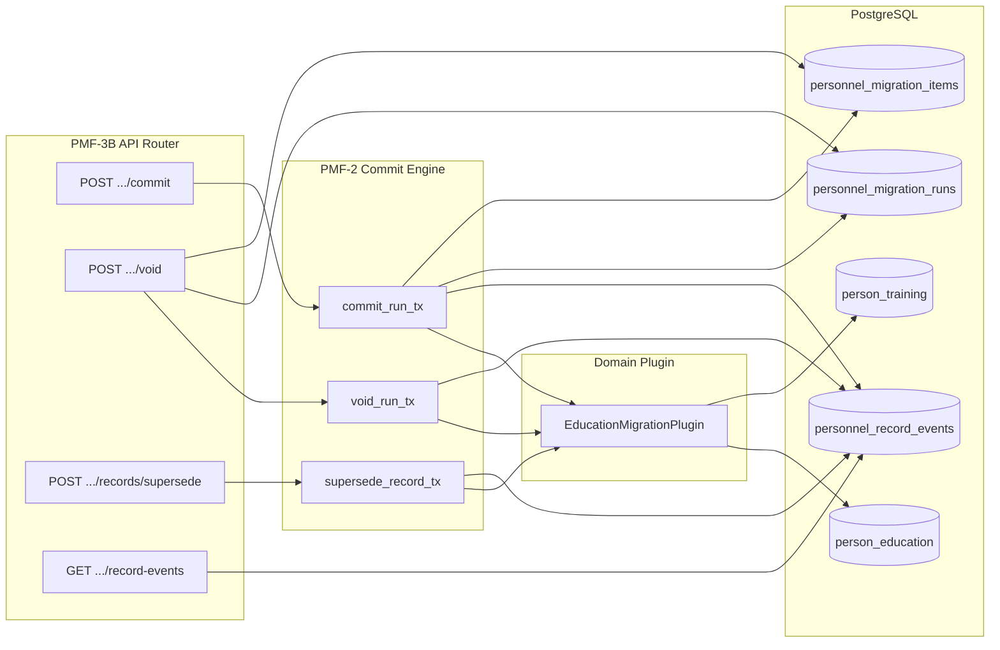

# PMF-3B — Mutation API Design (Personnel Migration Framework)

## Document status

| Field | Value |
|-------|-------|
| Phase | **PMF-3B** — design only |
| Status | **Draft for implementation** |
| Date | 2026-07-08 |
| Depends on | PMF-0 (ratified ADRs), PMF-1 (schema), PMF-2 (Commit Engine), PMF-3A (draft API) |
| Does **not** include | UI, Wizard, schema changes, bulk migration, new domains |

**Related documents**

| Document | Relationship |
|----------|--------------|
| [ADR-PMF-001](../adr/ADR-PMF-001-personnel-migration-framework.md) | Parent framework; commit/void/supersede semantics |
| [ADR-EDU-001](../adr/ADR-EDU-001-employee-education-migration-architecture.md) | Education plugin; `EDUCATION_*` event types |
| PMF-3A (implemented) | Draft-layer API prefix `/personnel-migration` |

---

## 1. Scope PMF-3B

### 1.1. Purpose

PMF-3B exposes **controlled mutation endpoints** over the existing PMF Commit Engine (PMF-2). It completes the backend REST surface for migration **write operations** that were intentionally excluded from PMF-3A.

PMF-3B is a **thin HTTP adapter**: validate auth, map DTOs, call service `*_tx` functions, map domain errors to HTTP, return serialized run/event payloads.

### 1.2. In scope

| Capability | Service delegate (PMF-2) |
|------------|---------------------------|
| Commit draft run → person-owned records | `commit_run_tx` |
| Void committed run (rollback, no DELETE) | `void_run_tx` |
| Supersede active education/training record | `supersede_record_tx` |
| Read business event journal | **new** `personnel_migration_record_events_query_service` (read-only; no schema change) |

Optional convenience reads (same phase, read-only):

| Capability | Notes |
|------------|-------|
| List migration runs by filter | Extends PMF-3A query layer; optional if time-constrained |
| List events for a run | Filter on `migration_run_id` |

### 1.3. Architectural invariants (must hold)

1. **Commit Engine is the sole writer** into `person_education` and `person_training`.
2. **API routers MUST NOT** contain `INSERT`/`UPDATE`/`DELETE` SQL against `person_*` tables.
3. **Business history** is published only via `personnel_record_events` (through Commit Engine / `emit_personnel_record_event`).
4. **No `personnel_migration_events`** table or endpoint.
5. **Physical DELETE** of personnel records is forbidden; void → `lifecycle_status=voided`, supersede → `superseded` + new `active` row.
6. **Import Layer** remains staging/provenance input only; PMF-3B does not mutate `hr_import_*` (staging freeze `review_status=migrated` deferred — see §8).

### 1.4. URL namespace decision

| Option | Example | Verdict |
|--------|---------|---------|
| A. ADR design path | `/directory/personnel/migration/...` | Rejected for PMF-3B — would break PMF-3A clients |
| B. PMF-3A prefix (**chosen**) | `/personnel-migration/...` | **Continue** — single router, already registered in `app/main.py` |
| C. Domain-nested only | `/personnel-migration/education/...` | Rejected as primary — framework endpoints stay domain-parameterized |

**Decision:** retain prefix `/personnel-migration` from PMF-3A. Domain-specific paths appear only where they add clarity (supersede body carries `domain_code`; optional alias documented in §3.4).

---

## 2. Endpoint catalog

### 2.1. Summary table

| # | Method | Path | Purpose | PMF-2 delegate |
|---|--------|------|---------|----------------|
| M1 | `POST` | `/personnel-migration/runs/{run_id}/commit` | Commit draft run | `commit_run_tx` |
| M2 | `POST` | `/personnel-migration/runs/{run_id}/void` | Void committed run | `void_run_tx` |
| M3 | `POST` | `/personnel-migration/records/supersede` | Supersede active record | `supersede_record_tx` |
| R1 | `GET` | `/personnel-migration/record-events` | List business events (filtered) | query service |
| R2 | `GET` | `/personnel-migration/record-events/{event_id}` | Event detail | query service |
| R3 | `GET` | `/personnel-migration/runs/{run_id}/record-events` | Events linked to run | query service (filter) |

**PMF-3A endpoints (unchanged, referenced):**

| Method | Path |
|--------|------|
| `GET` | `/personnel-migration/domains` |
| `POST` | `/personnel-migration/runs/draft` |
| `GET` | `/personnel-migration/runs/{run_id}` |
| `POST` | `/personnel-migration/runs/{run_id}/items` |

### 2.2. Alternative URLs considered

#### Supersede

| Alternative | Path | Pros / cons |
|-------------|------|-------------|
| **Recommended (M3)** | `POST /personnel-migration/records/supersede` | Matches `supersede_record_tx` signature; domain-agnostic; one route for education pilot |
| Domain-scoped | `POST /personnel-migration/domains/{domain_code}/records/supersede` | Explicit domain in URL; redundant with body `domain_code` |
| Resource-scoped | `POST /personnel-migration/domains/education/education-records/{id}/supersede` | Readable for education tab; premature before multi-domain supersede UI |
| ADR-EDU legacy | `POST /directory/personnel/migration/education/{employee_id}/commit` | Superseded by run-based commit in PMF-2; not used |

**Choice:** M3 with explicit `domain_code`, `record_table_name`, `record_id` in body — aligns with plugin registry and future domains without new routes.

#### Record events read

| Alternative | Path | Pros / cons |
|-------------|------|-------------|
| **Recommended (R1–R3)** | Under `/personnel-migration/record-events` | Clear separation from technical audit (`personnel_migration_runs/items`) |
| Nested under person | `GET /directory/persons/{person_id}/personnel-record-events` | Person-centric PF view; belongs to PMF-10 PF UI phase |
| Nested under employee | `GET /directory/employees/{id}/education/events` | Domain tab concern; PMF-4+ |

**Choice:** R1–R3 for migration/audit operators; PF tab may wrap same query service later.

---

## 3. Endpoint specifications

### 3.1. M1 — Commit run

```
POST /personnel-migration/runs/{run_id}/commit
```

#### Request

**Path**

| Param | Type | Validation |
|-------|------|------------|
| `run_id` | `int` | `>= 1` |

**Body:** `CommitRunRequest` (optional empty object allowed)

```json
{
  "confirm": true
}
```

| Field | Type | Required | Notes |
|-------|------|----------|-------|
| `confirm` | `bool` | no | Default `true`; explicit guard for future UI double-confirm |

No client-supplied `person_id` — resolved from run row (set at draft creation).

#### Response — `CommitRunResponse` (HTTP 200)

```json
{
  "run": { "...": "MigrationRunOut with items, run_status=committed" },
  "committed_items": [
    {
      "item_id": 1,
      "target_table_name": "person_education",
      "target_record_id": 42,
      "event_id": 100
    }
  ],
  "event_ids": [100]
}
```

Reuses `MigrationRunOut`, `MigrationItemOut` from PMF-3A schemas.

#### HTTP status codes

| Code | Condition |
|------|-----------|
| `200` | Successful commit |
| `401` | Unauthenticated |
| `403` | Not HR import admin / personnel admin |
| `404` | Run not found |
| `409` | Run not in `draft` (already committed/voided/failed) |
| `422` | Validation failed (no draft items; plugin validation errors on items) |
| `500` | Unexpected error |

#### Validation

| Rule | Source |
|------|--------|
| Run exists | Commit Engine |
| `run_status = draft` | Commit Engine → `PersonnelMigrationConflictError` |
| At least one item with `item_status = draft` | Commit Engine |
| Each item passes `plugin.validate_draft()` | Education plugin |
| Run has `person_id` | Set at draft creation (PMF-3A) |

#### Conflict scenarios

| Scenario | HTTP | Detail |
|----------|------|--------|
| Second commit on same run | `409` | Run already `committed` |
| Commit after void | `409` | Run `voided` |
| Item validation failure | `422` | `validation_errors` updated on items before rollback |

#### Idempotency

**Not idempotent.** Re-posting commit on a committed run returns `409`.

*Future (out of PMF-3B):* optional `Idempotency-Key` header storing outcome by `(run_id, key)` — requires no schema if stored in run `metadata` or separate idempotency table (deferred).

#### Transaction boundary

Single DB transaction via `commit_run_tx`:

```
BEGIN
  lock run (FOR UPDATE)
  load draft items (FOR UPDATE)
  validate all items
  plugin.write_records → INSERT person_education / person_training
  UPDATE items → committed + target refs
  UPDATE run → committed
  INSERT personnel_record_events (EDUCATION_MIGRATED per item)
COMMIT
```

On validation failure before write: transaction rolls back; item `validation_errors` update behavior matches PMF-2 (errors persisted only if partial update before raise — **implementation note:** PMF-3B should document that failed commit leaves run in `draft` with populated `validation_errors` on items when validation fails after item-level update; callers re-GET run).

---

### 3.2. M2 — Void run

```
POST /personnel-migration/runs/{run_id}/void
```

#### Request — `VoidRunRequest`

```json
{
  "void_reason": "Duplicate migration; HR requested rollback"
}
```

| Field | Type | Required | Validation |
|-------|------|----------|------------|
| `void_reason` | `string` | **yes** | Non-empty after trim; maps to DB CHECK on run/items |

#### Response — `VoidRunResponse` (HTTP 200)

```json
{
  "run": { "...": "MigrationRunOut, run_status=voided" },
  "voided_items": [
    {
      "item_id": 1,
      "target_table_name": "person_education",
      "target_record_id": 42,
      "event_id": 101
    }
  ],
  "event_ids": [101]
}
```

#### HTTP status codes

| Code | Condition |
|------|-----------|
| `200` | Successful void |
| `401` | Unauthenticated |
| `403` | Forbidden |
| `404` | Run not found; or target record not found for void |
| `409` | Run not `committed` (still draft or already voided) |
| `422` | Missing/blank `void_reason` |
| `500` | Unexpected error |

#### Validation

| Rule | Source |
|------|--------|
| `void_reason` required | Commit Engine `_normalize_void_reason` |
| `run_status = committed` | Commit Engine |
| Each committed item has `target_table_name` + `target_record_id` | Commit Engine |
| Target row exists with `lifecycle_status = active` | Plugin `void_target_record` |

#### Conflict scenarios

| Scenario | HTTP |
|----------|------|
| Void draft run | `409` |
| Void already voided run | `409` |
| Target already voided/superseded | `404` |

#### Idempotency

**Not idempotent.** Second void → `409`.

#### Transaction boundary

Single transaction via `void_run_tx`:

```
BEGIN
  lock run
  for each committed item:
    UPDATE person_* SET lifecycle_status=voided
    UPDATE item → voided + void_reason
    INSERT personnel_record_events (EDUCATION_VOIDED)
  UPDATE run → voided + void_reason
COMMIT
```

No `DELETE` on `person_education` / `person_training`.

---

### 3.3. M3 — Supersede record

```
POST /personnel-migration/records/supersede
```

#### Request — `SupersedeRecordRequest`

```json
{
  "domain_code": "education",
  "employee_context_id": 123,
  "record_table_name": "person_education",
  "record_id": 42,
  "replacement_payload": {
    "education_kind": "basic",
    "institution_name": "New University",
    "specialty": "Medicine"
  },
  "provenance": {
    "import_batch_id": null,
    "import_row_id": null,
    "source_field": "H",
    "source_text": "raw text",
    "parse_method": "manual_correction"
  }
}
```

| Field | Type | Required | Validation |
|-------|------|----------|------------|
| `domain_code` | `string` | yes | Must exist in `personnel_migration_domains`; enabled unless pilot flag |
| `employee_context_id` | `int` | yes | `>= 1`; must resolve to `employees.person_id` |
| `record_table_name` | `string` | yes | Plugin-allowed table (`person_education`, `person_training` for education) |
| `record_id` | `int` | yes | `>= 1` |
| `replacement_payload` | `object` | yes | Domain plugin field validation (same as draft payload mapping) |
| `provenance` | `object` | no | Passed to plugin; import FKs optional |

**Education alias (optional future route, same handler):**

```
POST /personnel-migration/domains/education/education-records/{record_id}/supersede
POST /personnel-migration/domains/education/training-records/{record_id}/supersede
```

Same DTO minus redundant `record_table_name` / `domain_code`. **Not required for PMF-3B MVP** — document only.

#### Response — `SupersedeRecordResponse` (HTTP 200)

```json
{
  "superseded_record_id": 42,
  "replacement_record_id": 57,
  "target_table_name": "person_education",
  "supersede_event_id": 200,
  "migrate_event_id": 201,
  "superseded_record": { "...": "optional PersonEducationOut snapshot" },
  "replacement_record": { "...": "optional PersonEducationOut snapshot" }
}
```

Core fields match `supersede_record_tx` return value. Optional nested record snapshots are **read-after-write** via query helpers (no direct API SQL).

#### HTTP status codes

| Code | Condition |
|------|-----------|
| `200` | Success |
| `401` / `403` | Auth |
| `404` | Record not found or not `active` |
| `422` | Domain disabled; missing `person_id`; invalid payload |
| `500` | Unexpected |

#### Validation

| Rule | Source |
|------|--------|
| `employees.person_id NOT NULL` | Commit Engine resolver |
| Old record `lifecycle_status = active` | Plugin |
| `replacement_payload` valid for table/kind | Education plugin |

#### Conflict scenarios

| Scenario | HTTP |
|----------|------|
| Record already superseded/voided | `404` |
| Domain disabled | `422` |
| Employee without person link | `422` |

#### Idempotency

**Not idempotent.** Re-supersede same `record_id` fails if no longer `active`.

#### Transaction boundary

Single transaction via `supersede_record_tx`:

```
BEGIN
  resolve person_id from employee_context_id
  UPDATE old person_* → lifecycle_status=superseded
  INSERT new person_* → lifecycle_status=active
  INSERT personnel_record_events (EDUCATION_SUPERSEDED on old)
  INSERT personnel_record_events (EDUCATION_MIGRATED on new)
COMMIT
```

**Note:** Supersede is **outside** a migration run (`run_id=0` in plugin context). Events have `migration_run_id=null` unless provenance links a run.

---

### 3.4. R1 — List record events

```
GET /personnel-migration/record-events
```

#### Query parameters — `RecordEventsListParams`

| Param | Type | Required | Notes |
|-------|------|----------|-------|
| `person_id` | `int` | no* | Person-owned filter |
| `employee_context_id` | `int` | no | Resolves to `person_id` if `person_id` omitted |
| `domain_code` | `string` | no | e.g. `education` |
| `record_table_name` | `string` | no | e.g. `person_education` |
| `record_id` | `int` | no | Specific record history |
| `event_type` | `string` | no | e.g. `EDUCATION_MIGRATED` |
| `migration_run_id` | `int` | no | Technical audit link |
| `limit` | `int` | no | Default 50, max 200 |
| `offset` | `int` | no | Default 0 |

\*At least one of `person_id`, `employee_context_id`, `migration_run_id`, or `record_id` required — prevents unbounded table scan.

#### Response — `RecordEventListResponse`

```json
{
  "items": [ { "...": "PersonnelRecordEventOut" } ],
  "total": 120,
  "limit": 50,
  "offset": 0
}
```

#### `PersonnelRecordEventOut`

| Field | Type |
|-------|------|
| `event_id` | `int` |
| `person_id` | `int` |
| `employee_context_id` | `int?` |
| `domain_code` | `string` |
| `record_table_name` | `string` |
| `record_id` | `int` |
| `event_type` | `string` |
| `event_at` | `string` (ISO8601) |
| `actor_id` | `string?` |
| `event_payload` | `object` |
| `migration_run_id` | `int?` |
| `migration_item_id` | `int?` |

#### HTTP status codes

| Code | Condition |
|------|-----------|
| `200` | Success (possibly empty list) |
| `401` / `403` | Auth |
| `422` | Missing required filter combination |
| `500` | Unexpected |

#### Idempotency

Read-only — fully idempotent.

#### Transaction boundary

Read-only `SELECT`; no transaction required (consistent read).

---

### 3.5. R2 — Get record event

```
GET /personnel-migration/record-events/{event_id}
```

#### Response

`PersonnelRecordEventOut` — HTTP `200`

| Code | Condition |
|------|-----------|
| `404` | Unknown `event_id` |

---

### 3.6. R3 — List events for run

```
GET /personnel-migration/runs/{run_id}/record-events
```

Shortcut for `GET /personnel-migration/record-events?migration_run_id={run_id}`.

Validates run exists (404 if not). Returns same list DTO as R1.

---

## 4. API ↔ Commit Engine interaction



### 4.1. Confirmed constraints

| Constraint | PMF-3B behavior |
|------------|-----------------|
| API does not write directly to `person_education` | ✅ All writes via `commit_run_tx` / `supersede_record_tx` → plugin |
| API does not write directly to `person_training` | ✅ Same |
| Commit Engine is sole write path | ✅ Router calls only `*_tx` service functions |
| No `personnel_migration_events` | ✅ Events read/write uses `personnel_record_events` only |
| Import Layer not SoT | ✅ No endpoints mutate `hr_import_*` in PMF-3B |

### 4.2. Service mapping (implementation checklist)

| Endpoint | Service function | New code in PMF-3B |
|----------|------------------|-------------------|
| M1 | `commit_run_tx(run_id, actor_id)` | Router + DTO only |
| M2 | `void_run_tx(run_id, actor_id, void_reason)` | Router + DTO only |
| M3 | `supersede_record_tx(...)` | Router + DTO only |
| R1–R3 | `list_record_events_tx(...)` / `get_record_event_tx(...)` | **New query service** (read-only SQL on `personnel_record_events`) |

**No changes** to plugin write logic unless API tests reveal DTO mapping gaps.

### 4.3. Auth & actor

| Item | Value |
|------|-------|
| Guard | Same as PMF-3A: `require_hr_import_admin_or_403` |
| `actor_id` | `str(user_id)` from JWT — passed to Commit Engine |
| Audit fields | `committed_by`, `voided_by`, `migrated_by`, `personnel_record_events.actor_id` |

---

## 5. Publication of `personnel_record_events`

### 5.1. Write path (PMF-2, exposed by PMF-3B)

Events are **append-only**. Emitted inside Commit Engine transaction:

| Operation | Event type(s) | When |
|-----------|---------------|------|
| Commit run | `EDUCATION_MIGRATED` | Per committed item |
| Void run | `EDUCATION_VOIDED` | Per voided target record |
| Supersede | `EDUCATION_SUPERSEDED` | On old record |
| Supersede | `EDUCATION_MIGRATED` | On new replacement record |

Future domains use plugin `event_type_for_*()` — API remains domain-agnostic.

### 5.2. Read path (PMF-3B)

PMF-3B adds **read API** only; no UPDATE/DELETE on events.

| Consumer | Endpoint |
|----------|----------|
| Migration audit UI (future) | R1, R3 |
| HR compliance export (future) | R1 with filters |
| PF history tab (PMF-10) | May reuse query service with `person_id` filter |

### 5.3. Event payload contract (education)

| Event | `event_payload` (minimum) |
|-------|---------------------------|
| `EDUCATION_MIGRATED` | `record_kind`, `source_kind`, `source_record_id`; optional `superseded_record_id` |
| `EDUCATION_VOIDED` | `void_reason` |
| `EDUCATION_SUPERSEDED` | `superseded_record_id`, `replacement_record_id` |

Full provenance remains on `person_*` rows, not duplicated in events (ADR-PMF-001 §4.8).

---

## 6. Alignment checklist

### 6.1. ADR-PMF-001

| Decision | PMF-3B |
|----------|--------|
| Single TX commit | ✅ M1 → `commit_run_tx` |
| Void rollback, no DELETE | ✅ M2 |
| Supersede lifecycle | ✅ M3 |
| `personnel_record_events` business journal | ✅ Write via engine; read R1–R3 |
| No `personnel_migration_events` | ✅ |
| `person_id` commit precondition | ✅ Enforced at draft (3A) + commit |
| Import Layer staging only | ✅ No import mutations |

### 6.2. ADR-EDU-001

| Element | PMF-3B |
|---------|--------|
| Target tables `person_education`, `person_training` | ✅ Via plugin only |
| `EDUCATION_*` events | ✅ |
| Employee entry / person owner | ✅ `employee_context_id` on supersede; run carries both |
| ADR §8.3 legacy routes under `/directory/personnel/migration/education/...` | **Not used** — superseded by PMF-3A/3B run model |

### 6.3. PMF-1 (schema)

| Table | PMF-3B touch |
|-------|--------------|
| `personnel_migration_domains` | Read only (domain validation) |
| `personnel_migration_runs` | Write via Commit Engine on commit/void |
| `personnel_migration_items` | Write via Commit Engine |
| `personnel_record_events` | Insert via engine; SELECT via query service |
| `person_education`, `person_training` | Insert/UPDATE lifecycle via engine only |

**No schema migration in PMF-3B.**

### 6.4. PMF-2 (Commit Engine)

| Function | Exposed |
|----------|---------|
| `create_draft_run_tx` | PMF-3A |
| `add_draft_item_tx` | PMF-3A |
| `commit_run_tx` | **PMF-3B M1** |
| `void_run_tx` | **PMF-3B M2** |
| `supersede_record_tx` | **PMF-3B M3** |

### 6.5. PMF-3A (draft API)

| Item | PMF-3B |
|------|--------|
| Prefix `/personnel-migration` | Continued |
| DTO reuse (`MigrationRunOut`, `MigrationItemOut`) | Extended in response wrappers |
| Auth guard | Unchanged |
| Draft endpoints | Unchanged |

---

## 7. Explicitly out of scope (PMF-3B)

| Item | Deferred to |
|------|-------------|
| Migration Wizard UI | PMF-3 (Wizard Shell) / PMF-5 pilot |
| Frontend / React pages | PMF-5+ |
| Bulk / batch migration | PMF-6 reconciliation |
| Import Layer writes (`review_status=migrated`, staging markers) | PMF-4 Education Plugin completion |
| New personnel domains (service record, certificates, …) | PMF-7, PMF-8 |
| DB schema changes | PMF-1 only (closed) |
| `GET /directory/personnel/employees/{id}/education` tab read API | PMF-4 / PF UI |
| Commit idempotency keys | Post-pilot |
| Auto-create `person_id` on commit (ADR-048) | Post-pilot |
| Control list generator | PMF-9 |
| Physical DELETE or purge jobs | Never (invariant) |
| `personnel_migration_events` table | Never (rejected) |

---

## 8. Implementation notes (for PMF-3B coding phase)

### 8.1. Files to add (expected)

| File | Purpose |
|------|---------|
| `app/api/personnel_migration_schemas.py` | Extend with mutation + event DTOs |
| `app/api/personnel_migration_router.py` | Add M1–M3, R1–R3 routes |
| `app/services/personnel_migration_record_events_query_service.py` | Read `personnel_record_events` |
| `tests/test_pmf_3b_mutation_api.py` | API integration tests |

### 8.2. Files to avoid changing

| Area | Reason |
|------|--------|
| `alembic/versions/*` | No schema change |
| `app/db/models/personnel_migration.py` | Stable PMF-1 |
| Frontend | Out of scope |
| Commit Engine logic | Unless test-driven minimal fix |

### 8.3. Test plan (minimum)

1. Commit draft run → `200`, `person_education` row exists, `EDUCATION_MIGRATED` event.
2. Double commit → `409`.
3. Void committed run → `200`, `lifecycle_status=voided`, `EDUCATION_VOIDED`.
4. Void without reason → `422`.
5. Supersede active education → old `superseded`, new `active`, two events.
6. List events by `migration_run_id` and `person_id`.
7. PMF-1, PMF-2, PMF-3A regression suite green.

---

## 9. Summary of architectural decisions

1. **Extend PMF-3A router** at `/personnel-migration` rather than introduce `/directory/personnel/migration` — avoids breaking existing draft clients and matches implemented PMF-3A.
2. **Run-scoped commit and void** (`POST .../runs/{run_id}/commit|void`) — aligns with `personnel_migration_runs/items` audit model from ADR-PMF-001 §4.5.
3. **Body-scoped supersede** (`POST .../records/supersede`) — matches `supersede_record_tx` and supports future domains without new routes.
4. **Separate record-events read API** — business journal distinct from technical migration run audit; person-filtered queries enforce bounded reads.
5. **Thin API layer** — zero direct SQL to `person_education` / `person_training`; all mutations delegate to PMF-2 `*_tx` functions inside single transactions.
6. **Non-idempotent mutations** — conflicts return `409`; explicit void reason required (`422` if missing).
7. **Staging freeze deferred** — PMF-3B does not mark `hr_import_normalized_records.review_status=migrated`; documented for PMF-4 plugin completion per ADR-EDU-001 §5.3.

---

## Status log

| Date | Event |
|------|-------|
| 2026-07-08 | PMF-3B mutation API design drafted |
