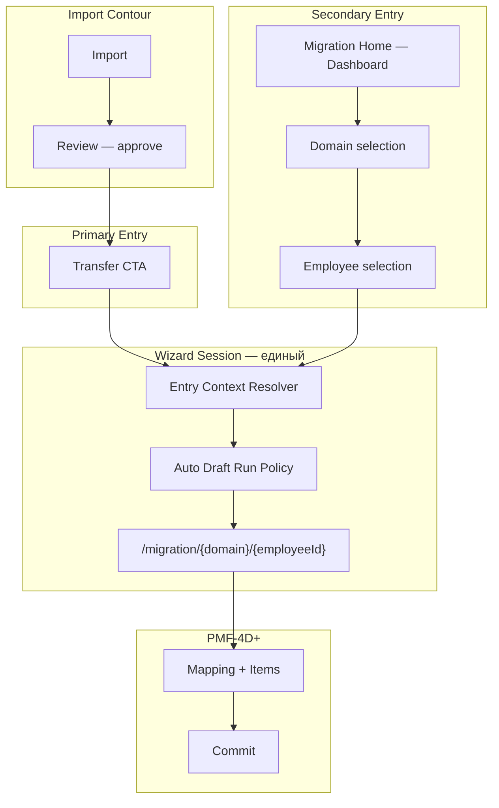
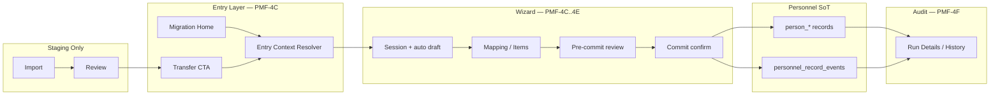

# PMF-4C — Entry Architecture Specification

| Поле | Значение |
|------|----------|
| **Work Package** | PMF-4C (architecture only) |
| **Тип** | Architecture Specification |
| **Статус** | **Ratified** — 2026-07-08 ([PMF-4C-ratification-record](./PMF-4C-ratification-record.md)) |
| **Дата** | 2026-07-08 |
| **Зависимости** | PMF-4A, PMF-4B, PMF-4B.1, PMF-3B API |
| **Связанные ADR** | [ADR-PMF-001](../adr/ADR-PMF-001-personnel-migration-framework.md), [ADR-EDU-001](../adr/ADR-EDU-001-employee-education-migration-architecture.md) |
| **Основа** | [PMF-4C Pre-Implementation Architecture Review](#appendix-a--pmf-4c-pre-implementation-review) |

---

## Цель документа

Зафиксировать **окончательную архитектуру входа** в Personnel Migration Wizard до начала реализации PMF-4C.

Документ является **контрактом** для всей дальнейшей реализации Wizard: session bootstrap, dual entry, navigation, deep links, auto-run policy, UX boundary.

**В scope:** entry layer, session lifecycle, navigation, deep links, entry context resolver, UX boundary.

**Вне scope:** код, backend, frontend, API, Alembic, commit.

---

## 1. Назначение документа

### 1.1. Что регулирует Entry Architecture

| Область | Описание |
|---------|----------|
| **Точки входа** | Primary (Review) и Secondary (Migration Home); дополнительные: history, deep link |
| **Wizard Session** | Определение, создание, продолжение, закрытие |
| **Auto Draft Run Policy** | Автоматическое создание/возобновление `personnel_migration_run` |
| **Entry Context Resolver** | Преобразование входных параметров в session context |
| **Маршруты** | Окончательное дерево URL для entry и session |
| **Deep links** | Допустимые и запрещённые query/path параметры |
| **UX Boundary** | Что видит HR vs что остаётся внутренней архитектурой |
| **Dual Entry Model** | Правила сосуществования двух сценариев запуска |

### 1.2. Что сознательно не регулирует

| Область | Где описано |
|---------|-------------|
| Items Grid, mapping UI | PMF-4D |
| Commit UI, void, supersede | PMF-4E |
| History UI, Run Details audit | PMF-4F |
| Pilot runbook, domain enablement | PMF-4G |
| Import internals, Review drawer logic | ADR-038, существующий Import contour |
| Commit Engine, domain plugins | ADR-PMF-001 §4.4, PMF-2 |
| PMF API contract | PMF-3B |
| Reconciliation mode | PMF-6 (future) |
| Candidate resolver API | PMF-5 (future); PMF-4D — client integration |

### 1.3. Связь с PMF-4A

[PMF-4A](./PMF-4A-migration-wizard-design.md) описывает **полный пользовательский процесс** Wizard: экраны, workflow, commit/history UX, разбиение PMF-4B–4G.

**PMF-4C Entry Architecture** — уточняющий контракт **только для entry layer**, принятый после Pre-Implementation Review:

| PMF-4A (as written) | PMF-4C (ratified entry) |
|---------------------|-------------------------|
| Employee search как focus PMF-4C | **Session bootstrap** как focus PMF-4C |
| `/migration/{domain}/candidates` как первый шаг | **Optional** secondary path; не primary для bootstrap |
| Deep links упомянуты | Deep links = **primary entry** из Review |
| `POST /runs/draft` как явное действие HR | `POST /runs/draft` = **auto policy** при mount session |
| Migration Home = dashboard | Migration Home = **Dashboard / Landing** (не primary workspace) |

PMF-4A остаётся valid для экранной модели, Items Grid, Commit UX. PMF-4C **не отменяет** PMF-4A — уточняет приоритеты входа и session contract.

---

## 2. Основные принципы

Следующие принципы **зафиксированы** и обязательны для всей реализации Wizard:

### P1. Migration Wizard — единый

Один **Wizard Shell** (`MigrationWizardShell` + session route) обслуживает все точки входа. Различается только **pre-fill context**, не архитектура session.

### P2. Точки входа могут различаться

Поддерживается **Dual Entry Model** (§3): primary из Review, secondary из Migration Home. Дополнительные входы: history resume, audit deep link.

### P3. Session всегда одна

Для пары `(domain_code, employee_id)` в активной работе существует **не более одной** открытой Wizard Session в UI. Технически — не более одного `draft` run (§5).

### P4. Commit Engine всегда один

Все входы ведут в один session route → один draft run → один commit path (`POST /personnel-migration/runs/{run_id}/commit`). Entry layer **не дублирует** commit logic.

### P5. Review является основным источником запуска

Для bootstrap pilot (education из Import) **primary path** = Import → Review → Transfer CTA → Wizard Session. Соответствует ADR-PMF-001 §4.2 CTA и целевой цепочке §2.

### P6. Migration Home остаётся Dashboard

Migration Home (`/directory/personnel/migration`) — **Landing / Dashboard PMF**: ориентация, process chain, roadmap, secondary entry. **Не** primary рабочий экран bootstrap.

### P7. Run невидим для HR

`personnel_migration_run` создаётся и возобновляется **автоматически**. HR работает с «сессией переноса» / «черновиком», не с «Migration Run».

### P8. `employee_id` entry, `person_id` ownership

UI entry — operational `employee_id`. Commit target — `person_id` (ADR-PMF-001 §13.4). Entry layer обязан проверять `person_id` до начала mapping.

### P9. Domain-agnostic entry contract

Entry Architecture **одинакова** для всех PMF domain plugins. Domain-specific поведение начинается **внутри** session (form slot, candidates — PMF-4D).

---

## 3. Dual Entry Model

### 3.1. Primary Entry — из Review (bootstrap)

Основной сценарий pilot и monthly bootstrap:

```text
Import
  ↓
Review (approve staging record)
  ↓
Transfer CTA («Перенести в кадровую карточку»)
  ↓
Wizard Session (auto bootstrap)
```

**Характеристики:**

| Аспект | Значение |
|--------|----------|
| Контекст | Оператор уже видит approved запись в Review drawer |
| Pre-fill | `domain_code`, `employee_id`, `candidate_id` |
| Действий до mapping | **1** (нажатие CTA) |
| Approved gate | Implicit — CTA доступен только для `review_status = approved` |
| Соответствие ADR | ADR-PMF-001 §4.2 CTA, ADR-EDU-001 §4.3 |

### 3.2. Secondary Entry — из Migration Home

Дополнительный сценарий: нет конкретной Review-записи, reconciliation (future), manual mode, повторный вход, audit re-entry.

```text
Migration Home (Dashboard)
  ↓
Domain (тип кадровых данных)
  ↓
Employee (выбор сотрудника)
  ↓
Wizard Session (auto bootstrap)
```

**Характеристики:**

| Аспект | Значение |
|--------|----------|
| Контекст | Оператор сам выбирает тип данных и сотрудника |
| Pre-fill | `domain_code` (из карточки), `employee_id` (из picker) |
| Approved gate | Explicit — показывать только approved candidates (PMF-4D) |
| Направление с Review | Home содержит CTA «Проверка записей» если записи не проверены (PMF-4B.1) |

### 3.3. Диаграмма Dual Entry



### 3.4. Правила сосуществования

1. **Один shell** — все входы открывают `/directory/personnel/migration/{domainCode}/{employeeId}`.
2. **Primary для bootstrap** — Review CTA обязателен для pilot (education); реализуется в PMF-4C (stub/deep link) или PMF-4D (полный CTA).
3. **Home не дублирует Review** — направляет в Review, если записи не проверены.
4. **Различается только resolver input** — `source=review | migration_home | history | deep_link`.
5. **Session route идентичен** — различие только в query params и pre-fill state.

---

## 4. Wizard Session

### 4.1. Определение

**Wizard Session** — UI-состояние активной работы оператора по переносу данных **одного сотрудника** в **одном домене**.

Session = маршрут + resolved context + привязанный draft run + локальный UI state (stepper step).

Session **не является** отдельной backend-сущностью. Backend anchor — `personnel_migration_run` (status `draft`).

### 4.2. Данные, определяющие Session

| Поле | Обязательность | Источник | Роль |
|------|----------------|----------|------|
| `domain_code` | **Обязательно** | path segment `{domainCode}` | Domain plugin selector |
| `employee_id` | **Обязательно** | path segment `{employeeId}` | Operational context (`employee_context_id`) |
| `run_id` | Условно | auto policy / query `?run_id=` | Draft run anchor |
| `candidate_id` | Опционально | query `?candidate_id=` (Review CTA) | Pre-select staging candidate |
| `person_id` | Resolved | `employees.person_id` via Directory API | Commit precondition |
| `source` | Обязательно (client) | Entry Context Resolver | UX hints, analytics |
| `batch_id` | Опционально | query `?batch_id=` | Filter candidates (PMF-4D) |
| `step` | Опционально | query `?step=` | Stepper override |

### 4.3. Когда создаётся Session

Session **создаётся** при навигации на:

```text
/directory/personnel/migration/{domainCode}/{employeeId}
```

**Триггеры:**

| Триггер | source |
|---------|--------|
| Review CTA click | `review` |
| Home → domain card → employee picker → continue | `migration_home` |
| Run Details «Продолжить редактирование» (draft) | `history` |
| Bookmark / shared URL with query params | `deep_link` |

**На mount session** (после guards):

1. Resolve employee context (ФИО, tab №, `person_id` status).
2. Execute Auto Draft Run Policy (§5).
3. Apply `candidate_id` pre-select (если передан).
4. Initialize workflow stepper (default: `scope` или `items` если candidate pre-selected).

### 4.4. Когда продолжается Session

Session **продолжается** (resume), если:

| Условие | Поведение |
|---------|-----------|
| Существует `draft` run для `(domain_code, employee_id)` | Auto policy возвращает `run_id`; UI загружает `GET /runs/{run_id}` |
| Передан `?run_id=` и run в статусе `draft` | Явный resume; валидация: run принадлежит тому же employee+domain |
| Оператор возвращается из Commit Result (failed 422) | Тот же run, step `review` или `items` |
| Browser back/forward в пределах session route | Client state restore; run_id из URL или session storage |

Session **не продолжается** из committed/voided run — только read-only Run Details (`/migration/runs/{runId}`).

### 4.5. Когда закрывается Session

Session считается **закрытой** (exit), когда:

| Событие | Переход |
|---------|---------|
| Успешный commit | Step `result` → CTA «Готово» → Home или domain tab (future) |
| Оператор нажимает «Выйти» / breadcrumb Home | Confirm if dirty local state → Home |
| Void committed run | Run Details (read-only); session route недоступен для edit |
| Auth loss / 403 | Forbidden panel; session abandoned |
| `person_id` blocker неразрешим | Blocker panel; session не переходит к mapping |

**Draft run** остаётся в backend до commit или explicit policy (future: expire stale drafts). UI может покинуть session — run сохраняется для resume.

---

## 5. Auto Draft Run Policy

### 5.1. Инвариант

> Пользователь **не должен** явно создавать Migration Run.

Run — технический контейнер сессии. HR не видит кнопку «Создать run».

### 5.2. Policy (зафиксировано)

При открытии Wizard Session (mount):

```text
1. IF query param run_id present AND run.status = draft
     AND run.domain_code = domain AND run.employee_context_id = employee_id
   THEN resume run_id

2. ELSE IF exists draft run for (domain_code, employee_id)
   THEN resume existing draft run
   (lookup: client recent list OR future GET /runs?domain=&employee_id=)

3. ELSE
   POST /personnel-migration/runs/draft
   { domain_code, employee_context_id, metadata: { source, candidate_id? } }
   → use returned run_id
```

### 5.3. Ограничения

| Правило | Enforcement |
|---------|-------------|
| Один active draft per `(domain, employee)` | Client policy; server may allow multiple — client picks latest draft |
| Не создавать новый draft если resume возможен | Client guard before POST |
| `person_id` missing | POST returns **422** — show blocker; **не** создавать orphan session state |
| Domain disabled | POST returns **422** / card disabled — redirect to Home |
| Committed run_id в query | Redirect to `/migration/runs/{runId}` (read-only) |

### 5.4. Workaround до PMF-3C

`GET /personnel-migration/runs?domain=&employee_id=` **не реализован** (PMF-3B gap).

**PMF-4C policy:**

| Механизм | Использование |
|----------|---------------|
| `?run_id=` deep link | Primary resume mechanism |
| Session storage / recent list | После create — сохранить `run_id` keyed by `{domain}:{employeeId}` |
| Re-POST draft | Только если нет cached run_id и нет `?run_id=` (создаст новый run) |

Документировать в runbook: оператору не нужно управлять этим — UI скрывает.

### 5.5. HR-facing labels (PMF-4B.1)

| Technical | HR-facing |
|-----------|-----------|
| `draft` run | «Черновик переноса» |
| Resume draft | «Продолжить незавершённый перенос» |
| New session (no draft) | «Начать перенос» (без упоминания run) |
| `run_id` | Только в Technical Information |

---

## 6. Контекст Session

### 6.1. Обязательно известно до открытия Wizard

| Поле | Когда обязательно | Как получить |
|------|-------------------|--------------|
| `employee_id` | Всегда | path segment или Review context |
| `domain_code` | Всегда | path segment, Review record `record_kind` mapping, или Home card |
| `person_id` | До mapping (commit precondition) | Resolve via Directory/employee API on mount |

### 6.2. Опционально известно при входе

| Поле | Источник | Влияние на UI |
|------|----------|---------------|
| `candidate_id` | Review CTA query | Pre-select candidate в stepper; skip scope step → items (PMF-4D) |
| `run_id` | Query / auto policy | Load existing draft items |
| `batch_id` | Query | Filter candidates list (PMF-4D) |
| `step` | Query | Open specific stepper step (`review`, `commit`, `result`) |

### 6.3. Что может отсутствовать

| Отсутствует | Допустимо когда | UI поведение |
|-------------|-----------------|--------------|
| `candidate_id` | Secondary entry (Home) | Показать candidate picker в PMF-4D |
| `run_id` | Первый вход | Auto create draft |
| `person_id` | Employee не связан с Person | **Blocker panel** — «Связать Person»; mapping disabled |
| `batch_id` | Всегда опционально | Показать все approved candidates |
| Approved candidates | Нет approved staging | Empty state — «Сначала проверьте записи в Review» + link |

### 6.4. Матрица контекста по entry source

| Поле | review | migration_home | history | deep_link |
|------|--------|----------------|---------|-----------|
| `domain_code` | ✓ implicit | ✓ from card | ✓ from run | ✓ path |
| `employee_id` | ✓ from record | ✓ from picker | ✓ from run | ✓ path |
| `candidate_id` | ✓ typical | — | — | optional |
| `run_id` | auto | auto | ✓ typical | optional |
| `person_id` | resolve | resolve | resolve | resolve |

---

## 7. Entry Context Resolver

### 7.1. Назначение

**Entry Context Resolver** — client-side механизм (функция/модуль), преобразующий входные параметры маршрута в **SessionBootstrapContext** для Wizard Session.

Не требует backend changes. Не является API endpoint.

### 7.2. SessionBootstrapContext (contract)

```typescript
// DESIGN ONLY — TypeScript contract for PMF-4C implementation
type EntrySource = "review" | "migration_home" | "history" | "deep_link";

type SessionBootstrapContext = {
  source: EntrySource;
  domain_code: string;
  employee_id: number;
  candidate_id: string | null;
  run_id: number | null;
  batch_id: number | null;
  initial_step: "scope" | "items" | "review" | "commit" | "result";
  person_id: number | null;
  person_id_resolved: boolean;
  employee_display_name: string | null;
};
```

### 7.3. Resolver по source

#### `source = review`

| Аспект | Значение |
|--------|----------|
| **Вход** | `/migration/{domain}/{employeeId}?candidate_id={key}` |
| **Обязательные params** | `domain_code` (path), `employee_id` (path) |
| **Опциональные params** | `candidate_id`, `batch_id` |
| **Автоматические действия** | Resolve employee; auto draft run; pre-select candidate; `initial_step = items` |
| **UX** | Header: «Перенос записи из проверки»; не показывать domain/employee pickers |

#### `source = migration_home`

| Аспект | Значение |
|--------|----------|
| **Вход** | Home → domain card → employee picker → `/migration/{domain}/{employeeId}` |
| **Обязательные params** | `domain_code`, `employee_id` |
| **Опциональные params** | `batch_id` |
| **Автоматические действия** | Resolve employee; auto draft run; `initial_step = scope` или `items` (если один candidate — future) |
| **UX** | Header: «Перенос: {domain_display_name} — {employee_name}»; breadcrumb через Home |

#### `source = history`

| Аспект | Значение |
|--------|----------|
| **Вход** | Run Details (draft) → «Продолжить редактирование» |
| **Обязательные params** | `run_id`, `domain_code`, `employee_id` |
| **Автоматические действия** | Validate run status = draft; load run; `initial_step` from run progress |
| **UX** | Banner: «Продолжение черновика от {date}» |

#### `source = deep_link`

| Аспект | Значение |
|--------|----------|
| **Вход** | Bookmark, shared URL, Import Card link (future), external |
| **Обязательные params** | `domain_code`, `employee_id` |
| **Опциональные params** | `candidate_id`, `run_id`, `batch_id`, `step` |
| **Автоматические действия** | Full resolver pipeline; infer best source from params |
| **UX** | Standard session header; no special casing |

### 7.4. Resolver pipeline (ordered)

```text
1. Parse route params: domainCode, employeeId
2. Parse query: candidate_id, run_id, batch_id, step
3. Infer source (explicit param ?source= or heuristic)
4. Validate domain enabled (GET /domains cache)
5. Fetch employee summary (Directory API)
6. Resolve person_id → set blocker if null
7. Execute Auto Draft Run Policy → obtain run_id
8. IF run_id + step → validate run status
9. Build SessionBootstrapContext
10. Render session shell OR blocker OR redirect
```

### 7.5. Ошибки resolver

| Условие | Действие |
|---------|----------|
| Invalid `employeeId` | 404 panel → link Home |
| Domain not found / disabled | Redirect Home + banner |
| `run_id` not found | Create new draft (policy step 3) |
| `run_id` committed | Redirect `/migration/runs/{runId}` |
| `person_id` null | Blocker panel (не redirect) |
| 403 auth | `MigrationForbiddenPanel` |

---

## 8. Navigation

### 8.1. Размещение

Wizard живёт в **HR operational contour** (ADR-045):

- Base: `/directory/personnel/migration/**`
- Layout: `PersonnelLayoutShell` + `PersonnelSubNav` (вкладка «Миграция»)
- Shell: `MigrationWizardShell` (PMF-4B)

### 8.2. Дерево маршрутов (окончательное)

```text
/directory/personnel/
  ├── import/
  │     └── review/                              # Review (existing) — Primary entry origin
  └── migration/
        ├── index                                # Migration Home (Dashboard)
        ├── [domainCode]/
        │     ├── page                           # Domain landing (optional; may redirect to Home)
        │     ├── employees/                     # Secondary: employee picker (PMF-4C)
        │     │     └── page
        │     └── [employeeId]/                  # ★ Wizard Session (PMF-4C core)
        │           └── page
        └── runs/
              └── [runId]/                       # Run Details — audit (PMF-4F)
                    └── page
```

**Примечание:** PMF-4A предлагал `/migration/{domain}/candidates`. PMF-4C уточняет:

- `/migration/{domain}/employees` — secondary employee picker (не candidates grid)
- Candidates grid — **внутри** session (PMF-4D), не отдельный обязательный route для bootstrap

### 8.3. Маршруты — summary table

| Route | Назначение | WP |
|-------|------------|-----|
| `/migration` | Migration Home — Dashboard | PMF-4B ✓ |
| `/migration/{domain}` | Domain context (optional redirect) | PMF-4C |
| `/migration/{domain}/employees` | Employee picker (secondary entry) | PMF-4C |
| `/migration/{domain}/{employeeId}` | **Wizard Session** | PMF-4C |
| `/migration/runs/{runId}` | Run Details (audit) | PMF-4F |

### 8.4. Breadcrumb

```text
Кадровые процессы / Миграция                                    # Home
Кадровые процессы / Миграция / {domain_display_name}            # Domain / employees
Кадровые процессы / Миграция / {domain} / {employee_name}     # Session
Кадровые процессы / Миграция / Сессия #{run_id}               # Session (HR: без «run» — «Перенос»)
Кадровые процессы / Миграция / История / #{run_id}             # Run Details
```

PMF-4B.1: в HR breadcrumb **не использовать** «Run», «Session ID» — только «Перенос», «История переноса».

### 8.5. Cross-links

| From | To | Label (HR) |
|------|-----|------------|
| Migration Home | `/import/review` | «Проверка записей» |
| Review drawer | `/migration/{domain}/{employeeId}?candidate_id=` | «Перенести в кадровую карточку» |
| Session | `/import/review` | «Вернуться к проверке» |
| Session | `/migration` | «К типам данных» |
| Run Details | `/migration/{domain}/{employeeId}?run_id=` | «Продолжить редактирование» (draft only) |

---

## 9. Deep Links

### 9.1. Поддерживаемые варианты

| Link | Пример | Назначение |
|------|--------|------------|
| **Session + employee** | `/migration/education/12345` | Secondary/manual entry |
| **Session + candidate** | `/migration/education/12345?candidate_id=education:normalized_record:456` | **Primary** Review CTA |
| **Session + run resume** | `/migration/education/12345?run_id=789` | Resume draft |
| **Session + step** | `/migration/education/12345?run_id=789&step=review` | Direct to step |
| **Session + batch** | `/migration/education/12345?batch_id=12` | Batch-scoped candidates |
| **Run audit** | `/migration/runs/789` | History / audit |
| **Home** | `/migration` | Dashboard |

### 9.2. Допустимые query parameters

| Param | Type | Required with | Valid on route |
|-------|------|---------------|----------------|
| `candidate_id` | string | — | `/{domain}/{employeeId}` |
| `run_id` | number | — | `/{domain}/{employeeId}` |
| `batch_id` | number | — | `/{domain}/{employeeId}` |
| `step` | enum | `run_id` recommended | `/{domain}/{employeeId}` |
| `source` | enum | — | `/{domain}/{employeeId}` (optional explicit) |

`step` values: `scope`, `items`, `review`, `commit`, `result`.

### 9.3. Запрещённые / невалидные deep links

| Link | Почему запрещён | Redirect |
|------|-----------------|----------|
| `/migration?employee_id=` | Employee без domain context | Home + error banner |
| `/migration/{domain}?employee_id=` | Employee без session route | `/{domain}/employees?preselect=` |
| `/migration?run_id=` | Run без domain/employee | `/migration/runs/{runId}` |
| `/migration/{domain}/{employeeId}` с committed `run_id` | Edit committed run | `/migration/runs/{runId}` |
| `/migration/{wrongDomain}/{employeeId}?run_id=` | Run domain mismatch | 409 panel → Home |
| `/migration/education/{employeeId}` для disabled domain | Domain guard | Home |

### 9.4. ADR-PMF-001 CTA contract (ratified)

Review CTA target (education example):

```text
/directory/personnel/migration/education?employee_id={id}&candidate_id={key}
```

PMF-4C **уточняет** path на session route:

```text
/directory/personnel/migration/education/{employeeId}?candidate_id={key}
```

`employee_id` в path (не query) — окончательный контракт. Review CTA обновить при реализации PMF-4C/4D.

---

## 10. Workflow

### 10.1. Полный жизненный цикл

```text
Import (control list upload)
  ↓
Review (human gate — approve/reject staging)
  ↓
Transfer (CTA — «Перенести в кадровую карточку»)
  ↓
Wizard Session (auto draft run — mapping + pre-commit review)
  ↓
Commit (explicit HR confirm → Commit Engine TX)
  ↓
Personnel Record (person_* — lifecycle_status=active)
  ↓
History (personnel_record_events + run audit)
```

### 10.2. Диаграмма lifecycle



### 10.3. Secondary path overlay

```text
Migration Home ──(если нет Review context)──► Employee picker ──► Session
                                                      │
                                    «Сначала проверьте записи» ◄──┘
                                              (если нет approved candidates)
```

### 10.4. Post-commit flow

```text
Commit success
  → step: result
  → show: N records fixed, links to History
  → CTA: «Открыть кадровую карточку» (future domain tab)
  → CTA: «Вернуться к проверке» (next records)
  → run status: committed (session → read-only or exit)
```

---

## 11. UX Boundary

### 11.1. Принцип разделения

| Слой | Аудитория | Язык |
|------|-----------|------|
| **HR contour** | Кадровый специалист | Бизнес-термины (PMF-4B.1) |
| **Technical Information** | Admin / support | PMF, run, domain, tables |
| **Backend / audit** | DevOps, compliance | `personnel_migration_*`, provenance |

### 11.2. HR видит

| Элемент | HR label |
|---------|----------|
| Migration Home | «Перенос проверенных данных в кадровую карточку» |
| Process step | «Импорт → Проверка → Перенос → Личная карточка» |
| Domain card | «Образование», «Что переносится: дипломы, …» |
| Session | «Перенос: Образование — Иванов И.И.» |
| Draft state | «Черновик», «Продолжить незавершённый перенос» |
| Commit | «Подтвердить перенос», «Зафиксировать в кадровой карточке» |
| Void | «Отменить перенос» (с причиной) |
| History | «История изменений», «История переносов» |

### 11.3. HR не знает (скрыто)

| Technical concept | Где допустимо |
|-------------------|---------------|
| Migration Run | Technical Information, Run Details admin |
| `run_id` | Technical Information, URL (не в заголовках) |
| Commit Engine | Technical Information only |
| `person_education`, `person_training` | Technical Information only |
| Domain registry / `domain_code` | Technical Information; HR sees `display_name` |
| `personnel_migration_runs/items` | Run Details audit panel |
| Plugin / PMF-4x | Dev documentation only |
| Staging / ImportProfile | Не в Migration UI (Import contour) |
| `source_kind`, `candidate_id` format | Technical Information |

### 11.4. Run создаётся автоматически — UX правила

1. **Нет кнопки** «Создать run» / «Новая сессия миграции».
2. При первом входе — seamless «Начать перенос» → session mount → auto draft.
3. При resume — «Продолжить незавершённый перенос от {дата}».
4. `run_id` показывается только в `<details>Техническая информация</details>`.
5. Workflow stepper использует HR labels: «Данные → Проверка → Подтверждение → Готово».

### 11.5. PMF-4B.1 forbidden terms (recap)

В HR-visible UI **запрещены:** Commit Engine, staging, migration run, plugin, domain (как термин), target tables, person_education, person_training, PMF-4x, runbook, seed.

---

## 12. Future Domains

Entry Architecture **одинакова** для всех PMF domain plugins. Добавление домена **не меняет** entry layer.

| domain_code | HR display_name | Review source | Primary CTA |
|-------------|-----------------|---------------|-------------|
| `education` | Образование | `normalized_record` (education, training) | ✓ pilot |
| `certificates` | Сертификаты | `normalized_record` (certificate) | ✓ |
| `qualifications` | Квалификации | TBD | ✓ |
| `service_record` | Послужной список | `import_row_field` (experience_raw) | ✓ (after row review) |
| `awards` | Награды | `import_profile_fragment` | ✓ |
| `degrees` | Научные степени | `import_profile_fragment` | ✓ |
| `languages` | Владение языками | TBD | ✓ |
| `categories` | Категории | `normalized_record` (category) | ✓ |

### 12.1. Per-domain variance (внутри session only)

| Layer | Domain-specific | Entry-agnostic |
|-------|-----------------|----------------|
| Review CTA label | «Перенести образование» / «Перенести сертификат» | Route pattern тот же |
| `domain_code` in path | ✓ | — |
| `candidate_id` format | ✓ resolver key | Resolver contract тот же |
| Home roadmap card | ✓ display_name | Card component тот же |
| Session form | ✓ PMF-4D plugin slot | Session route тот же |

### 12.2. Расширение checklist (новый домен)

1. Register in `personnel_migration_domains` (backend seed).
2. Add Review filter + CTA mapping `record_kind` → `domain_code`.
3. Add Home roadmap item (PMF-4B.1 pattern).
4. Implement domain form slot (PMF-4D+).
5. **Не менять:** entry routes, resolver, auto-run policy, dual entry rules.

---

## 13. Relationship to PMF-4C

После ratification данного документа PMF-4C реализуется **исключительно как код** следующих deliverables:

### 13.1. PMF-4C implementation scope (in)

| Deliverable | Описание |
|-------------|----------|
| **Session Bootstrap** | Route `/migration/{domain}/{employeeId}`; mount pipeline |
| **Entry Context Resolver** | `source` inference; `SessionBootstrapContext` |
| **Auto Draft Run** | Auto create/resume; session storage workaround |
| **Employee Context** | Header: ФИО, tab №; `person_id` blocker panel |
| **Workflow Stepper** | Shell stepper (Scope → Items → Review → Commit → Result); HR labels |
| **Review CTA** | Deep link handler; stub/link from Review (full CTA — PMF-4D option) |
| **Home Entry** | `/migration/{domain}/employees` picker; domain card → employees |
| **Deep link handler** | Query params: `candidate_id`, `run_id`, `batch_id`, `step` |
| **Guards** | `canSeeHrProcessesNav`, 403, domain enabled, employee 404 |

### 13.2. Explicitly deferred (out of PMF-4C code)

| Deliverable | WP |
|-------------|-----|
| Candidates table, split-view mapping | PMF-4D |
| `POST .../items` integration | PMF-4D |
| Commit confirmation, 422 display | PMF-4E |
| Void dialog | PMF-4E |
| History tab, Run Details page | PMF-4F |
| Full Review drawer CTA button | PMF-4C stub or PMF-4D |
| Education domain tab link | PMF-4G / separate WP |

### 13.3. PMF-4C refocus summary

| Было (PMF-4A §12) | Стало (PMF-4C Entry Architecture) |
|-------------------|----------------------------------|
| Employee search + select as main | Session bootstrap + dual entry |
| `/candidates` required route | `/employees` picker (secondary); candidates inside session |
| Manual `POST /runs/draft` action | Auto Draft Run Policy |
| Deep links secondary | Review deep link = primary |

---

## 14. Out of Scope

Данный документ **не описывает**:

| Item | WP / doc |
|------|----------|
| Items Grid | PMF-4D, PMF-4A §6 |
| Mapping UI / split-view | PMF-4D, PMF-4A §3.5–3.6 |
| Commit UI | PMF-4E, PMF-4A §7 |
| History UI | PMF-4F, PMF-4A §8 |
| Void UX | PMF-4E, PMF-4A §7.5 |
| Supersede UX | PMF-4E, PMF-4A §7.6 |
| Pilot runbook | PMF-4G |
| Import internals | ADR-038 |
| Review drawer approve/reject | Existing Import contour |
| Backend API changes | PMF-3C+ |
| Reconciliation entry | PMF-6 / PMF-4H |
| Candidate resolver API | PMF-5 |

---

## 15. Заключение

### 15.1. Стабильность архитектуры

После **ratification** данного документа:

1. **Entry Architecture считается стабильной** — изменения допускаются только через explicit ADR amendment или PMF-4C-entry-architecture rev. 2.
2. **PMF-4C переходит исключительно в стадию реализации** — без повторного архитектурного review entry layer.
3. **Dual Entry Model** (Review primary, Home secondary) — обязательный контракт для всех последующих PMF-4x WPs.
4. **Auto Draft Run Policy** — обязательный контракт; HR не создаёт run вручную.
5. **Wizard Session route** `/migration/{domain}/{employeeId}` — единственный рабочий экран переноса.

### 15.2. Ratification checklist

- [x] Dual Entry Model approved
- [x] Auto Draft Run Policy approved
- [x] Entry Context Resolver contract approved
- [x] Route tree approved (incl. `/employees` vs `/candidates`)
- [x] Deep link contract approved (path-based `employee_id`)
- [x] UX Boundary aligned with PMF-4B.1
- [x] PMF-4A cross-reference validated (no contradiction)
- [x] Document status → **Ratified** ([PMF-4C-ratification-record](./PMF-4C-ratification-record.md))

### 15.3. Следующий шаг

**PMF-4C implementation** — frontend only; backend frozen (PMF-3B).

---

## Appendix A — PMF-4C Pre-Implementation Architecture Review

Краткое резюме архитектурного заключения, послужившего основой данного документа:

| # | Вопрос | Заключение |
|---|--------|------------|
| 1 | Естественность для HR | **Вариант B** (Review CTA) естественнее для bootstrap |
| 2 | Соответствие PMF | **Вариант B** соответствует ADR-PMF-001 primary path |
| 3 | Универсальность Wizard | Оба варианта не нарушают; меняется entry router |
| 4 | Меньше действий | **B**: 1 действие до mapping vs 5–7 у A |
| 5 | Расширяемость | B = primary per domain; A = fallback hub |
| 6 | Роль Migration Home | **Dashboard / Landing**, не primary workspace |
| 7 | Migration Run visibility | **Невидим для HR**; auto create/resume |
| 8 | Идеальный workflow | Import → Review → Transfer → Wizard → Commit → Record → History |
| 9 | Оба сценария | **Да** — dual entry с фиксированными правилами |
| 10 | Изменение PMF-4C plan | **Refocus** на session bootstrap + dual entry (не отмена PMF-4A) |

**Вердикт review:** изменить roadmap PMF-4C (уточнить приоритеты входа, не менять архитектуру PMF).

---

## Appendix B — Query parameter reference

| Param | Example | Route |
|-------|---------|-------|
| `candidate_id` | `education:normalized_record:1234` | `/{domain}/{employeeId}` |
| `run_id` | `42` | `/{domain}/{employeeId}` |
| `batch_id` | `7` | `/{domain}/{employeeId}` |
| `step` | `review` | `/{domain}/{employeeId}` |
| `source` | `review` | `/{domain}/{employeeId}` |

---

## Appendix C — API touchpoints (PMF-3B, read-only for entry)

| When | API | Purpose |
|------|-----|---------|
| Home mount | `GET /personnel-migration/domains` | Domain list |
| Session mount | Directory employee API | Employee summary, `person_id` |
| Auto run policy | `POST /personnel-migration/runs/draft` | Create draft |
| Resume | `GET /personnel-migration/runs/{run_id}` | Load draft state |
| Blocker check | (implicit in POST draft) | **422** if `person_id` null |

**Не вызывать на entry:** `commit`, `void`, `supersede`, `POST .../items` — это PMF-4D/4E.

---

## Status Log

| Date | Event |
|------|-------|
| 2026-07-08 | PMF-4C Entry Architecture drafted; based on Pre-Implementation Review verdict |
| 2026-07-08 | **Ratified** — [PMF-4C-ratification-record](./PMF-4C-ratification-record.md); Architecture Ready for Implementation |
