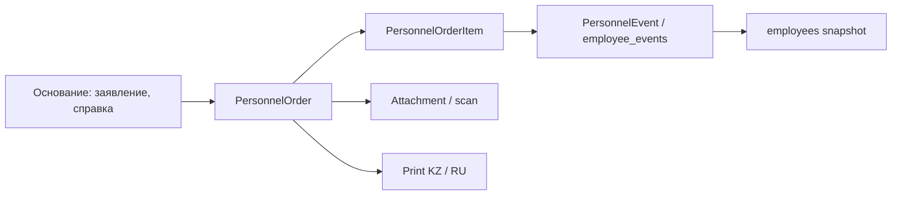
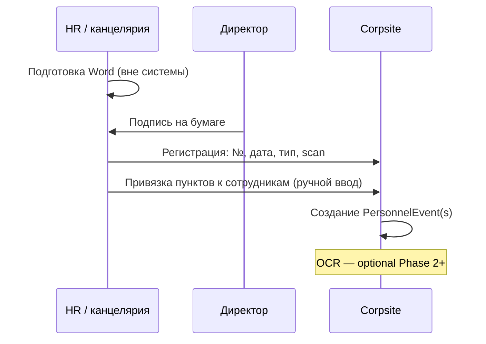
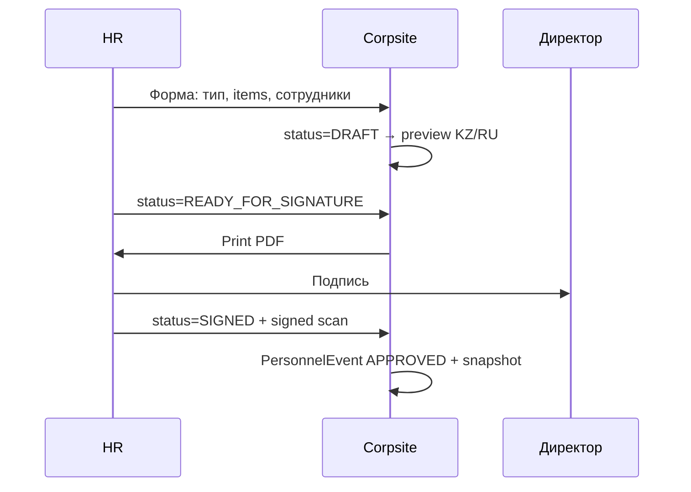
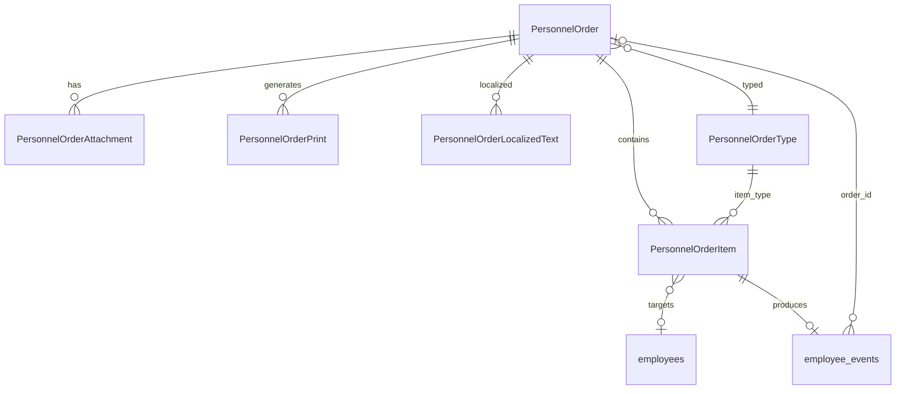

# WP-PO-001 — Personnel Orders Domain Analysis

| Поле | Значение |
|------|----------|
| Статус | **Complete** (research / architecture only) |
| Дата | 2026-07-07 |
| Work Package | WP-PO-001 |
| Ограничение | Без изменений runtime-кода, БД, API, UI, миграций |
| Связанные документы | [ADR-036](../adr/ADR-036-hr-events-unified-model.md), [ADR-033](../adr/ADR-033-personnel-governance-model.md), [ADR-037](../adr/ADR-037-employee-documents-registry.md), [ADR-047](../adr/ADR-047-appendix-service-record-and-pdf-export.md), [WP-CLEAN-001](../architecture/WP-CLEAN-001-personnel-domain-assessment.md) |
| Следующий WP | **WP-PO-002** — schema / API design (после ratification открытых вопросов) |
| Образцы | `d:\ТОО\4 dept\4A soft\10A soft\27 Corpsite ММЦ\order_samples\` (7 файлов `.docx`) |

---

## 1. Scope / границы исследования

### В scope

- Анализ **7 реальных образцов** кадровых и смежных приказов ММЦ (казахский язык).
- Классификация типов приказов и повторяющихся реквизитов.
- Связь приказов с кадровыми событиями Corpsite ([ADR-036](../adr/ADR-036-hr-events-unified-model.md)).
- Модель двуязычия (KZ / RU).
- Сценарии ввода **Paper First** и **Digital First**.
- Черновая доменная модель сущностей (design only).
- Наметки UI-интеграции с существующим Personnel UI.

### Вне scope (явно)

- DDL, миграции, API, UI-реализация.
- Cleanup Program Phase 2 / WP-CLEAN-005C.
- OCR-пipeline, e-signature, workflow согласования (ADR-035).
- Объединение с реестром профессиональных документов (ADR-034) — только boundary note.

### Ключевая гипотеза для проверки

> **Один приказ может содержать несколько пунктов; каждый пункт может относиться к отдельному сотруднику и отдельному кадровому событию.**

**Результат проверки:** гипотеза **подтверждается** образцом `ПРИЕМ.docx` (два нумерованных пункта — два сотрудника, одна подпись директора). Дополнительно: один приказ может порождать **несколько логических эффектов для одного сотрудника** (перевод + совмещение ставки в `Ауыстыру.docx`).

---

## 2. Источники анализа

### 2.1. Файлы образцов

| # | Файл | Язык | Краткое содержание |
|---|------|------|-------------------|
| 1 | `ПРИЕМ.docx` | KZ | Приём двух сотрудников (п. 1, п. 2) |
| 2 | `Ауыстыру.docx` | KZ | Перевод на другую должность + совмещение 0,5 ставки |
| 3 | `Еңбек шартын бұзу.docx` | KZ | Расторжение трудового договора (увольнение) |
| 4 | `Бала күтімінен жұмысқа шығу.docx` | KZ | Выход на работу после отпуска по уходу за ребёнком |
| 5 | `СТАВКА алу.docx` | KZ | Снятие совмещаемой 0,5 ставки |
| 6 | `Біліктілік санаты туралы мәліметіне.docx` | KZ | Изменение квалификационной категории по сертификату |
| 7 | `образцы приказов.docx` | KZ | **Сборник** из 8 отдельных шаблонов (см. §3.2) |

**Важно:** во всех образцах текст приказа — **только на казахском**. Русскоязычных парных версий в папке **нет**.

### 2.2. Архитектурный контекст Corpsite

| Арtefact | Состояние | Связь с приказами |
|----------|-----------|-------------------|
| `employee_events` + `order_ref` | Реализовано | Transitional: текстовая ссылка на приказ |
| `hr_orders` (ADR-036 Phase 1b) | **Design only** | Целевая модель заголовка приказа |
| `PersonnelJournalPageClient` | Реализовано | Org-wide журнал событий, колонка `order_ref` |
| `EmployeeEventsTimeline` | Реализовано | Per-employee «Кадровая история» |
| Файлы приказов | Вне Corpsite | UNC `\\server\share\…` (ADR-036) |

---

## 3. Классификация приказов

### 3.1. Два верхних класса

По образцам и практике ММЦ выделены **два верхних класса** (не взаимоисключающих в UI, но разных по доменной семантике):

| Класс | KZ-типичное название | Смысл | Примеры в образцах |
|-------|---------------------|-------|-------------------|
| **PERSONNEL** | Кадровый / личный приказ | Меняет или фиксирует статус занятости, должность, ставку, отпуск, увольнение | Приём, перевод, увольнение, совмещение |
| **PRODUCTION** | Производственный приказ | Операционное распоряжение без смены штатной позиции | Работа в выходной / праздник |
| **ADMINISTRATIVE** | Служебный / вспомогательный | Не кадровое событие занятости; финансы, соц. выплаты, отмена ошибки | Мат. помощь, отмена пункта приказа |
| **RECORD** | Кадровая запись | Фиксация факта без смены snapshot занятости (ADR-036 PERSONNEL class) | Квалиф. категория (?) |

> **Рекомендация:** в `PersonnelOrderType` хранить поле `order_class`: `PERSONNEL | PRODUCTION | ADMINISTRATIVE | RECORD`, чтобы фильтровать журнал приказов от производственных.

### 3.2. Детальная таксономия по образцам

#### Подтверждённые типы (есть образец)

| code (draft) | RU-название | KZ-название (из образца) | Файл |
|--------------|-------------|---------------------------|------|
| `HIRE` | Приём / зачисление | Жұмысқа қабылдау | `ПРИЕМ.docx` |
| `TRANSFER` | Перевод | Ауыстыру | `Ауыстыру.docx` |
| `TERMINATION` | Увольнение (расторжение ТД) | Еңбек шартын бұзу | `Еңбек шартын бұзу.docx` |
| `RETURN_FROM_CHILDCARE` | Выход на работу после отпуска по уходу | Бала күтімінен жұмысқа шығу | `Бала күтімінен…` |
| `CONCURRENT_DUTY_END` | Снятие совмещения / ставки | Ставканы алып тастау | `СТАВКА алу.docx`, п.5 сборника |
| `CONCURRENT_DUTY_START` | Совмещение должности (доп. ставка) | Қоса атқару | `Ауыстыру.docx`, п.3 сборника |
| `TEMPORARY_ASSIGNMENT` | Временное исполнение обязанностей (на период отпуска другого) | Уақытша … ауыстырылсын (на период отпуска) | п.4 сборника |
| `WORK_SCHEDULE_CHANGE` | Изменение режима рабочего времени | Жұмыс уақытының өзгеруі | п.5 сборника |
| `SUPPLEMENTARY_PAY` | Доплата (не смена ставки) | Қосымша ақы | п.2 сборника |
| `HOLIDAY_WORK` | Работа в выходной / праздник | Демалыс күніндегі жұмысқа ақы төлеу | п.1 сборника |
| `ORDER_VOID` | Отмена / признание недействительным пункта приказа | Бұйрықтың күшін жою | п.7 сборника |
| `MATERIAL_ASSISTANCE` | Материальная помощь | Материалдық көмек | п.8 сборника |
| `QUALIFICATION_CATEGORY` | Изменение квалификационной категории | Біліктілік санаты туралы мәлімет | `Біліктілік…` |

#### Ожидаемые, но **отсутствующие** в образцах

| code (draft) | RU-название | Статус |
|--------------|-------------|--------|
| `ANNUAL_LEAVE` | Ежегодный трудовой отпуск | ❌ нет образца |
| `UNPAID_LEAVE` | Отпуск без сохранения содержания | ❌ |
| `MATERNITY_LEAVE` | Декретный отпуск | ❌ |
| `CHILDCARE_LEAVE_START` | Отпуск по уходу за ребёнком (начало) | ❌ (есть только **выход**) |
| `LEAVE_RECALL` | Отзыв из отпуска | ❌ |
| `POSITION_CHANGE` | Смена должности без перевода | ❌ |
| `RATE_CHANGE` | Изменение ставки (не совмещение) | ❌ |
| `REHIRE` | Повторный приём | ❌ |
| `ACTING_ASSIGNMENT` | И.о. (формулировка ADR-036) | ⚠️ близкий образец — `TEMPORARY_ASSIGNMENT` |
| `BONUS` / дисциплинарные | Премия, выговор | ❌ |
| `TRANSFER` (между отделениями) | Перевод в другое подразделение | ⚠️ в образце перевод **внутри** того же отделения |

---

## 4. Таблица типов приказов

| code | class | Назначение | Обяз. поля (помимо общих реквизитов §5) | Зависимые поля | Сотрудников | Кадровое событие (ADR-036) | Влияние на lifecycle | Справочники |
|------|-------|------------|----------------------------------------|----------------|-------------|---------------------------|----------------------|-------------|
| `HIRE` | PERSONNEL | Оформление приёма | `effective_date`, `org_unit`, `position`, `employment_rate` | `concurrent_rate`, `education`, `certificate`, `experience` | 1..N | `HIRE` | ✅ snapshot | employees, org_units, positions, certificates |
| `TRANSFER` | PERSONNEL | Перевод (должность/подразделение) | `effective_date`, `from_*`, `to_org_unit`, `to_position`, `to_rate` | `concurrent_duty`, `legal_article` | 1 (обычно) | `TRANSFER` или `POSITION_CHANGE` | ✅ | org_units, positions |
| `TERMINATION` | PERSONNEL | Увольнение | `effective_date`, `legal_article`, `termination_reason` | `unused_leave_days`, settlement dept | 1 | `TERMINATION` | ✅ terminate | termination_reasons |
| `RETURN_FROM_CHILDCARE` | PERSONNEL | Выход после отпуска по уходу | `effective_date`, `position`, `rate` | `education`, `certificate`, `experience` | 1 | `REHIRE`-like или dedicated `RETURN_FROM_LEAVE` | ✅ restore status | positions, certificates |
| `CONCURRENT_DUTY_START` | PERSONNEL | Назначение совмещения | `effective_date`, `concurrent_org_unit`, `concurrent_position`, `concurrent_rate`, `total_rate` | `legal_article` (ст. 111 ТК РК) | 1 | `RATE_CHANGE` или combo event | ✅ rate overlay | positions |
| `CONCURRENT_DUTY_END` | PERSONNEL | Прекращение совмещения | `effective_date`, `removed_rate`, `remaining_rate` | | 1 | `RATE_CHANGE` | ✅ | positions |
| `TEMPORARY_ASSIGNMENT` | PERSONNEL | Временное исполнение на период отпуска другого | `effective_date`, `period_end`, `to_position`, `to_rate`, `replaced_employee` | `duty_on_holidays` | 1 | `ACTING_ASSIGNMENT` (Phase 3) | overlay | employees, positions |
| `WORK_SCHEDULE_CHANGE` | PERSONNEL / RECORD | Изменение графика | `effective_date`, `schedule_from`, `schedule_to`, `weekend_pattern` | | 1 | ⚠️ нет в ADR-036 MVP | ❌ или metadata | work_schedules (?) |
| `SUPPLEMENTARY_PAY` | ADMINISTRATIVE | Разовая доплата % | `period_start`, `period_end`, `percent`, `reason` | `replaced_employee` (за кого замещает) | 1 | ❌ | ❌ | — |
| `HOLIDAY_WORK` | PRODUCTION | Работа в нерабочий день | `work_dates[]`, `pay_rule` | | **N** | ❌ | ❌ | calendars |
| `ORDER_VOID` | ADMINISTRATIVE | Отмена пункта ранее изданного приказа | `voided_order_number`, `voided_clause`, `void_reason` | | 0..1 | `CORRECTION` / void chain | ⚠️ откат связанных событий | hr_orders |
| `MATERIAL_ASSISTANCE` | ADMINISTRATIVE | Единовременная соц. выплата | `amount_rule`, `event_reason`, `basis_document` | death certificate ref | 1 | ❌ (PERSONNEL reward?) | ❌ | — |
| `QUALIFICATION_CATEGORY` | RECORD | Категория по сертификату | `effective_date`, `category_code`, `category_valid_until`, `certificate_ref` | | 1 | ⚠️ новый тип или ADR-034 link | ❌ snapshot pos | certificates, categories |

---

## 5. Таблица обязательных реквизитов

### 5.1. Общие реквизиты (все кадровые приказы PERSONNEL)

| Реквизит | KZ (образцы) | RU (ожидаемый) | Обяз. | Примечание |
|----------|--------------|----------------|-------|------------|
| Тема / предмет | «… туралы» в заголовке | «О …» / «О …» | ✅ | Первая строка документа |
| Правовое основание | «… Кодексінің … бабына сәйкес» | «В соответствии со ст. … ТК РК» | ✅ | Номер статьи зависит от типа |
| Распорядительная часть | «БҰЙЫРАМЫН:» | «ПРИКАЗЫВАЮ:» | ✅ | |
| ФИО сотрудника | трёхкомпонентное KZ | ФИО RU | ✅ | |
| Подразделение | бөлімше | подразделение / отделение | ✅ | |
| Должность | лауазым / қызмет | должность | ✅ | |
| Ставка | ставка (1,0 / 0,5 / 1,5) | ставка | ✅ для занятости | «Барлығы: X ставка» |
| Дата вступления | «… жылғы … бастап» | «с …» | ✅ | |
| Основание | «Негіз:» | «Основание:» | ✅ | заявление, служебная записка, сертификат |
| Подписант | «Директор …» | «Директор …» | ✅ | Инициалы или полное ФИО |
| Исполнитель | «Орынд: / Орын:» | «Исп.:» | ⚠️ часто | Кадровик / HR |
| Ознакомление | «Бұйрықпен таныстым» | «С приказом ознакомлен(а)» | ⚠️ | Есть в части образцов, не во всех |
| № приказа | — | — | ⚠️ **нет в тексте образцов** | Предполагается регистрационный номер канцелярии |
| Дата приказа | — | — | ⚠️ **нет в тексте образцов** | Дата подписания — обязательна юридически |

### 5.2. Реквизиты, зависящие от типа

| Тип | Доп. реквизиты |
|-----|----------------|
| `HIRE` | трудовой договор, образование, сертификат, стаж |
| `TERMINATION` | статья ТК (49-5, 56-2), расчёт неисп. отпуска → бухгалтерия |
| `TEMPORARY_ASSIGNMENT` | ФИО замещаемого, период отпуска, разрешение дежурств |
| `RETURN_FROM_CHILDCARE` | ст. 100 п.3 ТК РК |
| `QUALIFICATION_CATEGORY` | № сертификата, код категории (7.2 R), срок действия |
| `ORDER_VOID` | ссылка на отменяемый приказ (№346–ж, п.2) |
| `MATERIAL_ASSISTANCE` | коллективный договор п. 6.26, документ-основание (свидетельство) |
| `HOLIDAY_WORK` | список дат, несколько ФИО через запятую |

---

## 6. Одно- и много-сотрудниковые приказы

### 6.1. Наблюдения по образцам

| Паттерн | Пример | Кол-во сотрудников | Кол-во пунктов |
|---------|--------|-------------------|----------------|
| Один сотрудник — один пункт | `Ауыстыру.docx`, увольнение | 1 | 1 |
| Один сотрудник — несколько эффектов в одном пункте | `Ауыстыру.docx`: перевод **и** совмещение | 1 | 1 (сложный текст) |
| Несколько сотрудников — нумерованные пункты | `ПРИЕМ.docx` п.1, п.2 | 2 | 2 |
| Несколько сотрудников — перечисление в одном пункте | п.1 сборника (работа в выходной) | 3+ | 1 |
| Без сотрудника | `ORDER_VOID` | 0 | 1 |

### 6.2. Модельная рекомендация

```text
PersonnelOrder (заголовок: №, дата, подписант, статус)
  └── PersonnelOrderItem[] (пункт 1..N)
        ├── item_number
        ├── employee_id (nullable для ORDER_VOID-only)
        ├── order_item_type  → маппинг на PersonnelOrderType
        ├── payload JSON / typed columns
        └── → 0..1 PersonnelEvent (employee_events)
```

**Правила:**

1. **Один пункт → один primary employee** (для HOLIDAY_WORK — optional `PersonnelOrderItemEmployee` many-to-many).
2. **Один пункт → одно или несколько кадровых событий** если текст совмещает перевод + совмещение (split на уровне orchestrator, один `order_id`).
3. **Один приказ → несколько пунктов → несколько сотрудников** — подтверждено (`ПРИЕМ.docx`).

---

## 7. Связь приказов с кадровыми событиями

### 7.1. Матрица «тип приказа → событие»

| Тип приказа | `event_class` | `event_type` (ADR-036) | Меняет snapshot |
|-------------|---------------|------------------------|-----------------|
| HIRE | EMPLOYMENT | `HIRE` | ✅ |
| TRANSFER | EMPLOYMENT | `TRANSFER` / `POSITION_CHANGE` | ✅ |
| TERMINATION | EMPLOYMENT | `TERMINATION` | ✅ |
| CONCURRENT_DUTY_* | EMPLOYMENT | `RATE_CHANGE` | ✅ rate |
| TEMPORARY_ASSIGNMENT | EMPLOYMENT | `ACTING_ASSIGNMENT` (Phase 3) | overlay |
| RETURN_FROM_CHILDCARE | EMPLOYMENT | new или `REHIRE` | ✅ status |
| QUALIFICATION_CATEGORY | PERSONNEL / metadata | TBD | ❌ |
| WORK_SCHEDULE_CHANGE | — | TBD | ❌ |
| SUPPLEMENTARY_PAY | PERSONNEL? | TBD | ❌ |
| HOLIDAY_WORK | — | — | ❌ |
| MATERIAL_ASSISTANCE | PERSONNEL | `BONUS`-like? | ❌ |
| ORDER_VOID | CORRECTION | void related events | ⚠️ |

### 7.2. Цепочка (согласовано с ADR-036)



### 7.3. Особые случаи из образцов

| Случай | Проблема | Рекомендация |
|--------|----------|--------------|
| Отпуск коллеги + временное исполнение | Два факта, часто **один** приказ в практике | Один `PersonnelOrder`, два `PersonnelOrderItem` → `ANNUAL_LEAVE` + `ACTING_ASSIGNMENT` (ADR-036 Appendix) |
| Отмена пункта приказа | Административное действие | `ORDER_VOID` item → void engine (ADR-035), не новое employment-событие |
| Квалиф. категория | Не employment | Связь с ADR-034 / employee metadata, не `employee_events` EMPLOYMENT |

---

## 8. Двуязычие (KZ / RU)

### 8.1. Наблюдение

Все 7 образцов — **монolingual KZ**. В Казахстане кадровый документооборот часто требует:

- приказ на **государственном языке** (KZ) — юридически значимый;
- русскую версию — для части персонала, отчётности, архива.

### 8.2. Принцип

> **Один приказ = одна юридическая сущность (`PersonnelOrder`) с двумя языковыми проекциями.**

### 8.3. Сравнение вариантов

| Вариант | Описание | Плюсы | Минусы | Вердикт |
|---------|----------|-------|--------|---------|
| **A. Оригинал + перевод (free text)** | KZ body + RU translation text | Paper First, OCR | Нет структуры, drift перевода | ✅ для Paper First / архива |
| **B. Структура → генерация** | Typed fields → template render KZ/RU | Digital First, консистентность | Нужны шаблоны, юр. review текстов | ✅ **primary для Digital First** |
| **C. Отдельные локализованные поля** | `title_kk`, `title_ru`, `body_kk`, … | Гибкость | Дублирование, sync | ✅ как слой `PersonnelOrderLocalizedText` |
| **D. Печатные версии как производные** | PDF/DOCX snapshots | Юридически фиксирует подписанный вид | Storage, версии | ✅ обязательно после подписания |

### 8.4. Рекомендуемая комбинированная модель

```text
PersonnelOrder
  structured_payload     -- канон для Digital First (тип, items, fields)
  PersonnelOrderLocalizedText
    locale: kk | ru
    title, preamble, body_rendered, signatory_line
  PersonnelOrderPrint
    locale, format (pdf/docx), file_ref, is_signed_copy
  source_mode: PAPER | DIGITAL
```

**Workflow:**

1. **Digital First:** заполнение формы → генерация KZ (+ опционально RU) → preview → print → scan signed → `PersonnelOrderPrint` (signed).
2. **Paper First:** регистрация №/дата → attach scan (KZ) → optional RU scan → optional OCR → structured_payload partial/manual.
3. **SoT для событий:** structured fields, **не** свободный текст; текст — projection.

**Locale policy (draft):**

| Поле | KZ | RU |
|------|----|----|
| Заголовок приказа | обяз. | рекоменд. |
| Статья ТК | KZ citation | RU citation (parallel) |
| ФИО сотрудника | из Person registry (kk variant if exists) | ru variant |
| Название должности / подразделения | из справочника `name_kk` / `name_ru` | |

---

## 9. Paper First и Digital First

### 9.1. Режим A — Paper First



| Шаг | Данные в системе |
|-----|------------------|
| Регистрация | `order_number`, `order_date`, `signed_by`, `status=SIGNED` |
| Attachment | scan PDF/JPG, `storage_type=LOCAL_SHARE` или upload |
| Items | ручной ввод или OCR-assisted |
| Events | создаются после регистрации подписанного приказа |

### 9.2. Режим B — Digital First



| Статус | Смысл |
|--------|-------|
| `DRAFT` | Редактируется HR |
| `READY_FOR_SIGNATURE` | Текст сгенерирован, ожидает печати |
| `SIGNED` | Подписан, события применяются |
| `VOIDED` | Отменён (whole order или через ORDER_VOID item) |
| `REGISTERED` | Paper First: зарегистрирован без draft-генерации |

### 9.3. Общие требования обоих режимов

- Нельзя менять snapshot без связи с `PersonnelOrder` (ADR-033 governance).
- `order_number` + `order_date` уникальны в пределах организации (или org scope).
- Подписант: `signed_by_employee_id` или free-text fallback (ADR-036).

---

## 10. Черновая доменная модель

> Имена сущностей — **proposal** для WP-PO-002. Маппинг на ADR-036 `hr_orders` — см. §10.2.

### 10.1. Сущности

#### PersonnelOrder

Заголовок кадрового приказа (юридический акт).

| Поле | Тип | Описание |
|------|-----|----------|
| `order_id` | PK | |
| `order_number` | text | Регистрационный № (напр. `346–ж`) |
| `order_date` | date | Дата подписания |
| `order_type_code` | FK → PersonnelOrderType | Primary type (или `COMPOSITE`) |
| `order_class` | enum | PERSONNEL / PRODUCTION / ADMINISTRATIVE |
| `status` | FK → PersonnelOrderStatus | |
| `source_mode` | enum | `PAPER` \| `DIGITAL` |
| `legal_basis_article` | text | Статья ТК / иного акта |
| `signed_by_employee_id` | FK nullable | |
| `signed_by_name` | text | fallback |
| `signed_by_position` | text | |
| `executor_name` | text | «Орынд: …» |
| `basis_summary` | text | Обобщённое основание |
| `created_by`, `created_at` | audit | |

#### PersonnelOrderType

Справочник типов (расширяемый).

| Поле | Описание |
|------|----------|
| `code` | `HIRE`, `TRANSFER`, … |
| `name_kk`, `name_ru` | |
| `order_class` | |
| `default_legal_article_kk` | шаблон |
| `event_type_mapping` | → ADR-036 event_type |
| `allows_multi_item` | bool |
| `allows_multi_employee_per_item` | bool |

#### PersonnelOrderItem

Пункт приказа.

| Поле | Описание |
|------|----------|
| `item_id` | PK |
| `order_id` | FK |
| `item_number` | 1, 2, 3… |
| `item_type_code` | FK → PersonnelOrderType |
| `employee_id` | FK nullable |
| `effective_date` | date |
| `period_start`, `period_end` | nullable |
| `payload` | JSONB (position, rates, org_unit, replaced_employee_id, …) |
| `event_id` | FK → employee_events nullable |
| `status` | ACTIVE / VOIDED |

#### PersonnelOrderStatus

| code | Описание |
|------|----------|
| `DRAFT` | Черновик (Digital First) |
| `READY_FOR_SIGNATURE` | Готов к печати |
| `SIGNED` | Подписан, события применены |
| `REGISTERED` | Paper First: внесён после подписи |
| `VOIDED` | Полностью отменён |

#### PersonnelOrderAttachment

| Поле | Описание |
|------|----------|
| `attachment_id` | PK |
| `order_id` | FK |
| `attachment_kind` | `SIGNED_SCAN`, `BASIS_DOCUMENT`, `UNSIGNED_DRAFT` |
| `storage_type` | LOCAL_SHARE \| URL \| CORPSITE_UPLOAD |
| `file_path` / `file_url` | |
| `locale` | kk \| ru \| any |

#### PersonnelOrderPrint

Производный печатный документ.

| Поле | Описание |
|------|----------|
| `print_id` | PK |
| `order_id` | FK |
| `locale` | kk \| ru |
| `format` | pdf \| docx |
| `generated_at` | |
| `is_signed_copy` | bool |
| `file_ref` | |

#### PersonnelOrderLocalizedText

| Поле | Описание |
|------|----------|
| `order_id` | FK |
| `locale` | kk \| ru |
| `title` | «Жұмысқа қабылдау туралы» |
| `preamble` | правовое основание |
| `body_text` | rendered full text |
| `render_version` | template version |
| `is_authoritative` | kk=true для юр. текста |

#### PersonnelEvent

**Не дублировать** `employee_events` — использовать как alias / view:

```text
PersonnelEvent ≡ employee_events (APPROVED)
  order_id → PersonnelOrder
  order_item_id → PersonnelOrderItem (new FK, Phase 1b+)
```

### 10.2. Маппинг на ADR-036

| WP-PO-001 | ADR-036 |
|-----------|---------|
| `PersonnelOrder` | `hr_orders` |
| `PersonnelOrderAttachment` | `order_file_path`, `storage_type` |
| `PersonnelEvent` | `employee_events` |
| `PersonnelOrderItem` | **новое** (расширение Phase 1b) |
| `PersonnelOrderLocalizedText` | **новое** |
| `PersonnelOrderPrint` | **новое** |

### 10.3. ER-диаграмма (draft)



---

## 11. Будущая UI-интеграция

### 11.1. Общий журнал кадровых приказов

**Новый маршрут (proposal):** `/directory/personnel/orders`

| Элемент | Описание |
|---------|----------|
| Размещение | Новая вкладка в `PersonnelSubNav` рядом с «Кадровый журнал» |
| Колонки | №, дата, тип, статус, подписант, сотрудники (summary), файл |
| Фильтры | период, тип, статус, сотрудник, подразделение, source_mode |
| Действия | просмотр, регистрация (Paper), создать (Digital), attach scan |

**Отличие от `/directory/personnel/journal`:** журнал событий (`employee_events`) — **факты занятости**; журнал приказов — **юридические акты**, 1:N к событиям.

### 11.2. Личная страница / drawer сотрудника

Текущее состояние:

- `EmployeeDrawer` — основные данные + transfer; **нет вкладок**.
- `EmployeeEventsTimeline` — блок «Кадровая история» (события).

Proposal:

| UI element | Phase |
|------------|-------|
| Вкладка **«История»** в `EmployeeDrawer` | stub WP-PO-003 |
| Подвкладки: События \| Приказы | stub → full |
| Список приказов сотрудника | join через `PersonnelOrderItem.employee_id` |
| Ссылка из события на приказ | `order_id` formatted badge (ADR-036) |

### 11.3. Связь с существующими экранами

| Экран | Интеграция |
|-------|------------|
| `PersonnelJournalPageClient` | Колонка «Приказ»: `№ X от DD.MM.YYYY` + link |
| Форма «Перевести» / «Оформить» | picker существующего приказа или создать draft |
| `ProfessionalDocumentsPageClient` | boundary: сертификаты ≠ приказы; cross-link для QUALIFICATION_CATEGORY |
| Service record PDF (ADR-047) | enrich timeline with order block when `hr_orders` exists |

---

## 12. Открытые вопросы

| # | Вопрос | Влияние | Предварительная позиция |
|---|--------|---------|-------------------------|
| 1 | Нумерация и дата приказа отсутствуют в тексте образцов — где assign? | Регистрация, уникальность | Отдельный шаг канцелярии до/после подписи; обязательны в `PersonnelOrder` |
| 2 | `TEMPORARY_ASSIGNMENT` vs `ACTING_ASSIGNMENT` (ADR-036) | event_type | Унифицировать: UI «и.о.», код `ACTING_ASSIGNMENT` |
| 3 | `QUALIFICATION_CATEGORY` — employment event или документ? | schema | RECORD + link ADR-034, не EMPLOYMENT snapshot |
| 4 | `WORK_SCHEDULE_CHANGE` — нужен ли event_type? | registry | Phase 2+; MVP — metadata или отдельный модуль табеля |
| 5 | `SUPPLEMENTARY_PAY` / `MATERIAL_ASSISTANCE` — в приказах или в payroll? | scope | ADMINISTRATIVE orders; optional PERSONNEL event без snapshot |
| 6 | RU-версия: обязательна ли legally для всех типов? | templates | KZ authoritative; RU optional per order type config |
| 7 | OCR из scan: scope MVP? | Paper First UX | Post-MVP; MVP — manual item entry |
| 8 | Composite order types в одном документе (перевод+совмещение в одном пункте) | item vs multi-event | 1 item → N events on apply |
| 9 | Void partial order (п.2 приказа №346–ж) | void engine | `PersonnelOrderItem.status=VOIDED` + cascade void events |
| 10 | Связь с Person-centric model (ADR-042/043) vs `employees` | dual registry | `employee_id` MVP; `person_id` / `assignment_id` — Phase 2 alignment |

---

## 13. Рекомендации для WP-PO-002

### 13.1. Scope WP-PO-002

1. **DDL design:** `personnel_orders`, `personnel_order_items`, `personnel_order_localized_texts`, `personnel_order_attachments`, `personnel_order_prints`; FK `employee_events.order_id`, `employee_events.order_item_id`.
2. **Enum / registry:** `PersonnelOrderType` codes из §4 + mapping → ADR-036.
3. **API contract (design):** CRUD draft, register signed, list/filter, link events.
4. **Template catalog:** минимум 5 типов с образцами: HIRE, TRANSFER, TERMINATION, CONCURRENT_DUTY, RETURN_FROM_CHILDCARE.
5. **Migration path:** `order_ref` → `order_id` backfill strategy (ADR-036).

### 13.2. Приоритет типов (по частоте и готовности образцов)

| Priority | Types |
|----------|-------|
| P0 | HIRE, TRANSFER, TERMINATION, CONCURRENT_DUTY_START/END |
| P1 | RETURN_FROM_CHILDCARE, TEMPORARY_ASSIGNMENT/ACTING, ORDER_VOID |
| P2 | ANNUAL_LEAVE, LEAVE_RECALL (образцы запросить у HR) |
| P3 | PRODUCTION (HOLIDAY_WORK), ADMINISTRATIVE (MATERIAL_ASSISTANCE), QUALIFICATION_CATEGORY |

### 13.3. Арtefakты WP-PO-002

- [ ] ADR-0XX Personnel Orders Schema (или amendment ADR-036)
- [ ] SQL DDL draft + validation queries
- [ ] API OpenAPI sketch
- [ ] Template field matrix per order type
- [ ] Decision log по открытым вопросам §12

### 13.4. Запрос дополнительных образцов у заказчика

Перед финализацией шаблонов запросить образцы:

- ежегодный отпуск (+ приказ на и.о.);
- декрет / отпуск по уходу (начало);
- отзыв из отпуска;
- дисциплинарный / поощрительный;
- перевод между подразделениями;
- русскоязычная версия (если используется).

---

## Appendix A — Структура типового кадрового приказа (KZ)

```text
[Заголовок: {действие} туралы]

[Правовое основание: … Кодексінің … бабына сәйкес,]

БҰЙЫРАМЫН:

[Пункт(ы): ФИО, подразделение, должность, ставка, дата]

Негіз: [основание]

[Опционально: білімі, сертификат, еңбек өтілі]

Директор [ФИО]

[Опционально:]
Бұйрықпен таныстым: ___ ФИО ___ дата

Орынд: [исполнитель]
```

---

## Appendix B — Glossary

| RU | KZ | EN (code) |
|----|----|----|
| Приказ | Бұйрық | Personnel Order |
| Пункт | Тармақ / нумерованный абзац | Order Item |
| Основание | Негіз | Basis |
| Совмещение | Қоса атқару | Concurrent duty |
| Ставка | Ставка | Employment rate |
| И.о. / временное исполнение | Уақытша / қоса атқару | Acting / temporary assignment |

---

*Документ подготовлен в рамках WP-PO-001. Runtime-код не изменялся.*
