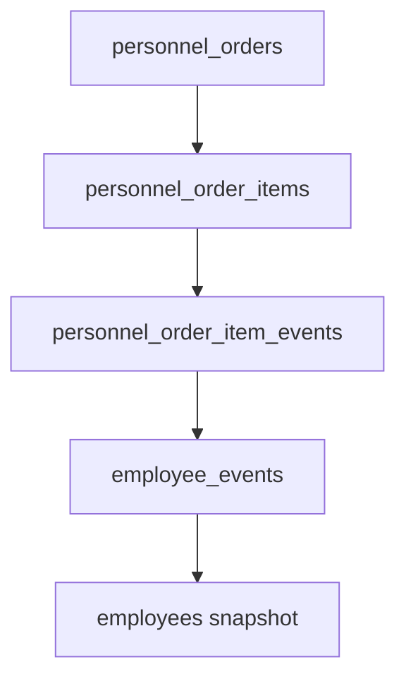
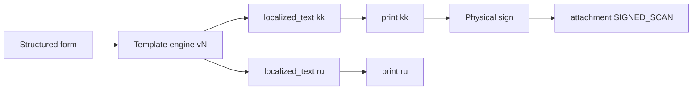
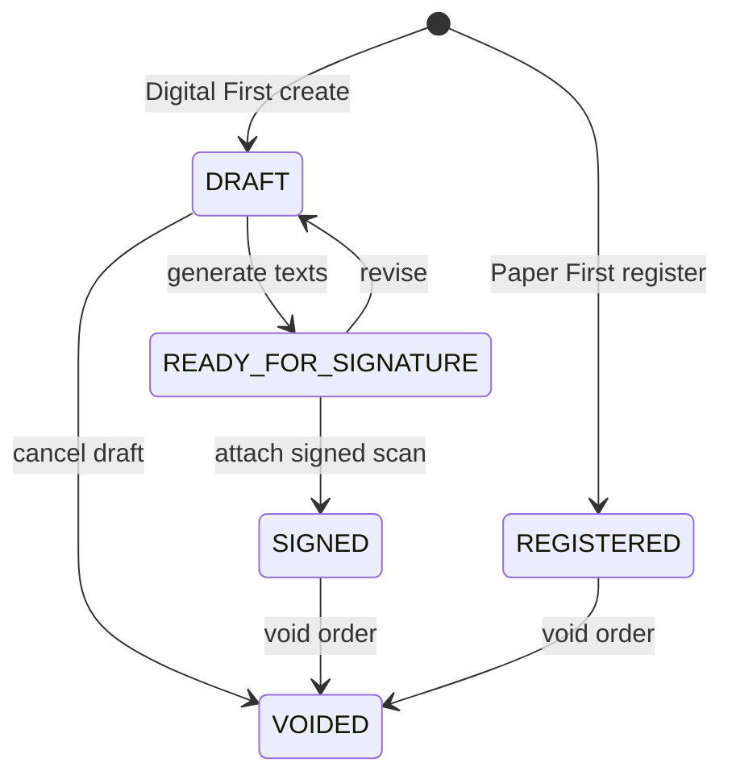
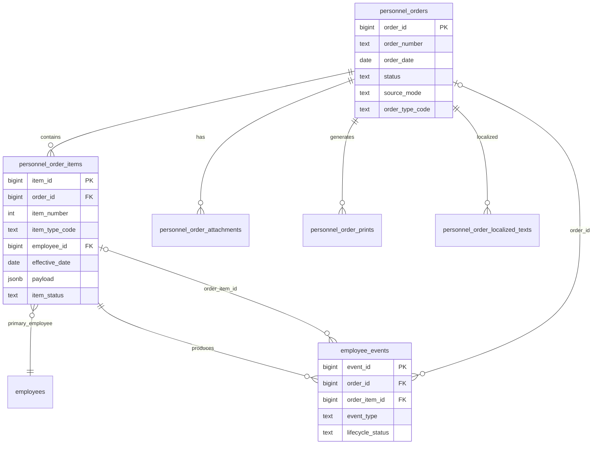

# WP-PO-002 — Personnel Orders Architecture and Scope Decision

| Поле | Значение |
|------|----------|
| Статус | **Accepted** (architecture / scope ratification) |
| Дата | 2026-07-07 |
| Work Package | WP-PO-002 |
| Предшественник | [WP-PO-001](./WP-PO-001-personnel-orders-domain-analysis.md) |
| Связанные ADR | [ADR-036](../adr/ADR-036-hr-events-unified-model.md), [ADR-033](../adr/ADR-033-personnel-governance-model.md), [ADR-035](../adr/ADR-035-hr-transfer-approval-and-event-voiding.md), [ADR-047](../adr/ADR-047-appendix-service-record-and-pdf-export.md) |
| Следующий WP | **WP-PO-003** — DDL / migration design |
| Ограничение | Без runtime-кода, миграций, API, UI |

---

## Executive Summary

WP-PO-002 **ratify** архитектурные решения подсистемы кадровых приказов до проектирования БД.

**Ключевые решения:**

1. **Scope MVP:** только класс `PERSONNEL`, **5 P0-типов** с подтверждёнными образцами; производственные и большинство административных приказов — **вне MVP**.
2. **Модель:** `PersonnelOrder` → `PersonnelOrderItem` → `employee_events` (1:N:N); один пункт может порождать **несколько** событий.
3. **SoT:** структурированные поля приказа; текст KZ/RU — **проекция**; подписанный scan/PDF — **attachment/print**, не источник snapshot.
4. **Связь с ADR-036:** приказ не заменяет `employee_events`; события создаются **при apply** подписанного приказа; `order_ref` → sunset через backfill.
5. **Void:** двухуровневый (item / order) с cascade void событий по правилам ADR-035 void chain.
6. **Dual registry:** MVP на `employee_id`; `person_id` / `assignment_id` — nullable FK Phase 2.

**Amendment к ADR-036:** целевая таблица заголовка приказа переименована с design-only `hr_orders` на **`personnel_orders`** + новые таблицы items/localized/attachments/prints. Семантика Phase 1b сохранена.

---

## 1. Scope Decision

### 1.1. In scope (MVP — WP-PO-003…004)

| Область | Решение |
|---------|---------|
| Регистрация подписанных приказов (Paper First) | ✅ |
| Черновик + генерация текста (Digital First) | ✅ data model; UI Phase 2 |
| P0 типы (§7) | ✅ |
| `personnel_orders` + items + attachments + localized text | ✅ |
| FK `employee_events.order_id`, `order_item_id` | ✅ |
| Apply → snapshot через существующий event registry | ✅ |
| Журнал приказов (design contract) | ✅ |
| KZ authoritative text + optional RU | ✅ |
| Partial void item / whole order void | ✅ design |
| `order_ref` backfill path | ✅ |

### 1.2. Out of scope (MVP)

| Область | Phase | Причина |
|---------|-------|---------|
| OCR / auto-extract из scan | 2+ | WP-PO-001 §12.7 |
| E-signature | 3+ | Вне текущего контура |
| ADR-035 workflow REQUESTED/REJECTED | 3d+ | Поверх базовых статусов |
| PRODUCTION orders (`HOLIDAY_WORK`) | 3+ | Другой домен |
| ADMINISTRATIVE (`MATERIAL_ASSISTANCE`, `SUPPLEMENTARY_PAY`) | 3+ | Payroll / соц. контур |
| `QUALIFICATION_CATEGORY` | 3+ | ADR-034 boundary |
| `WORK_SCHEDULE_CHANGE` | 3+ | Табель / расписание |
| `CORPSITE_UPLOAD` файлов | 3+ | ADR-036 Phase 3 |
| Unified `document_registry` merge | 3+ | ADR-034 |
| Person-centric primary key | 2 | ADR-042/043 alignment |
| Cleanup Program / WP-CLEAN-005C | — | Explicit pause |

### 1.3. Boundary rules

```text
PersonnelOrder     = юридический акт (№, дата, подписант, текст, файл)
employee_events    = кадровый факт занятости / запись (append-only journal)
employees snapshot = текущее состояние (derived from APPROVED events)
```

**Invariant PO-1:** snapshot **не** меняется регистрацией приказа без **apply** связанных `employee_events`.

**Invariant PO-2:** приказ **не** DELETE; только status/item void (ADR-033).

**Invariant PO-3:** один `employee_events` row ссылается на **не более одного** `order_item_id`; один item — на **0..N** events.

---

## 2. Physical Model Decision: Order → Items → Events

### 2.1. Ratified structure



> **Note:** junction `personnel_order_item_events` нужна когда **один item → несколько events** (combo-пункт). Если всегда 1:1, достаточно `employee_events.order_item_id`. **Решение:** junction **не вводить** на MVP; `employee_events.order_item_id` nullable FK; cardinality 1 item → N events через общий `order_item_id` на нескольких event rows.

### 2.2. Entity responsibilities

| Entity | Table | Responsibility |
|--------|-------|----------------|
| `PersonnelOrder` | `personnel_orders` | Заголовок акта: №, дата, статус, подписант, source_mode, legal_basis |
| `PersonnelOrderItem` | `personnel_order_items` | Пункт: сотрудник, тип, effective_date, payload, item_status |
| `PersonnelOrderType` | registry (Python enum MVP) | Код типа, class, event mapping, template id |
| `PersonnelOrderLocalizedText` | `personnel_order_localized_texts` | Rendered / edited text per locale |
| `PersonnelOrderAttachment` | `personnel_order_attachments` | Scan, basis docs, draft file refs |
| `PersonnelOrderPrint` | `personnel_order_prints` | Generated PDF/DOCX snapshots |
| `PersonnelEvent` | `employee_events` | **Existing table** — не дублировать |

### 2.3. Cardinality rules (ratified)

| Relationship | Cardinality | Rule |
|--------------|-------------|------|
| Order → Item | 1..N | N≥1 для зарегистрированного приказа |
| Item → Employee | 0..1 primary | 0 для pure `ORDER_VOID` admin item |
| Item → Events | 0..N | N≥1 после apply для employment items |
| Order → Events | 1..N | Derived via items |
| Event → Order | 0..1 | `order_id` nullable для legacy / CORRECTION-only |

### 2.4. Combo-item split (Decision PO-8)

**Решение:** один `PersonnelOrderItem` с `item_type=TRANSFER` и `payload.includes_concurrent_duty=true` при apply создаёт:

1. `TRANSFER` или `POSITION_CHANGE` event (primary employment change)
2. `RATE_CHANGE` event (совмещение), если `concurrent_rate` указана

Оба event rows получают один `order_id` и один `order_item_id`.

**UI:** один пункт формы; orchestrator разветвляет на N events.

### 2.5. Amendment к ADR-036 `hr_orders`

| ADR-036 (design) | WP-PO-002 (ratified) |
|------------------|----------------------|
| `hr_orders` | **`personnel_orders`** |
| `employee_events.order_id` only | + **`employee_events.order_item_id`** |
| Header-only model | Header + **items** |
| — | `personnel_order_localized_texts`, `personnel_order_prints`, `personnel_order_attachments` |

FK и поля ADR-036 (`signed_by_*`, `storage_type`, `order_file_path`) переносятся на `personnel_orders` / attachments без семантической смены.

---

## 3. Integration with `employee_events`

### 3.1. Principle

> **Приказ — документ-основание; событие — операционный факт в журнале.**

Apply подписанного приказа = транзакция:

```text
BEGIN
  validate order.status IN (SIGNED, REGISTERED)
  FOR each active item:
    INSERT employee_events (...)  -- lifecycle_status = APPROVED
    apply snapshot handler per event_type
  COMMIT
```

### 3.2. New / changed columns on `employee_events`

| Column | Type | MVP | Description |
|--------|------|-----|-------------|
| `order_id` | BIGINT FK → personnel_orders | ✅ | ADR-036 Phase 1b |
| `order_item_id` | BIGINT FK → personnel_order_items | ✅ | **New** — traceability to clause |
| `order_ref` | TEXT | ⚠️ transitional | Dual-write during migration; sunset Phase PO-5 |

### 3.3. Creation paths

| Path | Flow |
|------|------|
| **A. Order-first (target)** | Create order → items → sign → apply → events |
| **B. Event-first (legacy)** | Existing transfer UI with `order_ref` text → backfill order later |
| **C. Link existing** | Register order → attach to existing events (admin repair) |

**MVP primary:** Path A for new P0 types. Path B preserved for backward compatibility.

### 3.4. Event type mapping (P0)

| Order type | `event_type` | `event_class` | Snapshot |
|------------|--------------|---------------|----------|
| `HIRE` | `HIRE` | EMPLOYMENT | ✅ |
| `TRANSFER` | `TRANSFER` if org changes; else `POSITION_CHANGE` | EMPLOYMENT | ✅ |
| `TERMINATION` | `TERMINATION` | EMPLOYMENT | ✅ |
| `CONCURRENT_DUTY_START` | `RATE_CHANGE` | EMPLOYMENT | ✅ rate |
| `CONCURRENT_DUTY_END` | `RATE_CHANGE` | EMPLOYMENT | ✅ rate |

Metadata convention (JSONB):

```json
{
  "order_item_id": 123,
  "concurrent_position_id": 45,
  "concurrent_rate": 0.5,
  "total_rate": 1.5,
  "order_type_code": "CONCURRENT_DUTY_START"
}
```

### 3.5. `ACTING_ASSIGNMENT` (P1 note)

`TEMPORARY_ASSIGNMENT` из WP-PO-001 **не входит в P0**. При реализации P1:

- UI label: «Временное исполнение / и.о.»
- `event_type`: **`ACTING_ASSIGNMENT`** (ADR-036 Phase 3)
- `order_type_code`: `ACTING_ASSIGNMENT` (alias `TEMPORARY_ASSIGNMENT` deprecated)

---

## 4. Bilingual Model Decision

### 4.1. Ratified approach: **Structured SoT + localized projections + signed prints**

Комбинация WP-PO-001 вариантов **B + C + D** (не A как SoT).

| Layer | Role | Authority |
|-------|------|-----------|
| `personnel_order_items.payload` + header fields | **Source of truth** | Canonical for apply/events |
| `personnel_order_localized_texts` | Generated or hand-edited display | `kk` authoritative; `ru` optional |
| `personnel_order_prints` | Point-in-time export | Legal signed copy after print |
| `personnel_order_attachments` | External scan | Evidence; may lack structure (Paper First) |

### 4.2. Locale policy (Decision PO-6)

| Locale | Requirement | Notes |
|--------|-------------|-------|
| `kk` | **Mandatory** for SIGNED/REGISTERED | Гос. язык; `is_authoritative=true` |
| `ru` | **Optional** per org config | `org_settings.personnel_orders_ru_enabled` default `true` for MMЦ |
| Employee/position names | From registry | `name_kk` / `name_ru` if available; fallback primary name |

### 4.3. Digital First render pipeline



### 4.4. Paper First

- Minimum structured fields: `order_number`, `order_date`, type, items (manual), employee, dates, rates.
- Scan attachment **required** before `REGISTERED`.
- Full text body optional in `localized_texts`; may be empty if only scan exists.
- OCR **не** блокирует регистрацию.

---

## 5. Status Model Decision

### 5.1. Order-level statuses

| Status | Meaning | Transitions | Events applied? |
|--------|---------|-------------|-----------------|
| `DRAFT` | Digital First: редактируется | → `READY_FOR_SIGNATURE`, → `VOIDED` | ❌ |
| `READY_FOR_SIGNATURE` | Текст сгенерирован, ждёт печати/подписи | → `SIGNED`, → `DRAFT`, → `VOIDED` | ❌ |
| `SIGNED` | Подписан (Digital path) | → `VOIDED` | ✅ on enter |
| `REGISTERED` | Paper First: внесён после подписи | → `VOIDED` | ✅ on enter |
| `VOIDED` | Весь приказ отменён | terminal | cascade void |



### 5.2. Item-level statuses

| Status | Meaning |
|--------|---------|
| `ACTIVE` | Пункт действует |
| `VOIDED` | Пункт отменён (`ORDER_VOID` target или admin void) |

Item void **не** удаляет row; меняет `item_status` + void linked events.

### 5.3. Mapping to `employee_events.lifecycle_status`

| Order action | Event lifecycle |
|--------------|-----------------|
| Apply on SIGNED/REGISTERED | `APPROVED` |
| Void item / order | `VOIDED` (existing void endpoint semantics) |
| Draft order | events **не создаются** |

ADR-035 states `REQUESTED` / `REJECTED` — **не** используются в MVP orders module; добавляются Phase 3d as sub-status overlay.

### 5.4. Order number and date (Decision PO-1)

| Field | Rule |
|-------|------|
| `order_number` | Assigned at registration; **unique** per `(org_id, fiscal_year)` or global per tenant — **WP-PO-003** finalizes constraint |
| `order_date` | Date of director signature; **required** before SIGNED/REGISTERED |
| In body text | May be absent (как в образцах); system fields are authoritative |

---

## 6. Void / Cancel Decision

### 6.1. Terminology

| Term | Scope | Mechanism |
|------|-------|-----------|
| **Cancel draft** | Order in DRAFT / READY | `order.status → VOIDED` without events |
| **Void item** | Single clause | `item.item_status → VOIDED` + void its events |
| **Void order** | Whole document | All active items → VOIDED + all linked events voided |
| **ORDER_VOID item** | Administrative clause | Item type referencing `voided_order_id` + `voided_item_number` |

### 6.2. Void item algorithm

```text
1. Authorize HR head / system admin (ADR-035 RBAC)
2. Validate void chain per employee (no newer APPROVED events after target events)
3. SET item.item_status = VOIDED, item.void_reason, item.voided_at
4. FOR each employee_events WHERE order_item_id = item.item_id AND lifecycle = APPROVED:
     POST void semantics: lifecycle → VOIDED, rollback snapshot
5. If all items VOIDED → order.status = VOIDED
```

### 6.3. ORDER_VOID type (P1)

- Separate order with item type `ORDER_VOID`.
- Payload: `target_order_id`, `target_item_number`, `void_reason`.
- Apply triggers §6.2 on target item (not DELETE of target row).

### 6.4. Void chain (ADR-035 compatible)

**Ratified:** void item/event **запрещён**, если для того же `employee_id` существуют более новые `APPROVED` employment-события с `effective_date` > void target.

Exception: `CORRECTION` events — отдельный путь, не через order void.

### 6.5. Cancel vs void

| Action | When | Events |
|--------|------|--------|
| Cancel | DRAFT / READY_FOR_SIGNATURE | None existed |
| Void | SIGNED / REGISTERED | Cascade void + snapshot rollback |

---

## 7. P0 Order Types — Ratified Catalog

### 7.1. P0 list

| code | name_ru | class | Sample | MVP template |
|------|---------|-------|--------|--------------|
| `HIRE` | Приём на работу | PERSONNEL | `ПРИЕМ.docx` | ✅ |
| `TRANSFER` | Перевод / смена должности | PERSONNEL | `Ауыстыру.docx` | ✅ |
| `TERMINATION` | Увольнение (расторжение ТД) | PERSONNEL | `Еңбек шартын бұзу.docx` | ✅ |
| `CONCURRENT_DUTY_START` | Совмещение (назначение ставки) | PERSONNEL | `Ауыстыру.docx`, сборник | ✅ |
| `CONCURRENT_DUTY_END` | Прекращение совмещения | PERSONNEL | `СТАВКА алу.docx` | ✅ |

**Deferred P1:** `RETURN_FROM_CHILDCARE`, `ACTING_ASSIGNMENT`, `ORDER_VOID`  
**Deferred P2:** leave types (`ANNUAL_LEAVE`, …)  
**Deferred P3:** PRODUCTION, ADMINISTRATIVE, RECORD types

### 7.2. P0 required fields matrix

| Field | HIRE | TRANSFER | TERMINATION | CONCUR_START | CONCUR_END |
|-------|:----:|:--------:|:-----------:|:------------:|:----------:|
| `order_number`, `order_date` | ✅ | ✅ | ✅ | ✅ | ✅ |
| `employee_id` | ✅ | ✅ | ✅ | ✅ | ✅ |
| `effective_date` | ✅ | ✅ | ✅ | ✅ | ✅ |
| `org_unit_id` | ✅ | ✅ | ✅ | ✅ | ✅ |
| `position_id` | ✅ | ✅ | — | ✅ concurrent | ✅ primary |
| `employment_rate` | ✅ | ✅ | — | ✅ concurrent + total | ✅ removed + remaining |
| `legal_basis_article` | ✅ | ✅ | ✅ | ✅ | ✅ |
| `basis_type` + ref | ✅ | ✅ | ✅ | ✅ | ✅ |
| `signed_by_*` | ✅ | ✅ | ✅ | ✅ | ✅ |
| `to_org_unit_id` | — | if inter-unit | — | — | — |
| `to_position_id` | — | ✅ | — | ✅ | — |
| `termination_reason` | — | — | ✅ | — | — |
| `unused_leave_days` | — | — | ⚠️ optional | — | — |

### 7.3. Multi-item orders in P0

| Pattern | Supported | Example |
|---------|-----------|---------|
| Multi-employee hire | ✅ | `ПРИЕМ.docx` items 1, 2 |
| Single-employee combo | ✅ | Transfer + concurrent in one item |
| Multi-type in one order | ⚠️ Phase P1 | Leave + acting — needs P2 types |

P0 UI/API **must** support N items per order for `HIRE` at minimum.

---

## 8. Decision Log — WP-PO-001 Open Questions

| # | WP-PO-001 question | **WP-PO-002 decision** |
|---|-------------------|------------------------|
| 1 | № и дата приказа | System fields mandatory; assigned at registration; independent of body text |
| 2 | TEMPORARY vs ACTING | **`ACTING_ASSIGNMENT`** event/code; P1 only |
| 3 | QUALIFICATION_CATEGORY | **Out of MVP**; ADR-034 link Phase 3+ |
| 4 | WORK_SCHEDULE_CHANGE | **Out of MVP**; separate timekeeping module |
| 5 | SUPPLEMENTARY_PAY / MATERIAL_ASSISTANCE | **Out of MVP**; admin orders Phase 3+ |
| 6 | RU mandatory? | **KZ authoritative**; RU optional org setting |
| 7 | OCR scope | **Post-MVP**; manual item entry Paper First |
| 8 | Combo item → events | **1 item → N events** on apply (§2.4) |
| 9 | Partial void | **`item_status=VOIDED`** + cascade void events (§6) |
| 10 | employee vs person | **`employee_id` MVP**; nullable `person_id`/`assignment_id` Phase 2 |

---

## 9. Registry and Templates

### 9.1. `PersonnelOrderType` registry (MVP)

Python enum + registry (consistent with ADR-036 `HR_EVENT_REGISTRY` pattern):

```python
# Illustrative — not implementation
PERSONNEL_ORDER_REGISTRY = {
  "HIRE": {
    "order_class": "PERSONNEL",
    "event_types": ["HIRE"],
    "allows_multi_item": True,
    "template_id": "hire_v1",
  },
  "TRANSFER": {
    "order_class": "PERSONNEL",
    "event_types": ["TRANSFER", "POSITION_CHANGE"],  # resolver picks one
    "combo_events": ["RATE_CHANGE"],  # if concurrent in payload
    "allows_multi_item": False,
    "template_id": "transfer_v1",
  },
  # ...
}
```

Phase 2: DB table `personnel_order_types` if admin configurability required.

### 9.2. Template versioning

| Field | Purpose |
|-------|---------|
| `template_id` | e.g. `hire_v1` |
| `template_version` | monotonic int on `localized_texts` / `prints` |
| Legal text changes | New template version; old orders keep old `render_version` |

---

## 10. Migration and Compatibility

### 10.1. `order_ref` sunset plan

| Phase | Action |
|-------|--------|
| PO-3 | Add `personnel_orders`, FK columns |
| PO-4 | Dual-write: new orders use `order_id`; UI shows formatted badge |
| PO-5 | Backfill script: parse `order_ref` → create minimal orders where possible |
| PO-6 | Deprecate `order_ref` on new writes |
| PO-7 | Remove column (ADR-036 Phase 4+) |

### 10.2. Legacy event-first flows

Existing `POST …/transfer` with `order_ref` string **continues** until UI migrates to order picker. No breaking change in PO-3 migration alone.

---

## 11. API Surface (design contract only)

| Method | Path | Purpose |
|--------|------|---------|
| POST | `/directory/personnel-orders` | Create DRAFT or REGISTERED |
| PATCH | `/directory/personnel-orders/{id}` | Update draft header |
| POST | `/directory/personnel-orders/{id}/items` | Add item |
| PATCH | `/directory/personnel-orders/{id}/items/{item_id}` | Update item |
| POST | `/directory/personnel-orders/{id}/generate-texts` | Render localized texts |
| POST | `/directory/personnel-orders/{id}/sign` | → SIGNED + apply events |
| POST | `/directory/personnel-orders/{id}/void` | Void whole order |
| POST | `/directory/personnel-orders/{id}/items/{item_id}/void` | Void item |
| GET | `/directory/personnel-orders` | Journal + filters |
| GET | `/directory/personnel-orders/{id}` | Detail + items + events |
| POST | `/directory/personnel-orders/{id}/attachments` | Register file path |

RBAC: HR specialist create/register; HR head / admin void (align ADR-033/035).

---

## 12. UI Contract (design only)

| Surface | MVP | Notes |
|---------|-----|-------|
| `/directory/personnel/orders` | P1 UI | Journal — after API PO-4 |
| Order detail drawer | P1 | Items, texts, attachments, linked events |
| Employee drawer tab «История» | stub PO-3 | Orders sub-list read-only |
| Personnel events journal | enhance | Link to order detail |
| Transfer form | migrate | Order picker replaces free-text `order_ref` |

---

## 13. Risks and Mitigations

| Risk | Mitigation |
|------|------------|
| Combo item → multiple events breaks void chain | Void all events sharing `order_item_id` atomically |
| Paper First without structured body | Minimum field validation; scan required |
| KZ/RU drift | SoT in payload; texts regenerated from payload on demand |
| Dual registry confusion | Document `employee_id` as MVP FK; Phase 2 migration guide |
| ADR-036 `hr_orders` naming drift | This doc amends target name to `personnel_orders` |
| Missing leave samples | P2 blocked until HR provides samples |

---

## 14. Deliverables and Next Steps

### 14.1. WP-PO-002 deliverables (this document)

- [x] Scope boundaries
- [x] Order → Items → Events model
- [x] `employee_events` integration rules
- [x] Bilingual decision
- [x] Status state machine
- [x] Void / cancel semantics
- [x] P0 type catalog
- [x] Decision log (WP-PO-001 §12)

### 14.2. WP-PO-003 scope (next)

1. DDL: `personnel_orders`, `personnel_order_items`, `personnel_order_localized_texts`, `personnel_order_attachments`, `personnel_order_prints`
2. ALTER `employee_events`: `order_id`, `order_item_id`
3. Unique constraints, indexes, validation SQL
4. Amendment file or ADR-054 draft referencing this decision
5. Backfill strategy detail

### 14.3. Acceptance criteria for architecture freeze

Architecture considered **frozen for DDL** when:

- [x] P0 types ratified
- [x] Status / void rules unambiguous
- [x] employee_events FK direction confirmed
- [x] Bilingual SoT confirmed
- [x] Out-of-scope list explicit

**Status:** ✅ **Ready for WP-PO-003**

---

## Appendix A — ER Diagram (ratified)



---

## Appendix B — Glossary update

| Term | Definition |
|------|------------|
| **Apply** | Transition order to SIGNED/REGISTERED and create APPROVED events |
| **Combo item** | Single clause producing >1 employee_events row |
| **Authoritative locale** | `kk` — legal text default for MMЦ |
| **REGISTERED** | Paper First terminal status before void |
| **Personnel order class** | Top taxonomy: PERSONNEL / PRODUCTION / ADMINISTRATIVE / RECORD |

---

*Runtime-код не изменялся. Документ ratify решения WP-PO-001 для проектирования БД в WP-PO-003.*
