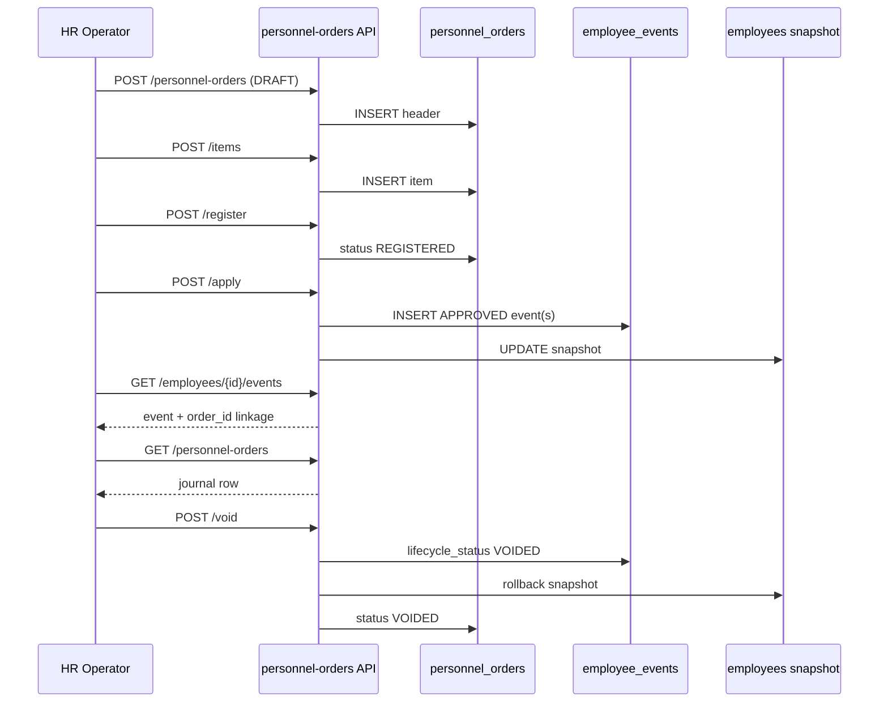

# WP-PO-006 — End-to-End Validation and Closure Report

| Поле | Значение |
|------|----------|
| Статус | **Closed** — MVP personnel orders validated on P0 scenarios |
| Дата | 2026-07-07 |
| Work Package | WP-PO-006 |
| Предшественник | WP-PO-005B — Employee Personnel History Tab |
| Связанные WP | WP-PO-001 … WP-PO-005B |
| Связанные ADR | ADR-033, ADR-035, ADR-036, ADR-047 |

---

## Executive Summary

WP-PO-006 завершает MVP-контур **кадровых приказов** (`personnel_orders`) проверкой полного P0-пути от черновика до void/rollback.

**Результат валидации:** все **26** автоматических тестов WP-PO-003…006 проходят на PostgreSQL. E2E-сценарий подтверждает:

1. создание приказа и пункта;
2. регистрацию и apply;
3. появление связанного `employee_events` в API истории сотрудника;
4. видимость приказа в org-wide журнале;
5. void/cancel без нарушения append-only;
6. rollback snapshot сотрудника при void applied-приказа.

Модуль приказов доступен в **двух UI-точках**: `/directory/personnel/orders` и вкладка **«История»** на карточке сотрудника.

---

## 1. Scope WP-PO-006

### 1.1. In scope

| Область | Статус |
|---------|--------|
| E2E API validation P0 flow | ✅ |
| Cancel draft без side effects | ✅ |
| Apply → history linkage (`order_id`, `order_item_id`) | ✅ |
| Journal list/detail visibility | ✅ |
| Void applied order + event cascade | ✅ |
| Snapshot rollback (TRANSFER / POSITION_CHANGE) | ✅ |
| Closure report (этот документ) | ✅ |

### 1.2. Out of scope (явно не проверялось в WP-PO-006)

| Область | Phase | Причина |
|---------|-------|---------|
| Browser/UI manual QA | — | API-first closure; UI smoke — ops runbook |
| DOCX/PDF generation | 2+ | WP-PO-002 §4.3 |
| OCR / e-signature | 2+ | WP-PO-002 §1.2 |
| P1 типы (`RETURN_FROM_CHILDCARE`, `ACTING_ASSIGNMENT`) | P1 | WP-PO-002 §7.1 |
| PRODUCTION / ADMINISTRATIVE orders | 3+ | WP-PO-002 §1.2 |
| Deep-link на конкретный приказ из вкладки «История» | 2 | Ссылка ведёт в журнал с `employee_id` filter |

---

## 2. Deliverables chain (WP-PO-001 … WP-PO-006)

| WP | Deliverable | Runtime |
|----|-------------|---------|
| WP-PO-001 | Domain analysis | docs only |
| WP-PO-002 | Architecture & P0 scope ratification | docs only |
| WP-PO-003 | DDL + `employee_events.order_id/order_item_id` | ✅ migration `p0q1r2s3t4u5` |
| WP-PO-004A | Read API + journal UI | ✅ |
| WP-PO-004B | Draft / register / item write API | ✅ |
| WP-PO-004C | Apply → `employee_events` + snapshot | ✅ |
| WP-PO-004D | Void/cancel + cascade + rollback | ✅ |
| WP-PO-005B | Employee card tab «История» (read-only) | ✅ |
| **WP-PO-006** | **E2E validation + closure** | ✅ this report |

---

## 3. P0 order types — validation coverage

Ratified catalog ([WP-PO-002 §7.1](./WP-PO-002-personnel-orders-architecture-scope-decision.md)):

| code | E2E / integration tested | Evidence |
|------|--------------------------|----------|
| `HIRE` | ✅ | `test_apply_registered_hire_order_creates_linked_event`, `test_void_applied_order_cascades_events`, E2E cancel draft |
| `TRANSFER` | ✅ | `test_apply_combo_transfer_item_creates_transfer_and_rate_change`, **WP-PO-006 E2E rollback** |
| `TERMINATION` | ⚠️ partial | schema + apply path exists; dedicated E2E not in WP-PO-006 suite |
| `CONCURRENT_DUTY_START` | ⚠️ partial | combo transfer test covers `RATE_CHANGE` side effect |
| `CONCURRENT_DUTY_END` | ⚠️ not in WP-PO-006 | deferred to ops smoke / follow-up |

**WP-PO-006 primary E2E scenario:** `TRANSFER` (position change, same org unit) — наиболее полный путь с rollback.

---

## 4. P0 end-to-end flow — validated steps

### 4.1. Scenario A — Apply + history + journal + void + rollback

**Test:** `tests/test_wp_po_006_e2e_validation.py::test_wp_po_006_p0_transfer_apply_history_journal_void_rollback`

| # | Step | API | Expected | Result |
|---|------|-----|----------|--------|
| 1 | Создать приказ | `POST /directory/personnel-orders` | `status=DRAFT` | ✅ |
| 2 | Добавить item | `POST …/items` | item with `effective_date` | ✅ |
| 3 | Зарегистрировать | `POST …/register` | `status=REGISTERED` | ✅ |
| 4 | Apply | `POST …/apply` | 1× `TRANSFER` event, FK linkage | ✅ |
| 5 | Snapshot изменён | DB `employees.position_id` | → target position | ✅ |
| 6 | История сотрудника | `GET /directory/employees/{id}/events` | `order_id`, `order_item_id`, `order_number`, `lifecycle_status=APPROVED` | ✅ |
| 7 | Журнал приказов | `GET /directory/personnel-orders?employee_id=` | order visible, `employee_ids` contains employee | ✅ |
| 8 | Detail приказа | `GET /directory/personnel-orders/{id}` | linked `events[]` | ✅ |
| 9 | Void | `POST …/void` | order/items `VOIDED`, events `lifecycle_status=VOIDED` | ✅ |
| 10 | Rollback | DB `employees.position_id` | restored to pre-apply value | ✅ |
| 11 | History after void | `GET …/events` | same event, `lifecycle_status=VOIDED` | ✅ |
| 12 | Journal filter | `GET …/personnel-orders?status=VOIDED` | order listed | ✅ |

### 4.2. Scenario B — Cancel draft (no apply)

**Test:** `tests/test_wp_po_006_e2e_validation.py::test_wp_po_006_p0_cancel_draft_without_side_effects`

| # | Step | Expected | Result |
|---|------|----------|--------|
| 1 | Create DRAFT + item | No events | ✅ |
| 2 | Void draft | `status=VOIDED`, `events=[]` | ✅ |
| 3 | Employee history | No rows with `order_id` | ✅ |
| 4 | Employee snapshot | Unchanged | ✅ |

---

## 5. Test execution record

**Command:**

```bash
python -m pytest \
  tests/test_wp_po_003_personnel_orders_schema.py \
  tests/test_wp_po_004a_personnel_orders_read_api.py \
  tests/test_wp_po_004b_personnel_orders_draft_register_api.py \
  tests/test_wp_po_004c_personnel_orders_apply_api.py \
  tests/test_wp_po_004d_personnel_orders_void_api.py \
  tests/test_wp_po_005b_employee_personnel_history_api.py \
  tests/test_wp_po_006_e2e_validation.py \
  -q
```

**Result (2026-07-07):** `26 passed in ~25s`

| Suite | Tests | Focus |
|-------|-------|-------|
| WP-PO-003 | 5 | Schema, FK, constraints |
| WP-PO-004A | 6 | Read list/detail, RBAC, filters |
| WP-PO-004B | 5 | Draft, items, register, RBAC |
| WP-PO-004C | 4 | Apply, idempotency, combo items |
| WP-PO-004D | 3 | Cancel draft, full void, partial item void |
| WP-PO-005B | 1 | Employee history order linkage |
| **WP-PO-006** | **2** | **Full E2E + cancel path** |

---

## 6. UI integration points (post-MVP visibility)

| Surface | Route / component | Mode | Linked data |
|---------|-------------------|------|-------------|
| Org-wide journal | `/directory/personnel/orders` | read + drawer detail | `personnel_orders`, items, events |
| Employee card | `/directory/personnel/employees/[id]/import-card` → tab **«История»** | read-only | `GET /directory/employees/{id}/events` |
| Personnel journal (legacy) | `/directory/personnel/journal` | org-wide `employee_events` | separate from orders module |

**Invariant confirmed:** регистрация приказа **не** меняет snapshot; только **apply** создаёт `employee_events` и обновляет `employees` (WP-PO-002 PO-1).

---

## 7. API surface (MVP implemented)

| Method | Path | WP |
|--------|------|-----|
| GET | `/directory/personnel-orders` | 004A |
| GET | `/directory/personnel-orders/{order_id}` | 004A |
| POST | `/directory/personnel-orders` | 004B |
| PATCH | `/directory/personnel-orders/{order_id}` | 004B |
| POST | `/directory/personnel-orders/{order_id}/items` | 004B |
| PATCH | `/directory/personnel-orders/{order_id}/items/{item_id}` | 004B |
| POST | `/directory/personnel-orders/{order_id}/localized-texts/{locale}` | 004B |
| POST | `/directory/personnel-orders/{order_id}/ready-for-signature` | 004B |
| POST | `/directory/personnel-orders/{order_id}/register` | 004B |
| POST | `/directory/personnel-orders/{order_id}/apply` | 004C |
| POST | `/directory/personnel-orders/{order_id}/void` | 004D |
| POST | `/directory/personnel-orders/{order_id}/items/{item_id}/void` | 004D |
| GET | `/directory/employees/{employee_id}/events` | 005B (extended linkage) |

RBAC: write/apply/void — `has_personnel_admin`; read journal — privileged operator.

---

## 8. Rollback semantics (validated)

Void applied order invokes `personnel_orders_void_service`:

1. **Void chain check** — нельзя void, если есть более новые APPROVED events (ADR-035).
2. **Snapshot rollback** — по `from_*` полям события (`TRANSFER` → restore org/position/rate; `users.unit_id` при inter-unit).
3. **Event cascade** — `lifecycle_status` → `VOIDED` (append-only; строка не DELETE).

E2E подтверждает rollback для **position-only TRANSFER** (same org unit): `employees.position_id` возвращается к исходному значению.

**Not fully E2E-tested in WP-PO-006:** rollback для `HIRE`, `TERMINATION`, inter-unit `TRANSFER` (покрыто unit-тестами 004D + service logic).

---

## 9. Known gaps and follow-ups

| ID | Gap | Severity | Suggested WP |
|----|-----|----------|--------------|
| GAP-PO-001 | Нет dedicated E2E для `TERMINATION`, `CONCURRENT_DUTY_*` | Low | Ops smoke / WP-PO-007 |
| GAP-PO-002 | UI «История» — ссылка на приказ без deep-link на drawer | Low | WP-PO-007 UI |
| GAP-PO-003 | DOCX/PDF print pipeline not implemented | Expected | Phase 2 |
| GAP-PO-004 | `order_status` после apply остаётся `REGISTERED` (нет статуса `APPLIED`) | Info | Design note; не блокер MVP |
| GAP-PO-005 | Manual browser QA не входила в WP-PO-006 | Medium | HR demo runbook |

---

## 10. Acceptance criteria — WP-PO-006 closure

| # | Criterion | Status |
|---|-----------|--------|
| 1 | P0 path create → item → register → apply automated | ✅ |
| 2 | Event visible in employee history API with order linkage | ✅ |
| 3 | Order visible in personnel orders journal API | ✅ |
| 4 | Void/cancel paths validated | ✅ |
| 5 | Snapshot rollback validated on apply+void | ✅ |
| 6 | Full WP-PO test suite green | ✅ 26/26 |
| 7 | Closure report published | ✅ this document |

**Decision:** WP-PO-006 **Closed**. MVP personnel orders module considered **integration-ready** for controlled HR pilot (Paper First, P0 types).

---

## 11. Recommended ops smoke (manual)

Для production/pilot checklist вне автотестов:

1. Открыть `/directory/personnel/orders` — создать приказ через UI (если write UI доступен) или через API.
2. Apply приказ → проверить запись в журнале и drawer detail.
3. Открыть карточку сотрудника → вкладка **«История»** → событие с номером приказа.
4. Void приказ → убедиться в badge «Аннулировано» и восстановлении текущего назначения в «Назначение».

См. также [HR-DEMO-LOCAL-RUNBOOK.md](../demo/HR-DEMO-LOCAL-RUNBOOK.md).

---

## Appendix A — Data flow (validated path)



---

## Appendix B — Key files

| Layer | Path |
|-------|------|
| Migration | `alembic/versions/p0q1r2s3t4u5_wp_po_003_personnel_orders_foundation.py` |
| Models | `app/db/models/personnel_orders.py` |
| Apply | `app/services/personnel_orders_apply_service.py` |
| Void / rollback | `app/services/personnel_orders_void_service.py` |
| Employee history API | `app/services/directory_service.py` (`list_employee_events`) |
| Orders UI | `corpsite-ui/app/directory/personnel/orders/` |
| History tab UI | `corpsite-ui/app/directory/personnel/_components/EmployeePersonnelHistorySection.tsx` |
| E2E tests | `tests/test_wp_po_006_e2e_validation.py` |
